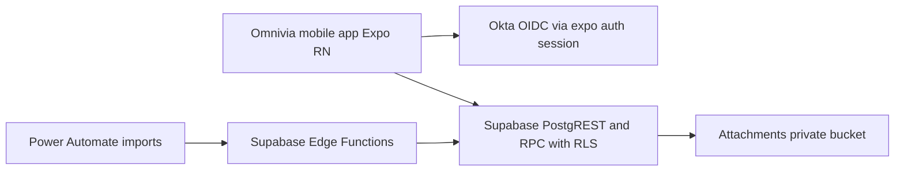

# Omnivia — Application Brief

## High-level overview
Omnivia is a role-aware mobile application designed for telco delivery programs to unify project visibility, field engagement capture, and evidence collection. Built on Expo and React Native, it provides scoped access for telco staff and delivery partners, keeps imported master data read-only, and enables user-generated content like contacts, engagements, and attachments. Authentication uses Okta OIDC, and authorization relies on Supabase row-level security and materialized project membership.

### Core capabilities
- Projects list with role-scoped visibility, search, filters, and status chips
- Project detail with tabs: Overview, Timeline, Contacts, Engagements, Attachments
- Evidence capture: attachments up to 25 MB with private storage and metadata authorization
- Derived Overall Project Status based on PRD rules, recomputed on import
- Deep linking to Stage Application identifiers
- Feature flags for progressive rollout

### Users and roles (summary)
- Telco Tenant Admin and Program Manager: full tenant visibility, can manage assignments and UGC
- Deployment Specialist and Relationship Manager: see only assigned projects, full UGC on those projects
- Delivery Partner roles: see projects for their org or sub-org, can create UGC on assigned projects

## Architecture at a glance

### Primary references
- Product: [docs/product/projects-feature-prd.md](docs/product/projects-feature-prd.md), [docs/product/projects-feature-ui-ux.md](docs/product/projects-feature-ui-ux.md)
- Security and policies: [docs/security/rbac-rls-review.md](docs/security/rbac-rls-review.md)
- App config and auth: [app.json](app.json), [config/supabase.ts](config/supabase.ts:27), [auth/okta.ts](auth/okta.ts:37), [context/supabase-provider.tsx](context/supabase-provider.tsx:178), [app/_layout.tsx](app/_layout.tsx:16)

## Detailed tech stack

### Mobile runtime and framework
- Expo SDK: ~53.0.8 [package.json](package.json:48)
- React Native: 0.79.2 [package.json](package.json:67)
- React: 19.0.0 [package.json](package.json:64)
- TypeScript: ~5.8.3 [package.json](package.json:94)
- New architecture: enabled [app.json](app.json:13)

### Navigation and routing
- expo-router ~5.0.7 with typed routes enabled [app.json](app.json:51), [app/_layout.tsx](app/_layout.tsx:16)

### UI, styling, and motion
- NativeWind 4 with Tailwind CSS ~3.4.17 [package.json](package.json:63)
- Tokens and primitives under [components/ui](components/ui/button.tsx)
- Bottom sheets via @gorhom/bottom-sheet ^4.6.3 [package.json](package.json:37)
- React Native Reanimated ~3.17.3 [package.json](package.json:72)
- Gesture handler ~2.24.0 and Screens ~4.10.0 [package.json](package.json:68), [package.json](package.json:74)
- Haptics: expo-haptics ~14.1.4 [package.json](package.json:54)
- Image: expo-image ~2.1.7; Document picker: expo-document-picker ^14.0.2 [package.json](package.json:55), [package.json](package.json:53)

### Forms, validation, state
- react-hook-form ^7.55.0 [package.json](package.json:66)
- zod ^3.24.3 [package.json](package.json:79)

### Authentication and identity
- Okta OIDC over expo-auth-session ~6.2.1 [package.json](package.json:49)
- Local secure token hints via expo-secure-store ~14.2.3 [package.json](package.json:59)
- Sign-in flow: [typescript.oktaAuthorize()](auth/okta.ts:37) then Supabase signInWithIdToken in [context/supabase-provider.tsx](context/supabase-provider.tsx:38)
- Optional local ID token verification: [typescript.verifyIdTokenClaims()](auth/okta.ts:326)
- Logout hardening and Okta end-session: [typescript.oktaSignOut()](context/supabase-provider.tsx:88) with [typescript.buildEndSessionUrl()](auth/okta.ts:216)

### Data layer and backend
- Supabase JavaScript client ^2.49.4 with secure storage [config/supabase.ts](config/supabase.ts:27)
- Row-level security and policies per security docs
- RPCs for profile and roles sync and for Projects list/status computation [supabase/migrations](supabase/migrations)
- Edge Functions for imports and anomalies [supabase/functions](supabase/functions)

### Files and storage
- Private bucket for attachments; metadata in attachments_meta with RLS

### Feature flags and configuration
- Feature gating and tenant flags per PRD and implementation plan
- Environment variables required at runtime: EXPO_PUBLIC_SUPABASE_URL, EXPO_PUBLIC_SUPABASE_ANON_KEY [config/supabase.ts](config/supabase.ts:20)

### Tooling and developer experience
- ESLint, Prettier, Expo doctor
- Supabase CLI scripts for migrations and verification in [package.json](package.json:12)
- SQL runners and guards in [scripts/run-sql.js](scripts/run-sql.js:92)

### CI and database lifecycle
- GitHub Actions workflow for migrations and stage verification: [.github/workflows/supabase-migrations.yml](.github/workflows/supabase-migrations.yml:1)
- Current workflow installs deps and runs verification scripts against remote DB

## Expo SDK and React Native alignment
- Declared versions
  - Expo ~53.0.8 [package.json](package.json:48)
  - React Native 0.79.2 [package.json](package.json:67)
  - React 19.0.0 [package.json](package.json:64)
- Alignment assessment
  - React Native 0.79.x is the platform version paired with Expo SDK 53, and React 19 is supported in this SDK line
  - newArchEnabled is true in [app.json](app.json:13), which is supported by Expo 53
- Recommendation
  - Keep versions within the Expo SDK’s supported range and run npx expo doctor after upgrades to verify compatibility

## Package manager policy — NPX-first expectation
- Intent
  - Standardize on Node npm plus npx for CLIs and developer commands
- Current state
  - Yarn is configured and in active use:
    - package manager is set to Yarn Classic in [package.json](package.json:104)
    - yarn.lock is present [yarn.lock](yarn.lock)
    - CI caches Yarn and runs Yarn commands [.github/workflows/supabase-migrations.yml](.github/workflows/supabase-migrations.yml:18)
    - Multiple docs instruct Yarn usage, for example [docs/starter docs/application-overview.md](docs/starter docs/application-overview.md:31), [docs/security/supabase-migrations-setup.md](docs/security/supabase-migrations-setup.md:24)
    - A generated Android debug file contains a Yarn reference and should not be committed [android/app/build/intermediates/assets/debug/mergeDebugAssets/dev-menu-packager-host](android/app/build/intermediates/assets/debug/mergeDebugAssets/dev-menu-packager-host:1)
- NPX-first command equivalents
  - yarn install → npm ci
  - yarn start → npx expo start or npm run start
  - yarn web → npx expo start --web or npm run web
  - yarn android → npx expo run:android or npm run android
  - yarn ios → npx expo run:ios or npm run ios
  - yarn db:* → npm run db:* (scripts remain defined in [package.json](package.json:5))
  - yarn supa:link → npm run supa:link (or npx supabase link --project-ref ...)
- CI changes
  - Switch actions/setup-node cache to npm and replace yarn install with npm ci
  - Replace yarn db:... steps with npm run db:... in [.github/workflows/supabase-migrations.yml](.github/workflows/supabase-migrations.yml:22)
- Repository hygiene
  - Remove yarn.lock after migration, and update [package.json](package.json:104) to remove the packageManager field or set it to npm

## Additional callouts and remediation items
- Expo Go readiness vs native-only modules
  - react-native-ios-context-menu is present [package.json](package.json:71) and is not supported in Expo Go; the Stage 6 review recommends removing or gating it behind a development build feature flag. See [docs/product/stage6-expo-go-readiness.md](docs/product/stage6-expo-go-readiness.md:31)
- Ensure haptics dependency is installed and compatible
  - expo-haptics is present and aligned with SDK 53 [package.json](package.json:54); keep using npx expo install for native module updates
- Environment variables must exist at runtime
  - Missing EXPO_PUBLIC_SUPABASE_URL or EXPO_PUBLIC_SUPABASE_ANON_KEY will throw early in [config/supabase.ts](config/supabase.ts:20)
- Android intermediate artifact tracked in git
  - Remove file [android/app/build/intermediates/assets/debug/mergeDebugAssets/dev-menu-packager-host](android/app/build/intermediates/assets/debug/mergeDebugAssets/dev-menu-packager-host:1) and ensure path is gitignored

## NPX-first quick start
- Install dependencies: npm ci
- Start development server: npx expo start
- Run on Android: npx expo run:android
- Run on iOS: npx expo run:ios
- Web: npx expo start --web
- Supabase login and link: npx supabase login and npx supabase link --project-ref YOUR_PROJECT_REF
- Verify DB in CI or locally: npm run db:remote:verify or npm run db:local:verify

## Acceptance summary
- High-level brief: established above with core capabilities, roles, and architecture
- Detailed tech stack: documented with versions and key libraries
- Package manager consistency: NPX-first policy proposed with concrete migration steps
- Expo SDK and React Native alignment: confirmed for current versions

## Appendix — Screens and anchors
- Protected tabs entry: [app/(protected)/(tabs)/index.tsx](app/(protected)/(tabs)/index.tsx:1)
- Protected layout: [app/(protected)/_layout.tsx](app/(protected)/_layout.tsx:1)
- Public layout: [app/(public)/_layout.tsx](app/(public)/_layout.tsx:1)
- Projects List screen: [app/(protected)/(tabs)/projects/index.tsx](app/(protected)/(tabs)/projects/index.tsx:1)
- Project Detail screen: [app/(protected)/projects/[stage_application].tsx](app/(protected)/projects/[stage_application].tsx:1)