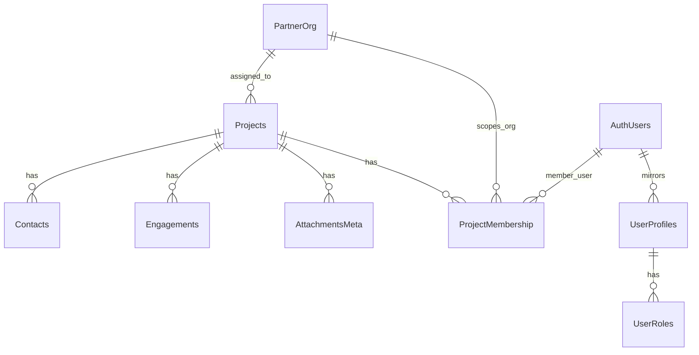
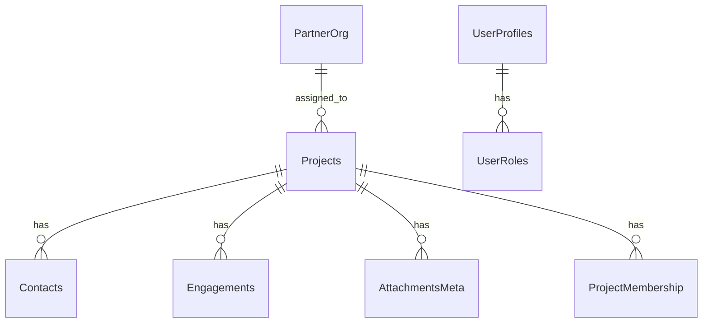

# Backend Steering Document — Projects Module (Expo + Supabase)

Audience: Product designers and Figma Make AI. Purpose: map backend data and RBAC to UI meaning and controls without SQL dumps. Traceability links point to migrations and functions for engineering.

Scope
- This covers core domain tables that drive the Projects experience: Projects, Contacts, Engagements, AttachmentsMeta, PartnerOrg, ProjectMembership, UserProfiles, UserRoles, Features. Storage policies for the attachments bucket are included. Staging and anomalies tables are excluded from UI mapping.
- Canonical sources with anchors: base schema and policies in [supabase/migrations/20250817061900_omni_bootstrap.sql:1](supabase/migrations/20250817061900_omni_bootstrap.sql:1), Stage 4 import helpers in [supabase/migrations/20250817231500_stage4_import.sql:1](supabase/migrations/20250817231500_stage4_import.sql:1), Stage 5 directory hygiene in [supabase/migrations/20250818033600_stage5_rm_directory_uniqueness.sql:1](supabase/migrations/20250818033600_stage5_rm_directory_uniqueness.sql:1), RLS standardization in [supabase/migrations/20250818050300_stage5_rls_helper_reuse.sql:1](supabase/migrations/20250818050300_stage5_rls_helper_reuse.sql:1), Stage 6 function updates in [supabase/migrations/20250820101500_stage6_functions_alignment.sql:1](supabase/migrations/20250820101500_stage6_functions_alignment.sql:1), Stage 6 field additions in [supabase/migrations/20250820100000_stage6_projects_field_alignment.sql](supabase/migrations/20250820100000_stage6_projects_field_alignment.sql).
- RBAC overview: see [docs/security/rbac-rls-review.md:1](docs/security/rbac-rls-review.md:1).

At‑a‑glance core entities
- Projects: canonical imported record; one row per Stage Application within tenant.
- Contacts, Engagements, AttachmentsMeta: user‑generated content scoped to a Project.
- PartnerOrg and normalization: Delivery Partner catalog used to display the Delivery Partner chip and scope visibility.
- ProjectMembership: materialized visibility links from a Project to Users and Orgs.
- UserProfiles, UserRoles: mirror Okta claims and determine what the UI can show or edit.
- Features: per‑tenant feature flags controlling module visibility like Projects and Attachments upload.

Mermaid ER diagram (conceptual)


Tables & Purpose
- Projects
  - What it represents: One development application owned by the Telco tenant. Most fields are synced from the spreadsheet importer; some are derived.
  - Where defined: [supabase/migrations/20250817061900_omni_bootstrap.sql:132](supabase/migrations/20250817061900_omni_bootstrap.sql:132), extended in [supabase/migrations/20250820100000_stage6_projects_field_alignment.sql](supabase/migrations/20250820100000_stage6_projects_field_alignment.sql).
- Contacts
  - Represents: Project‑scoped stakeholder records created in‑app.
  - Where defined: [supabase/migrations/20250817061900_omni_bootstrap.sql:171](supabase/migrations/20250817061900_omni_bootstrap.sql:171).
- Engagements
  - Represents: Project activity notes such as site visits, progress notes, or calls.
  - Where defined: [supabase/migrations/20250817061900_omni_bootstrap.sql:184](supabase/migrations/20250817061900_omni_bootstrap.sql:184).
- AttachmentsMeta
  - Represents: Metadata for files stored in the private attachments bucket; used to authorize reads and writes.
  - Where defined: [supabase/migrations/20250817061900_omni_bootstrap.sql:197](supabase/migrations/20250817061900_omni_bootstrap.sql:197). Storage policies: [supabase/migrations/20250817061900_omni_bootstrap.sql:453](supabase/migrations/20250817061900_omni_bootstrap.sql:453).
- PartnerOrg and PartnerNormalization
  - Represents: Canonical Delivery Partners and mapping from raw labels in imports.
  - Where defined: [supabase/migrations/20250817061900_omni_bootstrap.sql:14](supabase/migrations/20250817061900_omni_bootstrap.sql:14) and [supabase/migrations/20250817061900_omni_bootstrap.sql:22](supabase/migrations/20250817061900_omni_bootstrap.sql:22).
- DSDirectory and RMDirectory
  - Represents: Directory lookup for Deployment Specialists and Relationship Managers to resolve user IDs from import identifiers.
  - Where defined: DS [supabase/migrations/20250817061900_omni_bootstrap.sql:44](supabase/migrations/20250817061900_omni_bootstrap.sql:44), RM [supabase/migrations/20250817061900_omni_bootstrap.sql:53](supabase/migrations/20250817061900_omni_bootstrap.sql:53), uniqueness and normalized name in [supabase/migrations/20250818033600_stage5_rm_directory_uniqueness.sql:11](supabase/migrations/20250818033600_stage5_rm_directory_uniqueness.sql:11) and [supabase/migrations/20250818033600_stage5_rm_directory_uniqueness.sql:17](supabase/migrations/20250818033600_stage5_rm_directory_uniqueness.sql:17).
- ProjectMembership
  - Represents: Materialized visibility links between a Project and either a User, a PartnerOrg, or a Sub‑PartnerOrg.
  - Where defined: [supabase/migrations/20250817061900_omni_bootstrap.sql:150](supabase/migrations/20250817061900_omni_bootstrap.sql:150).
- UserProfiles and UserRoles
  - Represents: Mirror of Okta identity and role claims used by RLS and UI gating.
  - Where defined: Profiles [supabase/migrations/20250817061900_omni_bootstrap.sql:96](supabase/migrations/20250817061900_omni_bootstrap.sql:96), Roles [supabase/migrations/20250817061900_omni_bootstrap.sql:107](supabase/migrations/20250817061900_omni_bootstrap.sql:107).
- Features
  - Represents: Per‑tenant feature flags like ENABLE_PROJECTS and ENABLE_ATTACHMENTS_UPLOAD.
  - Where defined: [supabase/migrations/20250817061900_omni_bootstrap.sql:115](supabase/migrations/20250817061900_omni_bootstrap.sql:115).
- Out‑of‑scope for UI mapping
  - StagingImports: ingestion lineage; [supabase/migrations/20250817061900_omni_bootstrap.sql:211](supabase/migrations/20250817061900_omni_bootstrap.sql:211).
  - ImportAnomalies: importer diagnostics; [supabase/migrations/20250817231500_stage4_import.sql:94](supabase/migrations/20250817231500_stage4_import.sql:94).
  - ImportRetentionStats and cleanup function; [supabase/migrations/20250818043000_stage5_imports_retention.sql:13](supabase/migrations/20250818043000_stage5_imports_retention.sql:13).

Columns & UI Mapping
Projects (end‑user UI)
- stage_application: The client’s Application Number, unique within tenant. UI: read‑only label and primary identifier; searchable.
- tenant_id: The tenant owner of the project (TELCO). UI: implicit; not shown on screens.
- stage_application_created: When the application was created. UI: date label; used for sort and status logic.
- partner_org_id: Canonical Delivery Partner resolved from raw label. UI: Delivery Partner chip showing PartnerOrg.name; when null show Not Yet Assigned.
- delivery_partner_label: Raw label from import for audit. UI: not shown by default; admin QA only.
- developer_class: Normalized from class codes. UI: tag chip with Key Strategic, Managed, Inbound.
- development_type: Derived from residential and commercial counts. UI: filterable chip: Residential, Commercial, Mixed Use.
- build_type: SDU, MDU, HMDU, MCU. UI: filterable chip or dropdown on admin tools.
- address, suburb, state: Display address line as Address, Suburb State. UI: secondary line on list and Overview.
- latitude, longitude: Location coordinates. UI: link to open in maps; no inline map in MVP.
- efscd: Expected First Service Connection Date. UI: Overview date and status logic input.
- developer_design_submitted, developer_design_accepted, issued_to_delivery_partner, practical_completion_notified, practical_completion_certified, delivery_partner_pc_sub, in_service: Timeline dates. UI: Timeline rows; some feed status logic.
- premises_count, residential, commercial, essential: Integer counts. UI: counters on Overview; development_type derives from residential and commercial.
- derived_status: Computed overall status. UI: status pill with color semantics; hidden when efscd missing.
- deployment_specialist: Import field used for membership. UI: optional initials chip where appropriate; not editable.
- relationship_manager: Import field used for membership. UI: read‑only label on Overview; not editable.
- rm_preferred_username: Deprecated identifier. UI: not shown.
- created_at: System timestamp. UI: not shown.

Contacts (end‑user UI)
- project_id: Owning project. UI: hidden field on forms; set by navigation context.
- created_by: Creator user id. UI: hidden; used for edit permissions.
- name: Contact name. UI: required text field.
- phone: UI: text field with phone keypad.
- email: UI: text field with email keyboard.
- company, role: Optional descriptors. UI: text fields; appear in list secondary line when present.
- created_at, updated_at: Timestamps. UI: list ordering and internal.

Engagements (end‑user UI)
- project_id: Owning project. UI: hidden; set by context.
- created_by: Creator. UI: hidden; edit own only.
- kind: note, call, site_visit. UI: required dropdown; default note.
- body: The notes. UI: required multiline textarea.
- created_at, updated_at: Timestamps. UI: list ordering and internal.

AttachmentsMeta (end‑user UI)
- project_id: Owning project. UI: hidden.
- created_by: Uploader. UI: hidden.
- bucket: Always attachments. UI: hidden.
- object_name: Filename or path key. UI: label on card; used to authorize storage reads.
- content_type: e.g., image/jpeg, application/pdf. UI: small label and icon.
- size_bytes: File size. UI: formatted size.
- created_at: Timestamp. UI: ordering and internal.

Supporting tables (no end‑user UI; admin or system only)
- PartnerOrg: name. UI: chip label sourced from here; managed outside day‑to‑day app flows.
- PartnerNormalization: source_label → partner_org_id. UI: not shown; drives normalization during import.
- DSDirectory, RMDirectory: display_name, preferred_username, user_id. UI: not shown; resolve users during import and backfills.
- ProjectMembership: member_user_id or member_partner_org_id or member_sub_partner_org_id; one of these must be set. UI: not shown; governs visibility and write scope.
- UserProfiles: user tenant and org context. UI: not shown; read for gating.
- UserRoles: role slugs like telco_admin, dp_pm. UI: not shown; read for gating.
- Features: tenant flags like ENABLE_PROJECTS and ENABLE_ATTACHMENTS_UPLOAD. UI: used to show or hide modules.

Relationships and UI impact
- Projects has many Contacts, Engagements, and AttachmentsMeta. UI: the Project detail screen shows tabs or sections listing each.
- Projects belongs to PartnerOrg via partner_org_id. UI: show Delivery Partner chip; when null show Not Yet Assigned.
- ProjectMembership links Projects to Users and Orgs. UI: determines which projects a user can see and which projects allow UGC actions like Add Engagement.
- AttachmentsMeta authorizes actual file reads and writes in Storage for the attachments bucket. UI: only files with a matching metadata row and membership are visible.

Roles & Access RBAC in UI terms
Role slugs: vendor_admin, telco_admin, telco_pm, telco_ds, telco_rm, dp_admin, dp_pm, dp_cp. Canonical list: [docs/security/rbac-rls-review.md:351](docs/security/rbac-rls-review.md:351).
- Vendor Admin
  - Visibility: All projects across tenants.
  - UGC: Can create and manage Contacts, Engagements, and Attachments on any visible project.
  - Admin corrections: May edit certain project fields where allowed by policy.
- Telco Tenant Admin
  - Visibility: All projects within the telco tenant.
  - UGC: Yes on any telco project. May assign Delivery Partner org and DS users via admin paths.
- Telco Tenant Program Manager
  - Visibility: All projects within the telco tenant.
  - UGC: Yes on any telco project. May assign DS users; org assignment may require admin approval.
- Telco Deployment Specialist
  - Visibility: Only projects where they are assigned via membership.
  - UGC: Yes on assigned projects; cannot reassign projects.
- Telco Relationship Manager
  - Visibility: Only projects explicitly assigned via membership.
  - UGC: Yes on assigned projects; cannot reassign.
- Delivery Partner Admin and Program Manager
  - Visibility: Projects assigned to their org or subcontractors they manage.
  - UGC: Yes on visible projects; may allocate to subcontractors within their tenant.
- Delivery Partner Construction Partner
  - Visibility: Projects assigned to their subcontractor org.
  - UGC: Can add Contacts, Engagements, and Attachments on those projects; cannot reassign.

Important business rules and constraints translated to UI
- Visibility helper function gates reads by membership and roles: [public.using_rls_for_project(uuid)](supabase/migrations/20250817061900_omni_bootstrap.sql:255).
  - UI implication: If a Project does not appear in a list, the user lacks membership or tenant scope; do not show controls to fetch it.
- Projects unique key: one row per tenant_id + stage_application. See unique index setup in [supabase/migrations/20250817231500_stage4_import.sql:82](supabase/migrations/20250817231500_stage4_import.sql:82).
  - UI implication: Stage Application is the stable external identifier; use it for deep linking and search.
- ProjectMembership exclusivity: each membership row sets exactly one of member_user_id, member_partner_org_id, member_sub_partner_org_id; enforced by a check constraint at [supabase/migrations/20250817061900_omni_bootstrap.sql:158](supabase/migrations/20250817061900_omni_bootstrap.sql:158).
  - UI implication: Assignment UI should clearly choose one type of assignment per row.
- UGC creator guard: inserts must set created_by to the current user and users may update or delete only their own rows when permitted. Policies: Contacts [select](supabase/migrations/20250817061900_omni_bootstrap.sql:345) [insert](supabase/migrations/20250817061900_omni_bootstrap.sql:352) [update](supabase/migrations/20250817061900_omni_bootstrap.sql:359) [delete](supabase/migrations/20250817061900_omni_bootstrap.sql:367); Engagements [select](supabase/migrations/20250817061900_omni_bootstrap.sql:375) [insert](supabase/migrations/20250817061900_omni_bootstrap.sql:382) [update](supabase/migrations/20250817061900_omni_bootstrap.sql:389) [delete](supabase/migrations/20250817061900_omni_bootstrap.sql:397); AttachmentsMeta [select](supabase/migrations/20250817061900_omni_bootstrap.sql:405) [insert](supabase/migrations/20250817061900_omni_bootstrap.sql:412) [update](supabase/migrations/20250817061900_omni_bootstrap.sql:419) [delete](supabase/migrations/20250817061900_omni_bootstrap.sql:427).
  - UI implication: Hide Edit/Delete except for the creator or allowed admins; show Add only when the user has project membership.
- Storage authorization: storage.objects read, insert, delete policies are tied to AttachmentsMeta and membership: [read](supabase/migrations/20250817061900_omni_bootstrap.sql:455) [insert](supabase/migrations/20250817061900_omni_bootstrap.sql:471) [delete](supabase/migrations/20250817061900_omni_bootstrap.sql:489).
  - UI implication: Upload flow must create metadata first, then upload; previews list only files backed by metadata and visible via membership.
- Derived fields and normalization live on the server:
  - Developer Class normalization: [fn_normalize_developer_class(text)](supabase/migrations/20250817231500_stage4_import.sql:153).
  - Partner label mapping: [fn_partner_org_from_label(text)](supabase/migrations/20250817231500_stage4_import.sql:173).
  - Directory lookups for DS and RM: [fn_find_ds_user_id(text)](supabase/migrations/20250817231500_stage4_import.sql:194), [fn_find_rm_user_id(text,text)](supabase/migrations/20250817231500_stage4_import.sql:210).
  - Import checksum and merge: [fn_rows_checksum(jsonb)](supabase/migrations/20250820101500_stage6_functions_alignment.sql:38), [fn_projects_import_merge(text,text,text,jsonb,uuid)](supabase/migrations/20250820101500_stage6_functions_alignment.sql:101).
  - UI implication: Do not compute these on the client; render values as provided by the API.
- RM directory hygiene: normalized display names and active uniqueness to avoid ambiguous assignments: [supabase/migrations/20250818033600_stage5_rm_directory_uniqueness.sql:11](supabase/migrations/20250818033600_stage5_rm_directory_uniqueness.sql:11).
  - UI implication: When showing or selecting Relationship Manager names, rely on canonical directory values.
- Feature flags gate modules: Features table and RLS permit reading flags for the current tenant at [supabase/migrations/20250817061900_omni_bootstrap.sql:435](supabase/migrations/20250817061900_omni_bootstrap.sql:435).
  - UI implication: Hide Projects or Upload CTAs when flags are disabled; rely on RLS for enforcement.

Sample Data for UI prototyping
Note: IDs are illustrative. Use these for Figma data fills and AI generation.

projects
```json
[
  {
    "id": "aaaaaaaa-aaaa-aaaa-aaaa-aaaaaaaaaaaa",
    "tenant_id": "TELCO",
    "stage_application": "STG-2024-0001",
    "stage_application_created": "2024-06-12T03:10:00Z",
    "partner_org_id": "aaaaaaaa-0000-0000-0000-000000000001",
    "delivery_partner_label": "Fulton Hogan",
    "developer_class": "Managed",
    "development_type": "Residential",
    "build_type": "MDU",
    "address": "12 Main St",
    "suburb": "Adelaide",
    "state": "SA",
    "latitude": -34.9285,
    "longitude": 138.6007,
    "efscd": "2024-12-01",
    "developer_design_accepted": "2024-08-01",
    "issued_to_delivery_partner": "2024-09-15",
    "practical_completion_notified": null,
    "practical_completion_certified": null,
    "delivery_partner_pc_sub": null,
    "in_service": null,
    "premises_count": 120,
    "residential": 120,
    "commercial": 0,
    "essential": 0,
    "derived_status": "In Progress"
  },
  {
    "id": "bbbbbbbb-bbbb-bbbb-bbbb-bbbbbbbbbbbb",
    "tenant_id": "TELCO",
    "stage_application": "STG-2024-0002",
    "stage_application_created": "2024-05-01T00:00:00Z",
    "partner_org_id": "aaaaaaaa-0000-0000-0000-000000000002",
    "delivery_partner_label": "Ventia",
    "developer_class": "Key Strategic",
    "development_type": "Mixed Use",
    "build_type": "HMDU",
    "address": "8 Riverside Ave",
    "suburb": "Parramatta",
    "state": "NSW",
    "latitude": -33.8150,
    "longitude": 151.0011,
    "efscd": "2024-10-15",
    "developer_design_accepted": "2024-06-20",
    "issued_to_delivery_partner": "2024-07-10",
    "practical_completion_notified": "2024-09-28",
    "practical_completion_certified": "2024-10-10",
    "delivery_partner_pc_sub": "2024-10-08",
    "in_service": "2024-11-05",
    "premises_count": 80,
    "residential": 60,
    "commercial": 20,
    "essential": 0,
    "derived_status": "Complete Overdue"
  },
  {
    "id": "cccccccc-cccc-cccc-cccc-cccccccccccc",
    "tenant_id": "TELCO",
    "stage_application": "STG-2024-0003",
    "stage_application_created": "2024-07-20T00:00:00Z",
    "partner_org_id": null,
    "delivery_partner_label": "Unassigned",
    "developer_class": "Inbound",
    "development_type": null,
    "build_type": "SDU",
    "address": "45 Ocean Rd",
    "suburb": "Cottesloe",
    "state": "WA",
    "latitude": -31.9945,
    "longitude": 115.7513,
    "efscd": "2024-12-20",
    "developer_design_accepted": null,
    "issued_to_delivery_partner": null,
    "practical_completion_notified": null,
    "practical_completion_certified": null,
    "delivery_partner_pc_sub": null,
    "in_service": null,
    "premises_count": 30,
    "residential": 0,
    "commercial": 0,
    "essential": 0,
    "derived_status": "In Progress - Overdue"
  }
]
```

contacts
```json
[
  {
    "id": "d1d1d1d1-1111-1111-1111-111111111111",
    "project_id": "aaaaaaaa-aaaa-aaaa-aaaa-aaaaaaaaaaaa",
    "created_by": "00000000-0000-0000-0000-000000000001",
    "name": "Alex Chen",
    "company": "City Developments",
    "role": "Project Lead",
    "phone": "+61 412 345 678",
    "email": "alex.chen@example.com",
    "created_at": "2024-07-01T04:10:00Z"
  },
  {
    "id": "e2e2e2e2-2222-2222-2222-222222222222",
    "project_id": "bbbbbbbb-bbbb-bbbb-bbbb-bbbbbbbbbbbb",
    "created_by": "00000000-0000-0000-0000-000000000003",
    "name": "Priya Singh",
    "company": "Ventia",
    "role": "DP PM",
    "phone": "+61 433 222 333",
    "email": "priya.singh@ventia.com",
    "created_at": "2024-07-15T01:00:00Z"
  }
]
```

engagements
```json
[
  {
    "id": "f3f3f3f3-3333-3333-3333-333333333333",
    "project_id": "aaaaaaaa-aaaa-aaaa-aaaa-aaaaaaaaaaaa",
    "created_by": "00000000-0000-0000-0000-000000000001",
    "kind": "site_visit",
    "body": "Site inspected. Trenching 40 percent complete.",
    "created_at": "2024-08-02T00:30:00Z"
  },
  {
    "id": "a4a4a4a4-4444-4444-4444-444444444444",
    "project_id": "bbbbbbbb-bbbb-bbbb-bbbb-bbbbbbbbbbbb",
    "created_by": "00000000-0000-0000-0000-000000000003",
    "kind": "progress_note",
    "body": "PCC scheduled for 10 Oct; evidence prepared.",
    "created_at": "2024-09-25T06:20:00Z"
  }
]
```

attachments_meta
```json
[
  {
    "id": "aa11aa11-aaaa-1111-aaaa-1111aaaa1111",
    "project_id": "aaaaaaaa-aaaa-aaaa-aaaa-aaaaaaaaaaaa",
    "created_by": "00000000-0000-0000-0000-000000000001",
    "bucket": "attachments",
    "object_name": "TELCO/STG-2024-0001/20240802-site-photo.jpg",
    "content_type": "image/jpeg",
    "size_bytes": 1456320,
    "created_at": "2024-08-02T00:31:00Z"
  },
  {
    "id": "bb22bb22-bbbb-2222-bbbb-2222bbbb2222",
    "project_id": "bbbbbbbb-bbbb-bbbb-bbbb-bbbbbbbbbbbb",
    "created_by": "00000000-0000-0000-0000-000000000003",
    "bucket": "attachments",
    "object_name": "TELCO/STG-2024-0002/20241010-pcc-certificate.pdf",
    "content_type": "application/pdf",
    "size_bytes": 804321,
    "created_at": "2024-10-10T05:15:00Z"
  }
]
```

partner_org
```json
[
  { "id": "aaaaaaaa-0000-0000-0000-000000000001", "name": "Fulton Hogan" },
  { "id": "aaaaaaaa-0000-0000-0000-000000000002", "name": "Ventia" },
  { "id": "aaaaaaaa-0000-0000-0000-000000000003", "name": "UGL" }
]
```

user_profiles
```json
[
  {
    "user_id": "00000000-0000-0000-0000-000000000001",
    "okta_sub": "okta:telco:ds:1",
    "okta_user_id": "ds.alex",
    "tenant_id": "TELCO",
    "partner_org_id": null,
    "sub_partner_org_id": null
  },
  {
    "user_id": "00000000-0000-0000-0000-000000000003",
    "okta_sub": "okta:dp:pm:1",
    "okta_user_id": "pm.priya",
    "tenant_id": "DP_VENTIA",
    "partner_org_id": "aaaaaaaa-0000-0000-0000-000000000002",
    "sub_partner_org_id": null
  }
]
```

user_roles
```json
[
  { "user_id": "00000000-0000-0000-0000-000000000001", "role": "telco_ds" },
  { "user_id": "00000000-0000-0000-0000-000000000003", "role": "dp_pm" }
]
```

project_membership
```json
[
  {
    "project_id": "aaaaaaaa-aaaa-aaaa-aaaa-aaaaaaaaaaaa",
    "member_user_id": "00000000-0000-0000-0000-000000000001",
    "member_partner_org_id": null,
    "member_sub_partner_org_id": null
  },
  {
    "project_id": "bbbbbbbb-bbbb-bbbb-bbbb-bbbbbbbbbbbb",
    "member_partner_org_id": "aaaaaaaa-0000-0000-0000-000000000002",
    "member_user_id": null,
    "member_sub_partner_org_id": null
  }
]
```

Traceability index
- RLS helper: [public.using_rls_for_project(uuid)](supabase/migrations/20250817061900_omni_bootstrap.sql:255).
- Projects base DDL: [supabase/migrations/20250817061900_omni_bootstrap.sql:132](supabase/migrations/20250817061900_omni_bootstrap.sql:132). Field additions: [supabase/migrations/20250820100000_stage6_projects_field_alignment.sql](supabase/migrations/20250820100000_stage6_projects_field_alignment.sql).
- UGC tables: Contacts [supabase/migrations/20250817061900_omni_bootstrap.sql:171](supabase/migrations/20250817061900_omni_bootstrap.sql:171), Engagements [supabase/migrations/20250817061900_omni_bootstrap.sql:184](supabase/migrations/20250817061900_omni_bootstrap.sql:184), AttachmentsMeta [supabase/migrations/20250817061900_omni_bootstrap.sql:197](supabase/migrations/20250817061900_omni_bootstrap.sql:197).
- Storage policies: read [supabase/migrations/20250817061900_omni_bootstrap.sql:455](supabase/migrations/20250817061900_omni_bootstrap.sql:455), insert [supabase/migrations/20250817061900_omni_bootstrap.sql:471](supabase/migrations/20250817061900_omni_bootstrap.sql:471), delete [supabase/migrations/20250817061900_omni_bootstrap.sql:489](supabase/migrations/20250817061900_omni_bootstrap.sql:489).
- Import helpers: normalize name [supabase/migrations/20250817231500_stage4_import.sql:138](supabase/migrations/20250817231500_stage4_import.sql:138), developer class [supabase/migrations/20250817231500_stage4_import.sql:153](supabase/migrations/20250817231500_stage4_import.sql:153), partner mapping [supabase/migrations/20250817231500_stage4_import.sql:173](supabase/migrations/20250817231500_stage4_import.sql:173), DS lookup [supabase/migrations/20250817231500_stage4_import.sql:194](supabase/migrations/20250817231500_stage4_import.sql:194), RM lookup [supabase/migrations/20250817231500_stage4_import.sql:210](supabase/migrations/20250817231500_stage4_import.sql:210).
- Import checksum and merge: rows checksum [supabase/migrations/20250820101500_stage6_functions_alignment.sql:38](supabase/migrations/20250820101500_stage6_functions_alignment.sql:38), merge RPC [supabase/migrations/20250820101500_stage6_functions_alignment.sql:101](supabase/migrations/20250820101500_stage6_functions_alignment.sql:101).
- RM directory normalized uniqueness: [supabase/migrations/20250818033600_stage5_rm_directory_uniqueness.sql:11](supabase/migrations/20250818033600_stage5_rm_directory_uniqueness.sql:11).
- RBAC reference doc: [docs/security/rbac-rls-review.md:1](docs/security/rbac-rls-review.md:1).

End of document.
## Condensed UI‑first Cheat Sheet — Projects Module (Expo + Supabase)

Audience: Senior AI Figma designer. Goal: map UI to backend quickly. Engineering details via traceability links below.

Core entities
- Projects (single source per Stage Application)
- Contacts, Engagements, AttachmentsMeta (UGC per Project)
- PartnerOrg (Delivery Partner catalog)
- ProjectMembership (visibility links to Users/Orgs)
- UserProfiles, UserRoles (identity and RBAC)
- Features (tenant feature flags)

Compact ER diagram


UI‑to‑field mapping (essentials only)
- Projects
  - stage_application: read‑only primary label; searchable
  - address, suburb, state: secondary line
  - partner_org_id: Delivery Partner chip from PartnerOrg.name; null → Not Yet Assigned
  - developer_class: chip (Key Strategic, Managed, Inbound)
  - development_type, build_type: filter chips
  - efscd: date label; feeds status
  - timeline dates (submitted, accepted, issued, pcn, pcc, dp_pc_sub, in_service): show as timeline rows
  - premises_count, residential, commercial, essential: counters; development_type derives from counts
  - derived_status: status pill; hide when efscd missing
  - deployment_specialist, relationship_manager: read‑only context for membership; not editable
- Contacts
  - project_id: hidden (from nav context)
  - created_by: hidden; gates edit
  - name (required), phone, email, company, role
- Engagements
  - project_id, created_by: hidden
  - kind: note, call, site_visit (default note)
  - body (required)
- AttachmentsMeta
  - object_name: filename label
  - content_type: icon/label, size_bytes: formatted size, created_at: ordering
  - project_id, created_by, bucket: hidden

Relationships and UI impact
- Project detail shows tabs for Contacts, Engagements, Attachments
- Delivery Partner chip comes from PartnerOrg; null shows Not Yet Assigned
- ProjectMembership controls visibility and UGC permissions per user/org
- Attachments visible only when metadata exists and membership allows access

Minimal RBAC summary (UI terms)
- vendor_admin: all tenants; UGC on any visible project
- telco_admin, telco_pm: all telco projects; UGC; assign DS; admin may assign org
- telco_ds, telco_rm: only assigned projects; UGC on assigned
- dp_admin, dp_pm: projects for their org and managed subs; UGC
- dp_cp: subcontractor projects only; UGC on visible

Key rules → UI implications
- Visibility is gated by [public.using_rls_for_project(uuid)](supabase/migrations/20250817061900_omni_bootstrap.sql:255)
  - If a project is not visible, do not show fetch or UGC controls
- Unique key tenant_id + stage_application
  - Use stage_application for deep links and stable search
- ProjectMembership exclusivity
  - Each row targets exactly one of user, partner_org, sub_partner_org; reflect this in assignment UI
- Storage flow
  - Create AttachmentsMeta first, then upload; list only files with metadata and membership
- Server‑derived and normalized fields
  - Do not compute on client; render values from API
- Feature flags
  - Hide Projects and Upload CTAs when flags disabled; RLS enforces server‑side

Sample data for prototyping (trimmed)
Note: IDs illustrative. One example per dataset, then ellipses.

projects
```json
[
  {
    "id": "aaaaaaaa-aaaa-aaaa-aaaa-aaaaaaaaaaaa",
    "tenant_id": "TELCO",
    "stage_application": "STG-2024-0001",
    "stage_application_created": "2024-06-12T03:10:00Z",
    "partner_org_id": "aaaaaaaa-0000-0000-0000-000000000001",
    "delivery_partner_label": "Fulton Hogan",
    "developer_class": "Managed",
    "development_type": "Residential",
    "build_type": "MDU",
    "address": "12 Main St",
    "suburb": "Adelaide",
    "state": "SA",
    "latitude": -34.9285,
    "longitude": 138.6007,
    "efscd": "2024-12-01",
    "developer_design_accepted": "2024-08-01",
    "issued_to_delivery_partner": "2024-09-15",
    "practical_completion_notified": null,
    "practical_completion_certified": null,
    "delivery_partner_pc_sub": null,
    "in_service": null,
    "premises_count": 120,
    "residential": 120,
    "commercial": 0,
    "essential": 0,
    "derived_status": "In Progress"
  },
  ...
]
```

contacts
```json
[
  {
    "id": "d1d1d1d1-1111-1111-1111-111111111111",
    "project_id": "aaaaaaaa-aaaa-aaaa-aaaa-aaaaaaaaaaaa",
    "created_by": "00000000-0000-0000-0000-000000000001",
    "name": "Alex Chen",
    "company": "City Developments",
    "role": "Project Lead",
    "phone": "+61 412 345 678",
    "email": "alex.chen@example.com",
    "created_at": "2024-07-01T04:10:00Z"
  },
  ...
]
```

engagements
```json
[
  {
    "id": "f3f3f3f3-3333-3333-3333-333333333333",
    "project_id": "aaaaaaaa-aaaa-aaaa-aaaa-aaaaaaaaaaaa",
    "created_by": "00000000-0000-0000-0000-000000000001",
    "kind": "site_visit",
    "body": "Site inspected. Trenching 40 percent complete.",
    "created_at": "2024-08-02T00:30:00Z"
  },
  ...
]
```

attachments_meta
```json
[
  {
    "id": "aa11aa11-aaaa-1111-aaaa-1111aaaa1111",
    "project_id": "aaaaaaaa-aaaa-aaaa-aaaa-aaaaaaaaaaaa",
    "created_by": "00000000-0000-0000-0000-000000000001",
    "bucket": "attachments",
    "object_name": "TELCO/STG-2024-0001/20240802-site-photo.jpg",
    "content_type": "image/jpeg",
    "size_bytes": 1456320,
    "created_at": "2024-08-02T00:31:00Z"
  },
  ...
]
```

partner_org
```json
[
  { "id": "aaaaaaaa-0000-0000-0000-000000000001", "name": "Fulton Hogan" },
  ...
]
```

user_profiles
```json
[
  {
    "user_id": "00000000-0000-0000-0000-000000000001",
    "okta_sub": "okta:telco:ds:1",
    "okta_user_id": "ds.alex",
    "tenant_id": "TELCO",
    "partner_org_id": null,
    "sub_partner_org_id": null
  },
  ...
]
```

user_roles
```json
[
  { "user_id": "00000000-0000-0000-0000-000000000001", "role": "telco_ds" },
  ...
]
```

project_membership
```json
[
  {
    "project_id": "aaaaaaaa-aaaa-aaaa-aaaa-aaaaaaaaaaaa",
    "member_user_id": "00000000-0000-0000-0000-000000000001",
    "member_partner_org_id": null,
    "member_sub_partner_org_id": null
  },
  ...
]
```

Traceability essentials
- RLS helper function: [public.using_rls_for_project(uuid)](supabase/migrations/20250817061900_omni_bootstrap.sql:255)
- Projects DDL: [supabase/migrations/20250817061900_omni_bootstrap.sql:132](supabase/migrations/20250817061900_omni_bootstrap.sql:132)
- Storage read policy: [supabase/migrations/20250817061900_omni_bootstrap.sql:455](supabase/migrations/20250817061900_omni_bootstrap.sql:455)
- RBAC canonical list: [docs/security/rbac-rls-review.md:351](docs/security/rbac-rls-review.md:351)

End of condensed cheat sheet.