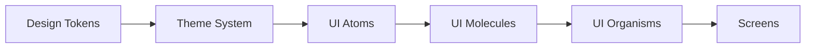

# Omnivia UI and UX Steering Guide
Version 1.2

Purpose
- This document defines the overarching UI and UX philosophy for Omnivia. It guides how we choose colors, typography, spacing, motion, and interaction patterns across every screen and component. It is the single source of truth for designers and engineers to ensure the product feels sleek, minimalist, premium, and consistently iOS-native in spirit.

Scope
- Mobile-first React Native application using modern iOS design conventions.
- Applies to all front-end elements including navigation, forms, cards, system feedback, motion, and component states.
- Compatible with a token-driven theme system (Unistyles), supporting light and dark modes.

---

## 1. Design Philosophy

Principles
- Sleek and minimalist: remove the non-essential, emphasize clarity and confident whitespace.
- Premium feel: refined color, typography, and motion with a calm, trustworthy tone.
- iOS-native: follow Apple’s Human Interface Guidelines (HIG) for spacing, hierarchy, and motion principles.
- Consistency: use the same tokens, spacing, radii, shadows, and motion across all screens.
- Accessibility-first: maintain legibility and contrast; respect platform accessibility settings including reduced motion.
- Responsiveness: layouts adapt gracefully across device sizes and orientations.

Experience Tenets
- Immediate legibility: content and actions should be scannable at a glance.
- Single-focus screens: minimize simultaneous competing actions; progressive disclosure for complexity.
- Calm motion: motion supports comprehension and context, never distracts.
- Honest feedback: responsive interactions with visual, motion, and haptic confirmation.

## 1.1 iPhone-first Baseline

Defaults
- Base device width: 390 pt first; support 320–430 pt.
- Grid and gutters: keep 4-pt scale; default horizontal gutter 20 pt on 375–430 pt, 16 pt on 320 pt.

Safe Areas and Reachability
- Always respect top and bottom safe areas including Dynamic Island and the home indicator.
- Define a bottom action area for primary CTAs; minimum bottom inset 24 pt from the home indicator.

Navigation
- Top-level screens use large titles that collapse on scroll.
- Deeper stack screens use compact titles; back affordance visible and reachable.
- Integrate search in the navigation area for content-dense screens where appropriate.

Gestures
- Edge-swipe back is enabled throughout unless it conflicts with critical interactions.
- Lists support pull-to-refresh and swipe actions with clear visual feedback.

Sheets and Modals
- Prefer sheet presentations for tasks and editors, with medium and large detents and a visible grabber.
- Use a blurred background and a soft dim; drag to dismiss where safe.

Context Menus
- Long-press context menus are the default for secondary actions on list rows, cards, and media.

Motion and Haptics
- Transitions are calm and spring-based; durations follow motion tokens.
- Map selection, success, warning, error, and destructive confirmations to distinct haptics; respect reduced motion.

Keyboard
- Forms provide a pinned footer with the primary action above the keyboard; "Next" and "Done" navigation between fields; avoid content being obscured.

Diagram: iPhone layout zones
```mermaid
flowchart TB
Top[Safe area top]
Nav[Large title navigation]
Body[Scrollable content]
CTA[Bottom action area (min 24 pt above home indicator)]
Bottom[Safe area bottom]
Top --> Nav --> Body --> CTA --> Bottom
```

## 1.2 Android Compatibility Notes

- Do not emulate Dynamic Island on Android; use standard ongoing notifications and system surfaces.
- Respect status and navigation bars and safe insets; maintain minimum 48 dp touch targets.
- Reserve edge-swipe back for iOS; on Android rely on system back and avoid gesture conflicts with horizontal carousels.
- Bottom sheets, large-title styling, and context menus may appear on Android but should follow Material expectations where appropriate; presentation may differ while flows remain identical.

---

## 2. Brand and Theme

Colors
- Primary (Brand Anchor): Tech Navy #0D2E52
  - Usage: headers, primary surfaces in dark contexts, key text on light surfaces, emphasis backgrounds.
- Primary Alt (Brand Navy Alt): #184873
  - Usage: large header bands, elevated dark cards, and navigation chrome in light mode to reduce visual weight; complements primary.
- Secondary (Base Surface): Porcelain #F2F4F7
  - Usage: light-mode app background, cards, and neutral surfaces for a crisp, modern neutral with a slight cool tint.
- Accent (Action and Focus): iOS Blue #007AFF
  - Justification: iOS-native accent that pairs well with tech navy and cool neutrals, evokes clarity and modernity.
  - Usage: primary call-to-action, focused input states, active navigation, links.
  - Dark-mode support: lighten accent for dark surfaces when needed (for example ~ #4DA3FF) to preserve contrast.
- Neutral Palette (Text, Dividers, Shadows)
  - Gray 50  #F7F8FA
  - Gray 100 #EEF1F5
  - Gray 200 #E3E8EF
  - Gray 300 #CDD5DF
  - Gray 400 #9AA4B2
  - Gray 500 #697586
  - Gray 600 #4B5565
  - Gray 700 #364152
  - Gray 800 #202939
  - Gray 900 #0F172A
- Semantic Colors
  - Success #22C55E
  - Warning #F59E0B
  - Danger  #EF4444
  - Info    #0EA5E9

Typography
- Font family: SF Pro as primary; system default fallback if unavailable. Prefer SF Pro Text for body, SF Pro Display for headings.
- Weights
  - Headings: Bold or Semibold
  - Body: Regular or Medium
- Type ramp (sizes in points; line heights aim for ~1.3 to 1.45)
  - Display: 34
  - H1: 28
  - H2: 24
  - H3: 20
  - H4: 18
  - Body Large: 17
  - Body: 15
  - Caption: 13
  - Overline: 11 (use sparingly)
- Accessibility: support Dynamic Type. Respect system font scaling and avoid hard caps where possible.

Spacing and Shape
- Grid: 4-pt base across all spacing and sizing.
- Spacing Tokens (example scale, in pt)
  - 0, 2, 4, 8, 12, 16, 20, 24, 32, 40, 48, 56, 64
- Radius Tokens (rounded corners)
  - sm 8
  - md 12
  - lg 16
  - xl 20
  - Cards, modals, and buttons typically use md to lg per requirement range 12–16.
- Whitespace: generous spacing between groups of content to minimize cognitive load.

Surfaces
- Light mode
  - Background: Porcelain #F2F4F7
  - Card: White or near-white with subtle shadow
  - Elevated surfaces: subtle elevation with soft shadow
- Dark mode
  - Background: Tech Navy #0D2E52 or a near-navy tone
  - Card: Slightly lighter navy or very dark gray
  - Shadows: replace with overlays and subtle borders for clarity

---

## 3. UI Elements

Buttons
- Types
  - Primary: Accent background, white label
  - Secondary: Subtle background (Gray 100 or 200), Accent or Navy label
  - Tertiary: Text-only with Accent label
  - Destructive: Danger background, white label
  - Ghost: Transparent background, Accent label with increased touch target
- Sizes
  - Large: height 56, radius 16, spacing 16–20 horizontal
  - Medium: height 48, radius 16, spacing 16 horizontal
  - Small: height 40, radius 12, spacing 12–16 horizontal
- States
  - Default: defined by type
  - Hover and Pressed: darken or lighten background by one step; add subtle scale 0.98 on press
  - Disabled: reduce opacity to ~40 to 50 percent and remove shadow
  - Loading: show spinner; preserve button width to avoid layout shift
- Shadows: subtle for elevation; blur 12 to 16, low y-offset; keep premium and soft

Inputs and Forms
- Text fields
  - Label always present above the field
  - Placeholder is informative but not a substitute for labels
  - Focus: glow ring using Accent; subtle shadow or border emphasis
  - Validation: error state uses Danger color for border and helper text
- Controls
  - Switches: reflect accent for on state; clear contrast on dark mode
  - Radio and Checkbox: accessible hit area at least 44x44
- Helper Text
  - Use concise, plain language
  - Reserve red color for errors only

Cards
- Structure
  - Radius: md to lg
  - Padding: 16 to 24
  - Shadow: soft and shallow with low spread; avoid harsh dark shadows
  - Dividers: Gray 100 to 200 for grouping
- Content Hierarchy
  - Primary title, supporting text, primary action; optional metadata row

Navigation
- Bottom Tab Bar
  - 3 to 5 tabs recommended
  - Icon size 24; labels Body or Caption depending on space
  - Active: Accent color; Inactive: Gray 500 to 600
  - Use safe area padding and avoid crowding
- Stacks and Presentation
  - Push transitions are horizontal
  - Modals present vertically with sheet behavior when appropriate

### iOS Component Patterns

Large-Title Navigation
- Large titles on the first screen of each tab; collapse to compact on scroll with smooth motion.
- Optional inline search in the navigation area for list-heavy screens.

Lists
- Pull-to-refresh with spinner.
- Swipe actions on rows with clear labels and haptic feedback on commit.

Sheets
- Use medium and large detents; grabber visible; rounded top corners; drag-to-dismiss where safe.

Context Menus
- Long-press to show context menus for secondary actions instead of inline overflow buttons.

Date and Time
- Wheel selector for quick picks; inline calendar for range selection.

Keyboard
- Form action footer pinned above the keyboard; tap outside to dismiss where safe.

Modals and Sheets
- Blur background with react-native-blur
- Rounded corners lg for sheet top
- Gestures
  - Swipe to dismiss when safe; provide clear affordances
- Elevation
  - Dim backdrop 40 to 60 percent; use content drop shadow sparingly
- Transitions
  - Smooth slide-up or fade-in 180 to 240 ms

Icons
- Ionicons via @expo/vector-icons for parity and coverage
- Sizes
  - Standard 24
  - Dense 18
  - Emphasis 28
- Style
  - Keep stroke or glyph style consistent within a context
  - Avoid mixing filled and outline styles in one cluster unless intentional for states

Lists and Empty States
- Lists
  - Use consistent item height and spacing; truncation rules: single-line primary text where possible
- Empty States
  - Friendly illustration or icon plus single-action CTA
  - Tone is encouraging and concise
  - Optional Lottie animation kept subtle and performant

---

## 4. Interaction and Motion

Motion Principles
- Motion clarifies structure and maintains spatial continuity
- Duration ramps use short, confident timings to feel responsive

Durations (milliseconds)
- xfast 120
- fast 180
- standard 240
- slow 320
- xslow 400 (use sparingly)

Easing Curves
- Standard: cubic-bezier 0.2, 0.8, 0.2, 1
- Decelerate in: 0, 0, 0.2, 1
- Accelerate out: 0.4, 0, 1, 1
- Prefer spring transitions for sheet and bottom tab interactions with gentle overshoot

Micro-animations
- Use Lottie for success, loading, and illustrative moments
- Keep file sizes small and loops subtle; avoid high-contrast flicker

Feedback and Haptics
- Selection: light
- Success: notificationSuccess
- Warning: notificationWarning
- Error: notificationError
- Destructive confirmations: heavy impact
- Respect user settings and throttle repetitive haptics

Gestures
- Swipe actions on list items with clear visual feedback
- Pull-to-refresh: show spinner and optional subtle stretch effect
- Avoid gesture conflicts; prioritize platform-expected patterns

Reduced Motion
- If reduced motion is enabled, swap transitions to simple fades and instant state changes

---

## 5. Theming and Styling System

Approach
- Token-first design using Unistyles for theming and responsive styling
- Support light and dark themes with the same token names mapping to different values per mode
- Component states resolved through tokenized state layers

Token Categories
- Color tokens: brand, accent, neutrals, semantic, surface, border, overlay
- Typography tokens: font families, sizes, weights, line heights, letter spacing
- Spacing tokens: margins, paddings, gaps on a 4-pt scale
- Shape tokens: radii, border widths
- Elevation tokens: shadows and overlays by level
- Motion tokens: durations and easings
- State tokens: hover, pressed, focus, disabled

Naming Conventions
- color.brand.primary
- color.accent.default and color.accent.onAccent
- color.text.primary, color.text.secondary, color.text.muted, color.text.inverted
- surface.background, surface.card, surface.elevated
- border.default, border.muted
- radius.sm, radius.md, radius.lg, radius.xl
- space.0 to space.64
- motion.duration.fast, motion.easing.standard
- state.focus.ring, state.pressed.overlay

Light and Dark Modes
- Same semantic token names across modes for easy switching
- Ensure accessible contrast in both modes, including accent on dark surfaces
- Use overlays in dark mode where shadows are less visible

Implementation Notes
- Apply tokens consistently in shared UI primitives first, then in feature screens
- Reference existing UI components and layer tokens in them
  - Button: [components/ui/button.tsx](components/ui/button.tsx)
  - Input: [components/ui/input.tsx](components/ui/input.tsx)
  - Text and Typography: [components/ui/text.tsx](components/ui/text.tsx), [components/ui/typography.tsx](components/ui/typography.tsx)
  - Form and Label: [components/ui/form.tsx](components/ui/form.tsx), [components/ui/label.tsx](components/ui/label.tsx)
  - Radio Group: [components/ui/radio-group.tsx](components/ui/radio-group.tsx)
  - Switch: [components/ui/switch.tsx](components/ui/switch.tsx)
  - Safe Area: [components/safe-area-view.tsx](components/safe-area-view.tsx)
  - Layout shells: [app/(public)/_layout.tsx](app/(public)/_layout.tsx), [app/(protected)/(tabs)/_layout.tsx](app/(protected)/(tabs)/_layout.tsx)
  - Color constants anchor: [constants/colors.ts](constants/colors.ts)
- Gradual adoption is acceptable; prioritize foundational components and layout scaffolds

Responsive Behavior
- Respect device safe areas
- Allow content width to breathe on tablets; cap line lengths for legibility

---

## 6. Tech and Packages

- Unistyles: theming and responsive styling based on tokens
- react-native-reanimated: performant transitions, shared values, and gestures
- react-native-haptic-feedback: consistent tactile feedback mappings
- react-native-blur: premium iOS blur for modals and contextual overlays
- @expo/vector-icons (Ionicons): cohesive iconography
- Lottie: micro-animations; keep assets optimized
- iOS context menus: adopt a native iOS context menu library for long-press secondary actions (for example react-native-ios-context-menu); gate usage to iOS
- Bottom sheet: standardize on @gorhom/bottom-sheet with iOS-style detents and grabber
- SF Symbols: prefer SF Symbols on iOS with Ionicons fallback policy

Performance Guidance
- Aim for 60 fps on transitions
- Avoid blocking the JS thread on heavy interactions
- Defer non-critical animations and lazy-load heavy assets

---

## 7. Tone and Experience

Tone
- Professional, modern, approachable
- Confident and concise copy; avoid jargon and excessive exclamation

Experience
- Fluid, calm, trustworthy
- Never overwhelming; progressive disclosure and focused screens
- Positive microcopy that guides users to next best action

Content Guidelines
- Sentence case for labels and buttons
- Primary actions use verbs and clarity
- Error messages state the problem and how to resolve it

---

## Appendix A. Token Catalog v1.0

Color Tokens
- color.brand.primary: #0D2E52
- color.brand.primaryAlt: #184873
- color.brand.onPrimary: #FFFFFF
- color.accent.default: #007AFF
- color.accent.onAccent: #FFFFFF
- color.accent.darkSurfaceVariant: #4DA3FF
- color.surface.background.light: #F2F4F7
- color.surface.card.light: #FFFFFF
- color.surface.background.dark: #0D2E52
- color.surface.card.dark: #184873
- color.text.primary.light: #0D2E52
- color.text.secondary.light: #4B5565
- color.text.primary.dark: #FFFFFF
- color.text.secondary.dark: #E3E8EF
- color.border.default.light: #E3E8EF
- color.border.default.dark: #364152
- color.semantic.success: #22C55E
- color.semantic.warning: #F59E0B
- color.semantic.danger:  #EF4444
- color.semantic.info:    #0EA5E9
- color.overlay.scrim: rgba 0,0,0,0.45

Typography Tokens
- font.family.display: SF Pro Display
- font.family.text: SF Pro Text
- font.weight.regular: 400
- font.weight.medium: 500
- font.weight.semibold: 600
- font.weight.bold: 700
- font.size.display: 34
- font.size.h1: 28
- font.size.h2: 24
- font.size.h3: 20
- font.size.h4: 18
- font.size.bodyLg: 17
- font.size.body: 15
- font.size.caption: 13

Spacing Tokens
- space.0: 0
- space.1: 2
- space.2: 4
- space.3: 8
- space.4: 12
- space.5: 16
- space.6: 20
- space.7: 24
- space.8: 32
- space.9: 40
- space.10: 48
- space.11: 56
- space.12: 64

Shape Tokens
- radius.sm: 8
- radius.md: 12
- radius.lg: 16
- radius.xl: 20
- border.width.hairline: 0.5
- border.width.default: 1

Elevation Tokens
- elevation.0: no shadow
- elevation.1: small soft shadow blur 12, y 2, alpha low
- elevation.2: medium soft shadow blur 16, y 4, alpha low
- elevation.overlay: dim scrim plus slight lift on content

Motion Tokens
- motion.duration.xfast: 120
- motion.duration.fast: 180
- motion.duration.standard: 240
- motion.duration.slow: 320
- motion.easing.standard: 0.2, 0.8, 0.2, 1
- motion.easing.decelerate: 0, 0, 0.2, 1
- motion.easing.accelerate: 0.4, 0, 1, 1

State Tokens
- state.focus.ring: Accent color ring at 2 to 3 px
- state.pressed.overlay: black overlay 6 to 8 percent in light, white overlay 8 to 12 percent in dark
- state.disabled.opacity: 0.45

Iconography
- icon.size.sm: 18
- icon.size.md: 24
- icon.size.lg: 28

---

## Appendix B. Accessible Color Pairs

- Light mode
  - Text on Porcelain: Tech Navy #0D2E52 on #F2F4F7 meets AA for small text
  - Accent on Porcelain: #007AFF on #F2F4F7 meets AA for small text
  - Danger on Porcelain: #EF4444 on #F2F4F7 meets AA for small text
- Dark mode
  - Text on Tech Navy: White #FFFFFF on #0D2E52 meets AA for small text
  - Accent on Tech Navy: Prefer lightened Accent (~ #4DA3FF) for small text AA
  - Borders on Tech Navy: #364152 provides subtle but visible separation

Always validate with automated contrast tools and manual visual checks.

---

## Appendix C. Adoption Checklist

Foundations
- Add Unistyles and define a single theme module containing all tokens
- Implement light and dark modes with identical token names
- Introduce iOS token catalog (Appendix F) and wire safe area/zone tokens

Components
- Migrate foundational primitives to tokens
  - Text and Typography: [components/ui/text.tsx](components/ui/text.tsx), [components/ui/typography.tsx](components/ui/typography.tsx)
  - Button: [components/ui/button.tsx](components/ui/button.tsx)
  - Input and Form: [components/ui/input.tsx](components/ui/input.tsx), [components/ui/form.tsx](components/ui/form.tsx), [components/ui/label.tsx](components/ui/label.tsx)
  - Toggles: [components/ui/radio-group.tsx](components/ui/radio-group.tsx), [components/ui/switch.tsx](components/ui/switch.tsx)
- Apply spacing and radius tokens consistently
- Standardize shadows and overlays via elevation tokens
- Adopt iOS context menus for long-press secondary actions (iOS only)
- Adopt standardized bottom sheet with medium/large detents and grabber

Navigation and Layout
- Align tab bar and stacks with tokenized colors and sizes
  - Public layout: [app/(public)/_layout.tsx](app/(public)/_layout.tsx)
  - Protected tabs layout: [app/(protected)/(tabs)/_layout.tsx](app/(protected)/(tabs)/_layout.tsx)
- Large-title navigation verified on all top-level screens with smooth collapse
- Edge-swipe back verified on iOS; Android system back parity without gesture conflicts
- Bottom action area clears the home indicator by at least 24 pt on iOS
- Respect safe areas on all screens (top and bottom)

Interaction
- Replace ad hoc animations with reanimated-driven transitions using motion tokens
- Add haptic feedback to primary confirmations, destructive actions, and key interactions
- Pull-to-refresh present on list screens
- Swipe actions on list rows with clear affordances and haptic on commit
- Long-press context menus on list items and media

Accessibility
- Enforce minimum tap targets 44x44 (iOS) and 48 dp (Android)
- Validate dynamic type scaling across layouts, including at 320-pt width
- Audit contrast in both light and dark
- Respect reduced motion by swapping to fades and instant state changes

QA and Review
- Run a UI sweep per screen with tokens applied
- Verify performance budget for transitions and Lottie assets
- Capture before and after screenshots for sign-off
- Record navigation collapse and sheet interactions for reference

---

## Appendix D. Definition of Done for UI Work

- All styles reference tokens rather than hard-coded values
- Designs conform to spacing, radius, and motion scales
- Light and dark modes have parity
- Accessibility is validated: tap targets, contrast, dynamic type, reduced motion
- Haptics are applied where specified
- No visual regressions in core flows after change
- PR includes screenshots or recordings of interactions
- iOS: Large-title navigation collapses smoothly on top-level screens; edge-swipe back enabled where safe
- iOS: Sheets present with medium and large detents, visible grabber, blurred/dimmed backdrop, and safe drag-to-dismiss
- iOS: Bottom action areas maintain at least 24 pt inset from the home indicator
- iOS: Long-press context menus provided for list rows/cards/media where secondary actions exist
- Android: Back navigation parity validated; no gesture conflicts with horizontal swipes; minimum 48 dp touch targets
- Lists: Pull-to-refresh and swipe actions validated with haptic feedback on commit

---

## Appendix E. System Overview Diagram



## Appendix F. iOS Token Catalog

Safe Area and Zones
- ios.safeArea.top
- ios.safeArea.bottom
- ios.zone.bottomAction.minInset: 24

Navigation
- ios.nav.height.compact: 44
- ios.nav.height.largeExpanded: 96
- ios.nav.search.height: 44

Bars
- ios.tabBar.height: 83
- ios.toolbar.height: 44

Sheets
- ios.sheet.detent.medium: 0.5
- ios.sheet.detent.large: 0.9
- ios.sheet.cornerRadius: 16
- ios.sheet.grabber.visible: true

Blur Materials
- ios.blur.material.thin
- ios.blur.material.regular
- ios.blur.material.thick

Haptics
- ios.haptics.selection
- ios.haptics.impact.light
- ios.haptics.impact.medium
- ios.haptics.impact.heavy
- ios.haptics.notification.success
- ios.haptics.notification.warning
- ios.haptics.notification.error

Gestures
- ios.gesture.backSwipe.edgeWidth: 16

Dynamic Type Anchors
- ios.type.scale.bodyBase: 17
- ios.type.scale.captionBase: 13

## Appendix G. Roadmap: Live Activities and Dynamic Island

Definition
- Live Activities are glanceable, real-time status experiences on the Lock Screen and, on compatible devices, in the Dynamic Island. They represent one ongoing task (for example delivery progress, ride status, timer) with minimal, non-scrolling UI updated by the app or via APNs.

Dynamic Island Behavior
- On supported devices, Live Activities render compact/minimal/expanded presentations in the Dynamic Island. The app supplies content via ActivityKit; the system controls presentation.

Prerequisites
- iOS 16.1+ target with ActivityKit
- Widget Extension target for the Live Activity
- App entitlements and background modes as required
- APNs setup for Live Activity update tokens and server update pipeline
- Build configuration (EAS or native) to include the extension and entitlements

Design Guidelines
- One task per Live Activity; compact textual content and clear progress/time affordances
- Primary affordance launches the relevant screen; no scrolling, minimal imagery
- Respect reduced update frequency and energy constraints

Engineering Tasks
- Create Widget Extension and implement Live Activity views (compact/minimal/expanded)
- Implement Activity lifecycle in-app (start, update, end)
- Build server-side push update flow via APNs using activity update tokens
- Test across Lock Screen, Dynamic Island, background, and reduced motion scenarios
- Add telemetry for start/update/end and error paths

Acceptance Criteria
- Live Activity starts from an eligible in-app action and reflects state within latency budgets
- Updates are visible on Lock Screen (and Dynamic Island where supported) and remain accessible
- Ending the underlying task ends the Live Activity promptly, including user-initiated dismissal handling

Non-Goals
- Do not emulate Live Activities/Dynamic Island on Android. Use ongoing notifications and system surfaces instead.

---

Change Management
- Propose token additions or changes with rationale and contrast checks
- Increment version and update this guide when introducing new token categories or scales
- Avoid breaking token names; prefer adding new semantic aliases over renaming

End of document.