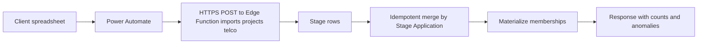
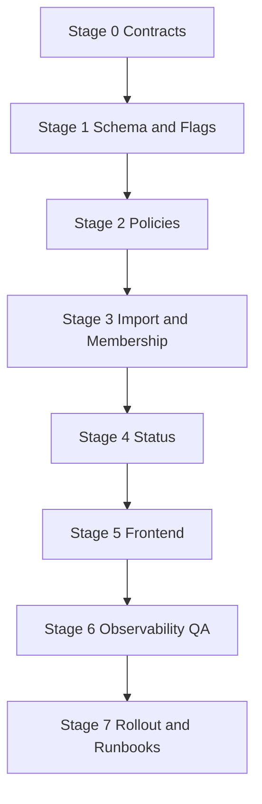

# Projects Feature — Implementation Plan

Author: Kilo Code
Status: Draft v0.1
Date: 2025-08-15
Sources: [docs/product/projects-feature-prd.md](docs/product/projects-feature-prd.md:1), [docs/product/projects-feature-ui-ux.md](docs/product/projects-feature-ui-ux.md:1), [docs/security/rbac-rls-review.md](docs/security/rbac-rls-review.md:1), [docs/okta-oidc-supabase.md](docs/okta-oidc-supabase.md:1)

1. Summary
- This document provides a staged, production-readiness implementation plan for the Projects feature as specified in the PRD and UI/UX spec. Tasks are ordered to minimize risk, enable parallel work streams, and support canary rollout with feature flags.

2. Confirmed assumptions and scope boundaries
- Canonical ownership: The primary telco tenant owns the canonical projects dataset.
- Import identity: The client spreadsheet contains no tenant id column; tenant context is inferred by the import endpoint path or credentials.
- Stable key: Stage Application is unique within the primary telco, used as the stable key for import merge and deep linking.
- Deployment Specialist mapping: Okta users have only a unique user id; Deployment Specialist in import maps to Okta user id via a maintained directory mapping. No emails required.
- Delivery Partner visibility: Delivery Partner project managers see all projects assigned to their company. Mapping uses a canonical Delivery Partner list with normalization of variants.
- UGC separation: Imported fields never overwrite user generated content such as contacts, engagements, and attachment metadata.
- Attachments: Private storage bucket with 25 MB per-file limit; previews for images and PDFs; access mediated by metadata and policies.
- Status logic: Overall Project Status follows PRD section 8.3 with Monday to Friday business days and dynamic recomputation on import.
- Feature flags: Tenant-scoped flags enable progressive rollout.

3. Power Automate integration — simple and streamlined
- Trigger: Scheduled daily run at 17:00 local time. Optionally support manual run for catch-up.
- Transform: Single Compose action to shape rows to the PRD 8.1 whitelist of fields and include Stage Application exactly as provided; normalize Developer Class values (Class 1=Key Strategic, Class 2=Managed, Class 3/4=Inbound) and allow Delivery Partner to be blank meaning Unassigned.
- Transport: One HTTPS POST to a per-tenant Edge Function endpoint secured by a bearer secret stored in a secure connection reference.
- Idempotency: Server performs idempotent merge keyed by Stage Application; partial batch acceptance with clear error reporting for rejected rows.
- Retries and logging: Automatic exponential backoff retries on non 2xx; write success and failure counts to a simple Power Automate log list for observability.

Mermaid flow

4. Stage overview
- Stage 0: Contracts and sign-off
- Stage 1: Data model and feature flags
- Stage 2: RLS and storage policies with policy tests
- Stage 3: Import endpoint, staging, merge, and membership materialization
- Stage 4: Overall Project Status computation
- Stage 5: Frontend implementation per UI spec
- Stage 6: Observability, performance, QA
- Stage 7: Rollout, support, and runbooks

5. Stage 0 — Contracts and sign-off
Objectives
- Lock the import JSON contract, the Delivery Partner canonical list, and DS mapping approach.
- Confirm environment topology and feature flag governance.
Tasks
- Define import JSON schema matching PRD 8.1 fields and data types, including required Stage Application.
- Define per-tenant Edge Function endpoint path format and authentication header.
- Create Delivery Partner normalization list and mapping policy for variants to canonical partner orgs.
- Define ds_directory mapping table structure and stewardship process to map Deployment Specialist values to Okta user ids.
- Approve business-day calendar rules for status logic and timezone handling.
Deliverables
- One page import contract in [docs/product/projects-feature-prd.md](docs/product/projects-feature-prd.md:1) appendix or a new addendum in this plan.
- Confirmed partner normalization list and DS directory owner.
- Environment and feature flag governance note in [docs/security/rbac-rls-review.md](docs/security/rbac-rls-review.md:1).

6. Stage 1 — Data model and feature flags
Objectives
- Introduce tables to separate staging, canonical projects, UGC, membership, flags, and audit while avoiding code-first schema drift.
Tasks
- Create staging table for raw import rows with lineage fields including source batch id, imported at, checksum, and per-row validation state.
- Ensure canonical projects table contains only PRD 8.1 fields and system fields such as created at and updated at.
- Ensure UGC tables exist and are unchanged by imports, including contacts, engagements, and attachment metadata.
- Create project membership table to relate projects to member subjects for both Delivery Partner orgs and Deployment Specialist users.
- Create partner_org table with canonical partner ids and names; create partner_normalization table for mapping variants.
- Create ds_directory table to map Deployment Specialist identifiers to Okta user ids.
- Create rm_directory table to map Relationship Manager identifiers to Okta user ids.
- Create features table with tenant scoped flags such as ENABLE_PROJECTS and ENABLE_ATTACHMENTS_UPLOAD.
- Add necessary indexes for Stage Application, partner org id, and status filters.
Deliverables
- Migration scripts committed and reviewed.
- Data dictionary section in this plan.

7. Stage 2 — RLS and storage policies with policy tests
Objectives
- Enforce defense in depth for tenant isolation, membership based project visibility, and attachment access.
Tasks
- Implement RLS policies restricting project reads to members by Delivery Partner org or Deployment Specialist user membership.
- Implement write scopes for UGC tables gated by project membership and role claims for admin overrides as applicable.
- Implement storage access policy backed by attachment metadata and project membership.
- Add minimal admin edit policy for controlled corrections on imported fields if required in a future stage; otherwise deny by default.
- Create automated policy tests to validate visibility, write scopes, and storage rules across all roles.
Deliverables
- Policy definitions documented in [docs/security/rbac-rls-review.md](docs/security/rbac-rls-review.md:1).
- Automated policy test suite and results summary.

8. Stage 3 — Import endpoint, staging, merge, membership materialization
Objectives
- Provide a simple, robust ingestion path and ensure derived memberships are always consistent with the latest import.
Tasks
- Implement Edge Function accepting HTTPS POSTs with schema validation and per row validation errors.
- Persist accepted rows to staging with batch id, then perform idempotent merge into canonical projects keyed by Stage Application.
- Materialize project membership immediately after a successful merge:
  - For Delivery Partner orgs, map Delivery Partner value via partner_normalization to a partner_org id and upsert project membership for that org subject. When Delivery Partner is blank, treat as Unassigned (no ORG membership created).
  - For Deployment Specialists, resolve the DS value via ds_directory to Okta user id and upsert project membership for that user subject.
  - For Relationship Managers, resolve the Relationship Manager value via rm_directory to Okta user id and upsert project membership for that user subject (assigned-only scope).
- Record anomalies for unresolved mappings (non-blank Delivery Partner that does not normalize, unknown DS identifier, unknown Relationship Manager identifier) with actionable error messages and expose them in logs.
- Return response including counts for inserted, updated, rejected rows, and membership changes.
- Provide a one off backfill job to compute memberships for existing canonical projects on first deployment of this feature.
Deliverables
- Endpoint live with secret header verification.
- Instrumentation emitting import and membership metrics.
- Backfill job and run log.

9. Stage 4 — Overall Project Status computation
Objectives
- Compute status per PRD 8.3 and expose for UI filters and chips.
Tasks
- Implement a deterministic computation module that runs after each merge and can be invoked on demand.
- Handle Late Application, PCC waiver, and overdue windows using a Monday to Friday business day calendar.
- Persist the computed status in the canonical projects table or a derived view for UI consumption.
- Add unit tests with fixtures covering edge cases including missing EFSCD and missing Issued to Delivery Partner.
Deliverables
- Status module with tests and documented rules.

10. Stage 5 — Frontend implementation per UI spec
Objectives
- Deliver the Projects module UI with role scoped visibility, read only imported fields, and UGC flows.
Tasks
- Navigation and feature flag integration in the protected tabs at [app/(protected)/(tabs)/index.tsx](app/(protected)/(tabs)/index.tsx:1) and [app/(protected)/_layout.tsx](app/(protected)/_layout.tsx:1).
- Projects List with search, filters, sort, infinite scroll, and status chips per [docs/product/projects-feature-ui-ux.md](docs/product/projects-feature-ui-ux.md:1).
- Project Detail tabs Overview, Timeline, Contacts, Engagements, Attachments with permission aware CTAs.
- UGC forms for engagements, contacts, and attachments using primitives in [components/ui](components/ui/button.tsx:1).
- Deep linking to Project Detail by Stage Application from list and external links.
- Apply read only presentation for imported fields and show status pill when computable.
- Display Delivery Partner as "Not Yet Assigned" when the Delivery Partner field is blank.
- Display Developer Class using normalized labels (Class 1=Key Strategic, Class 2=Managed, Class 3/4=Inbound).
Deliverables
- Screens implemented per spec with baseline accessibility and performance.
- Analytics events instrumented at key interaction points.

11. Stage 6 — Observability, performance, QA
Objectives
- Ensure operational readiness, verify performance budgets, and complete end to end QA.
Tasks
- Logging and metrics for imports, merges, membership materialization, and status recomputes with alerts on failures.
- Performance tests for list and detail under a dataset of five thousand projects.
- QA test plan covering role scopes, filters, status logic, UGC flows, attachments constraints, and deep linking per UI spec checklist.
- Security review of policies and storage with targeted pen tests.
Deliverables
- Metrics dashboards and alerting rules.
- QA report with pass rates and prioritized fixes.

12. Stage 7 — Rollout, support, and runbooks
Objectives
- Deploy safely behind flags, validate with a canary tenant, and hand over operations.
Tasks
- Tenant scoped feature flags ENABLE_PROJECTS and ENABLE_ATTACHMENTS_UPLOAD set initially off.
- Enable for canary tenant, monitor imports and app metrics, then progressively enable for remaining tenants.
- Execute membership backfill if required and validate sample projects for each role.
- Publish concise runbooks for imports, anomaly handling, membership reconciliation, and storage access incidents.
- Publish role specific quick start guides for DP users, DS users, and PMs.
Deliverables
- Rollout log, runbooks, and user guides committed to docs.

13. Data dictionary summary
- Staging import rows
  - Holds raw row payload, validation state, source batch id, imported at, checksum, and error messages.
- Canonical projects
  - Stores PRD 8.1 fields only plus system timestamps and derived status.
- Partner org and normalization
  - partner_org holds canonical id and label; partner_normalization maps variants to canonical.
- DS directory
  - Maps Deployment Specialist identifiers found in imports to Okta user ids used for membership.
- RM directory
  - Maps Relationship Manager identifiers found in imports to Okta user ids used for membership (assigned-only scope).
- Project membership
  - Relates projects to subjects where subject can be a partner org or a DS user id with a type discriminator.
- UGC tables
  - Contacts, engagements, and attachment metadata scoped to projects and governed by membership.
- Feature flags
  - Tenant scoped flags controlling feature visibility such as ENABLE_PROJECTS and ENABLE_ATTACHMENTS_UPLOAD.

13a. Data Dictionary — Stage 2 tables (detailed)
- public.partner_org
  - Definition: [sql.CREATE TABLE](docs/sql/omni-bootstrap.sql:17)
  - Columns
    - id uuid primary key default [sql.gen_random_uuid](docs/sql/omni-bootstrap.sql:10)
    - name text not null
    - parent_partner_org_id uuid null references public.partner_org(id) on delete set null
    - created_at timestamptz not null default now()
  - Constraints and indexes
    - Self-referencing FK for SUB_ORG hierarchy via parent_partner_org_id.
    - No unique(name) constraint; normalization handled via partner_normalization.
  - Purpose: Canonical Delivery Partner organizations and optional SUB_ORG hierarchy.
  - Visibility/RLS: Not enabled in bootstrap (no RLS); stewarded by admins.
  - Client writes: No (admin/governed only).

- public.partner_normalization
  - Definition: [sql.CREATE TABLE](docs/sql/omni-bootstrap.sql:25)
  - Columns
    - id uuid primary key default [sql.gen_random_uuid](docs/sql/omni-bootstrap.sql:10)
    - source_label text not null
    - partner_org_id uuid not null references public.partner_org(id) on delete cascade
    - created_at timestamptz not null default now()
  - Constraints and indexes
    - Unique normalized source label via [sql.CREATE UNIQUE INDEX](docs/sql/omni-bootstrap.sql:41) partner_normalization_source_label_normalized_uniq on lower(trim(source_label))
  - Purpose: Normalize raw delivery partner labels from imports to canonical partner_org ids.
  - Visibility/RLS: Not enabled in bootstrap.
  - Client writes: No (backend/import stewardship).

- public.ds_directory
  - Definition: [sql.CREATE TABLE](docs/sql/omni-bootstrap.sql:47)
  - Columns
    - id uuid primary key default [sql.gen_random_uuid](docs/sql/omni-bootstrap.sql:10)
    - display_name text not null
    - preferred_username text null
    - user_id uuid null references auth.users(id) on delete set null
    - status text not null default 'active'
    - created_at timestamptz not null default now()
  - Constraints and indexes
    - Unique normalized active name via [sql.CREATE UNIQUE INDEX](docs/sql/omni-bootstrap.sql:74) ds_directory_display_name_active_uniq on lower(trim(display_name)) where status='active'
  - Purpose: Mapping Deployment Specialist identifiers to auth.users.id for membership materialization.
  - Visibility/RLS: Not enabled in bootstrap.
  - Client writes: No (admin stewarded).

- public.rm_directory
  - Definition: [sql.CREATE TABLE](docs/sql/omni-bootstrap.sql:56)
  - Columns: same shape as ds_directory
  - Constraints and indexes
    - Unique normalized active name via [sql.CREATE UNIQUE INDEX](docs/sql/omni-bootstrap.sql:88) rm_directory_display_name_active_uniq on lower(trim(display_name)) where status='active'
  - Purpose: Mapping Relationship Manager identifiers to auth.users.id for assigned-only membership.
  - Visibility/RLS: Not enabled in bootstrap.
  - Client writes: No (admin stewarded).

- public.user_profiles
  - Definition: [sql.CREATE TABLE](docs/sql/omni-bootstrap.sql:99)
  - Columns
    - user_id uuid primary key references auth.users(id) on delete cascade
    - okta_sub text not null
    - okta_user_id text not null
    - tenant_id text null
    - partner_org_id uuid null references public.partner_org(id) on delete set null
    - sub_partner_org_id uuid null references public.partner_org(id) on delete set null
    - created_at timestamptz not null default now()
  - Indexes
    - [sql.CREATE INDEX](docs/sql/omni-bootstrap.sql:127) user_profiles_tenant_idx(tenant_id)
    - [sql.CREATE INDEX](docs/sql/omni-bootstrap.sql:128) user_profiles_partner_idx(partner_org_id, sub_partner_org_id)
  - RLS
    - Enabled: [sql.ALTER TABLE ... ENABLE RLS](docs/sql/omni-bootstrap.sql:233)
    - Policy: [sql.CREATE POLICY](docs/sql/omni-bootstrap.sql:243) user_can_read_own_profile — select to authenticated using auth.uid() = user_id
  - Purpose: Mirror Okta identifiers and tenant/org context for RLS.
  - Client writes: No direct; mirrored on login.

- public.user_roles
  - Definition: [sql.CREATE TABLE](docs/sql/omni-bootstrap.sql:110)
  - Columns
    - user_id uuid not null references auth.users(id) on delete cascade
    - role text not null
    - created_at timestamptz not null default now()
    - primary key (user_id, role)
  - RLS
    - Enabled: [sql.ALTER TABLE ... ENABLE RLS](docs/sql/omni-bootstrap.sql:234)
    - Policy: [sql.CREATE POLICY](docs/sql/omni-bootstrap.sql:249) user_can_read_own_roles — select to authenticated using auth.uid() = user_id
  - Purpose: Mirror role claims for policy evaluation.
  - Client writes: No direct; mirrored post-login.

- public.features
  - Definition: [sql.CREATE TABLE](docs/sql/omni-bootstrap.sql:118)
  - Columns
    - tenant_id text not null
    - name text not null
    - enabled boolean not null default false
    - updated_at timestamptz not null default now()
    - primary key (tenant_id, name)
  - RLS
    - Enabled: [sql.ALTER TABLE ... ENABLE RLS](docs/sql/omni-bootstrap.sql:239)
    - Policy: [sql.CREATE POLICY](docs/sql/omni-bootstrap.sql:439) features_select_same_tenant — select allowed when user_profiles.tenant_id = features.tenant_id
  - Purpose: Tenant-scoped feature flags (ENABLE_PROJECTS, ENABLE_ATTACHMENTS_UPLOAD, ENABLE_OKTA_AUTH).
  - Client writes: No (admin-only toggles; audited).

- public.projects
  - Definition: [sql.CREATE TABLE](docs/sql/omni-bootstrap.sql:135)
  - Columns
    - id uuid primary key default [sql.gen_random_uuid](docs/sql/omni-bootstrap.sql:10)
    - tenant_id text not null default 'TELCO'
    - stage_application text not null
    - stage_application_created timestamptz not null default now()
    - delivery_partner_label text null
    - partner_org_id uuid null references public.partner_org(id) on delete set null
    - developer_class text null
    - derived_status text null
    - created_at timestamptz not null default now()
  - Indexes (filters and pagination)
    - [sql.CREATE INDEX](docs/sql/omni-bootstrap.sql:147) projects_stage_idx(stage_application, stage_application_created desc)
    - [sql.CREATE INDEX](docs/sql/omni-bootstrap.sql:148) projects_partner_idx(partner_org_id)
    - [sql.CREATE INDEX](docs/sql/omni-bootstrap.sql:149) projects_status_idx(derived_status)
    - [sql.CREATE INDEX](docs/sql/omni-bootstrap.sql:150) projects_tenant_idx(tenant_id)
  - RLS
    - Enabled: [sql.ALTER TABLE ... ENABLE RLS](docs/sql/omni-bootstrap.sql:235)
    - Policies:
      - [sql.CREATE POLICY](docs/sql/omni-bootstrap.sql:327) projects_select_policy — select using public.using_rls_for_project(id)
      - [sql.CREATE POLICY](docs/sql/omni-bootstrap.sql:335) projects_update_admin_only — update for vendor_admin/telco_admin only
    - Helper: [sql.CREATE FUNCTION](docs/sql/omni-bootstrap.sql:258) public.using_rls_for_project(project_id uuid) centralizes membership logic
  - Purpose: Canonical projects dataset per PRD; imported fields; derived_status filled in later stage.
  - Client writes: Imported fields read-only; UGC lives in separate tables.

- public.project_membership
  - Definition: [sql.CREATE TABLE](docs/sql/omni-bootstrap.sql:153)
  - Columns
    - id uuid primary key default [sql.gen_random_uuid](docs/sql/omni-bootstrap.sql:10)
    - project_id uuid not null references public.projects(id) on delete cascade
    - member_user_id uuid null references auth.users(id) on delete cascade
    - member_partner_org_id uuid null references public.partner_org(id) on delete cascade
    - member_sub_partner_org_id uuid null references public.partner_org(id) on delete cascade
    - created_at timestamptz not null default now()
    - Check: exactly one discriminator set (member_user_id xor member_partner_org_id xor member_sub_partner_org_id)
  - Indexes
    - [sql.CREATE INDEX](docs/sql/omni-bootstrap.sql:168) pm_project_idx(project_id)
    - [sql.CREATE INDEX](docs/sql/omni-bootstrap.sql:169) pm_user_idx(member_user_id)
    - [sql.CREATE INDEX](docs/sql/omni-bootstrap.sql:170) pm_partner_idx(member_partner_org_id)
    - [sql.CREATE INDEX](docs/sql/omni-bootstrap.sql:171) pm_sub_partner_idx(member_sub_partner_org_id)
  - RLS: Not enabled in bootstrap (system-maintained by backend).
  - Purpose: Materialized membership driving RLS visibility and UGC permissions.
  - Client writes: No.

- public.contacts
  - Definition: [sql.CREATE TABLE](docs/sql/omni-bootstrap.sql:174)
  - Columns: id, project_id, created_by, name, phone, email, created_at, updated_at
  - Indexes: [sql.CREATE INDEX](docs/sql/omni-bootstrap.sql:185) contacts_project_idx(project_id)
  - RLS
    - Enabled: [sql.ALTER TABLE ... ENABLE RLS](docs/sql/omni-bootstrap.sql:236)
    - Policies: [sql.CREATE POLICY](docs/sql/omni-bootstrap.sql:349) select; [sql.CREATE POLICY](docs/sql/omni-bootstrap.sql:356) insert (with created_by = auth.uid()); [sql.CREATE POLICY](docs/sql/omni-bootstrap.sql:363) update own; [sql.CREATE POLICY](docs/sql/omni-bootstrap.sql:371) delete own
  - Purpose: UGC — project contacts
  - Client writes: Yes (within membership scope).

- public.engagements
  - Definition: [sql.CREATE TABLE](docs/sql/omni-bootstrap.sql:187)
  - Columns: id, project_id, created_by, kind, body, created_at, updated_at
  - Indexes: [sql.CREATE INDEX](docs/sql/omni-bootstrap.sql:197) engagements_project_idx(project_id)
  - RLS
    - Enabled: [sql.ALTER TABLE ... ENABLE RLS](docs/sql/omni-bootstrap.sql:237)
    - Policies: [sql.CREATE POLICY](docs/sql/omni-bootstrap.sql:379) select; [sql.CREATE POLICY](docs/sql/omni-bootstrap.sql:386) insert; [sql.CREATE POLICY](docs/sql/omni-bootstrap.sql:393) update own; [sql.CREATE POLICY](docs/sql/omni-bootstrap.sql:400) delete own
  - Purpose: UGC — project notes, calls, site visits
  - Client writes: Yes (within membership scope).

- public.attachments_meta
  - Definition: [sql.CREATE TABLE](docs/sql/omni-bootstrap.sql:200)
  - Columns
    - id uuid primary key default [sql.gen_random_uuid](docs/sql/omni-bootstrap.sql:10)
    - project_id uuid not null references public.projects(id) on delete cascade
    - created_by uuid not null references auth.users(id) on delete cascade
    - bucket text not null default 'attachments'
    - object_name text not null
    - content_type text null
    - size_bytes bigint null
    - created_at timestamptz not null default now()
    - unique (bucket, object_name)
  - Indexes: [sql.CREATE INDEX](docs/sql/omni-bootstrap.sql:212) attachments_project_idx(project_id)
  - RLS
    - Enabled: [sql.ALTER TABLE ... ENABLE RLS](docs/sql/omni-bootstrap.sql:238)
    - Policies: [sql.CREATE POLICY](docs/sql/omni-bootstrap.sql:409) select; [sql.CREATE POLICY](docs/sql/omni-bootstrap.sql:416) insert; [sql.CREATE POLICY](docs/sql/omni-bootstrap.sql:423) update own; [sql.CREATE POLICY](docs/sql/omni-bootstrap.sql:430) delete own
    - Storage policies on storage.objects (bucket 'attachments'): [sql.CREATE POLICY](docs/sql/omni-bootstrap.sql:458) attachments_read; [sql.CREATE POLICY](docs/sql/omni-bootstrap.sql:475) attachments_insert; [sql.CREATE POLICY](docs/sql/omni-bootstrap.sql:493) attachments_delete
  - Purpose: Metadata for private Storage objects; enforces access with membership.
  - Client writes: Yes (metadata create before upload; own edits/deletes).

- public.staging_imports
  - Definition: [sql.CREATE TABLE](docs/sql/omni-bootstrap.sql:215)
  - Columns: id, batch_id, tenant_id default 'TELCO', raw jsonb, checksum, validation jsonb, imported_at
  - Indexes: [sql.CREATE INDEX](docs/sql/omni-bootstrap.sql:225) staging_batch_idx(batch_id); [sql.CREATE INDEX](docs/sql/omni-bootstrap.sql:226) staging_tenant_idx(tenant_id)
  - RLS: Not enabled in bootstrap.
  - Purpose: Raw import payloads and lineage.
  - Client writes: No (Edge Function only).

- Indexing focus for Stage 2 (already present via bootstrap, validated/ensured in [docs/sql/stage2-apply.sql](docs/sql/stage2-apply.sql:1))
  - Projects list/search filters and pagination:
    - [sql.CREATE INDEX](docs/sql/omni-bootstrap.sql:147) on stage_application, stage_application_created desc
    - [sql.CREATE INDEX](docs/sql/omni-bootstrap.sql:148) on partner_org_id
    - [sql.CREATE INDEX](docs/sql/omni-bootstrap.sql:149) on derived_status
    - [sql.CREATE INDEX](docs/sql/omni-bootstrap.sql:150) on tenant_id

- Seeds and flags (Stage 2)
  - partner_org canonical labels seeded idempotently (UPSERT-by-normalized-name) in [docs/sql/stage2-apply.sql](docs/sql/stage2-apply.sql:1)
  - partner_normalization mappings seeded idempotently (UPSERT-by-normalized-source_label) in [docs/sql/stage2-apply.sql](docs/sql/stage2-apply.sql:1)
  - features seeded per-tenant (primary key (tenant_id,name)); defaults set to false for ENABLE_PROJECTS, ENABLE_ATTACHMENTS_UPLOAD, ENABLE_OKTA_AUTH in [docs/sql/stage2-apply.sql](docs/sql/stage2-apply.sql:1)

- Storage bucket and policies
  - Private bucket 'attachments' ensured via [sql.storage.create_bucket](docs/sql/stage2-apply.sql:1) guard on storage.buckets
  - Duplicate-safe reapplication of storage policies (drop/create) in [docs/sql/stage2-apply.sql](docs/sql/stage2-apply.sql:1); safe to run after bucket creation

- Visibility summary
  - Canonical/import tables (projects, staging_imports, partner_org, partner_normalization, ds_directory, rm_directory): no client writes; admin/import maintained.
  - UGC tables (contacts, engagements, attachments_meta): client writes allowed under RLS using membership.
  - Mirrors (user_profiles, user_roles, features): select-limited (self-tenant or self-user); no client writes for profiles/roles; features read-only to clients.
14. Acceptance criteria traceability
- Visibility: List and detail scoped by membership for Delivery Partner, Deployment Specialist, and Relationship Manager roles (RM assigned-only).
- Edit scope: Imported fields are read only for non admin roles; UGC is editable by authorized members.
- Adoption: Engagement capture flows optimized for fast entry on mobile.
- Data quality: Idempotent merge with whitelisted fields; partial batch acceptance; audit preserved.
- Performance: List and detail meet two second median load for up to five thousand projects.
- Attachments: Private bucket, 25 MB limit, previews for images and PDFs, access via metadata and policies.
- Status: Derived per PRD 8.3, hides when EFSCD missing, recomputes on import changes.
- Deep links: Navigate to Project Detail by Stage Application.
- Display rules: Delivery Partner shows "Not Yet Assigned" when blank; Developer Class values normalized to labels (Class 1=Key Strategic, Class 2=Managed, Class 3/4=Inbound).

15. Risks and mitigations
- Unmapped DS identifiers
  - Mitigation: Anomaly queue with owner, ds_directory stewardship, and skip membership until resolved.
- Delivery Partner name drift
  - Mitigation: partner_normalization table with periodic review and monitoring.
- Over permissive policies
  - Mitigation: Policy tests in CI and periodic production checks with synthetic users.
- Import anomalies and partial failures
  - Mitigation: Clear batch responses, retry guidance, and dashboard alerts for persistent failures.
- Performance regression at scale
  - Mitigation: Indexes on Stage Application, partner, and status; pagination; list virtualization in UI.

16. Operational dashboards and alerts
- Import success rate, rows processed, merge durations, and anomalies per batch.
- Membership materializations per batch and unresolved mappings.
- Status recompute durations and counts.
- Storage access denials and attachment size validation failures.

17. Roles and responsibilities
- Product owner approves import contract, partner list, and status rules.
- Backend lead owns schema, policies, import endpoint, and membership materialization.
- Frontend lead owns UI delivery, analytics, and performance adherence.
- Security lead reviews policies and storage access.
- Ops lead manages dashboards, alerts, and runbooks.

18. Stage gates and sign offs
- Stage 0 complete when import contract, partner list, ds_directory process, and endpoint auth are approved.
- Stage 1 complete when schema migrations are applied and reviewed.
- Stage 2 complete when policy tests pass in CI and in staging.
- Stage 3 complete when import flow operates end to end in staging with membership backfill done.
- Stage 4 complete when status logic passes unit tests and staging verification.
- Stage 5 complete when UI acceptance checklist passes per [docs/product/projects-feature-ui-ux.md](docs/product/projects-feature-ui-ux.md:1).
- Stage 6 complete when dashboards and alerts are live and QA sign off is recorded.
- Stage 7 complete when canary rollout succeeds and runbooks are in place.

19. Mermaid stage sequence

20. Execution checklist by stage
Stage 0
- Approve import JSON schema and HTTP auth header details.
- Confirm partner_org canonical list and normalization strategy.
- Define ds_directory governance and update cadence.
- Confirm business day and timezone rules.
Stage 1
- Apply migrations for staging, canonical, UGC, membership, partner, ds_directory, features, and indexes.
- Populate partner_org and partner_normalization with initial values.
Stage 2
- Implement and test RLS and storage policies across roles and subjects.
- Land policy tests in CI with synthetic identities.
Stage 3
- Deploy Edge Function endpoint and secure it.
- Connect Power Automate flow to staging endpoint.
- Validate merge and membership materialization, then run one off backfill.
Stage 4
- Implement and verify status computation against fixtures.
- Surface derived status in API or view for UI use.
Stage 5
- Implement list, detail tabs, UGC, and attachments with flags and deep links.
- Instrument analytics events.
Stage 6
- Stand up dashboards and alerts, execute performance tests, complete QA.
Stage 7
- Enable canary, monitor, progressively enable, publish runbooks and guides.

21. Dependencies and references
- Identity and session per [docs/okta-oidc-supabase.md](docs/okta-oidc-supabase.md:1).
- Policies baseline per [docs/security/rbac-rls-review.md](docs/security/rbac-rls-review.md:1).
- UI details per [docs/product/projects-feature-ui-ux.md](docs/product/projects-feature-ui-ux.md:1).
- PRD details per [docs/product/projects-feature-prd.md](docs/product/projects-feature-prd.md:1).

22. Change log
- v0.1 Initial staged implementation plan aligned to confirmed assumptions for DS user id mapping and Delivery Partner based visibility.