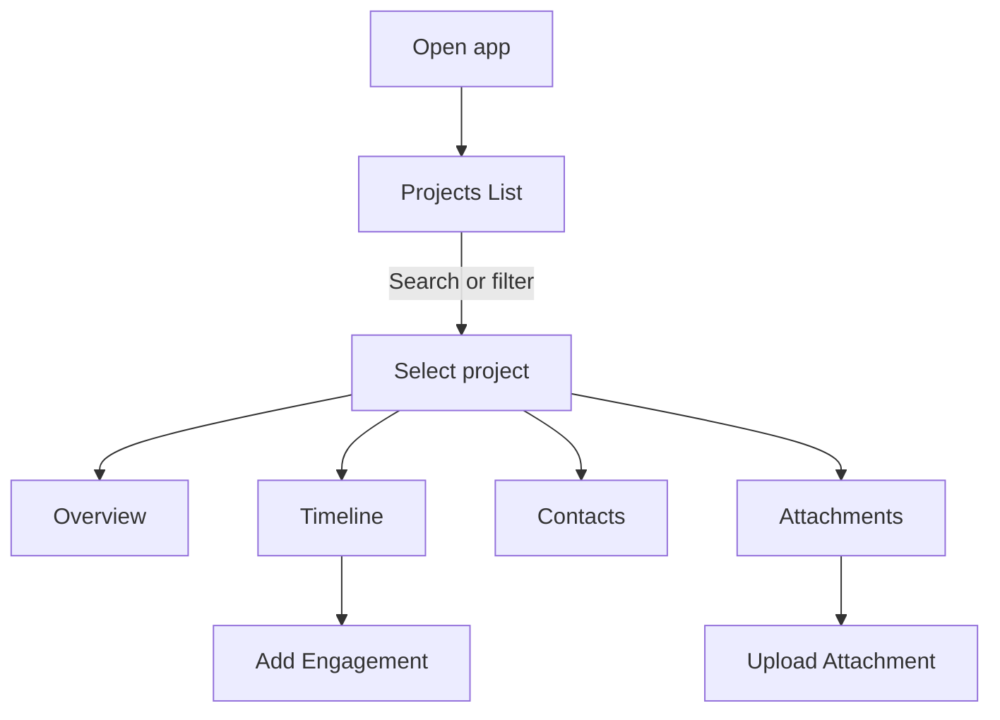
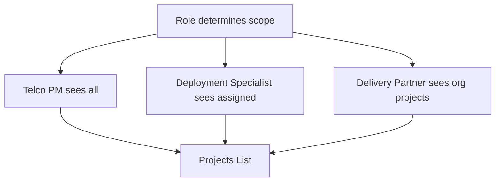

# Projects Feature — Frontend UI and UX Specification

Author: Kilo Code
Status: Draft v0.3
Audience: Product design, frontend engineering, QA
Date: 2025-08-15
Source PRD: [docs/product/projects-feature-prd.md](docs/product/projects-feature-prd.md:1)

Purpose
- Define user interface, interaction patterns, and end-to-end workflows for the Projects Feature as specified in the PRD.
- Map the PRD’s role-based visibility, data ownership, and assignment model into concrete screens, controls, and navigation flows.
- Avoid backend/policy specifics; focus on UX behavior, visual hierarchy, and UI state handling.

Out of scope
- Database schema, RLS policies, ingestion merge logic, or storage policies. Refer to [docs/projects-feature.md](docs/projects-feature.md:1) and [docs/security/rbac-rls-review.md](docs/security/rbac-rls-review.md:1) for backend details.

1. Information architecture and navigation

Primary routes and screens
- Protected stack and tabs
  - Root protected tabs container: [app/(protected)/(tabs)/index.tsx](app/(protected)/(tabs)/index.tsx:1)
  - Protected layout: [app/(protected)/_layout.tsx](app/(protected)/_layout.tsx:1)
- Projects module screens
  - Projects List: entry point for role-scoped project visibility
  - Project Detail
    - Tabs: Overview, Timeline, Contacts, Engagements, Attachments
  - Modals/Forms
    - Add/Edit Contact
    - Add Engagement
    - Upload Attachment
    - Shared modal shell: [app/(protected)/modal.tsx](app/(protected)/modal.tsx:1)

Core UI components
- Buttons and CTAs: [components/ui/button.tsx](components/ui/button.tsx:1)
- Inputs: [components/ui/input.tsx](components/ui/input.tsx:1), [components/ui/textarea.tsx](components/ui/textarea.tsx:1)
- Labels and text: [components/ui/label.tsx](components/ui/label.tsx:1), [components/ui/text.tsx](components/ui/text.tsx:1)
- Form harness: [components/ui/form.tsx](components/ui/form.tsx:1)

Navigation model
- Projects List is accessible from protected home. Deep-link to Project Detail by Stage Application (Application Number).
- Within Project Detail, tabs preserve scroll position per tab and reflect the selected state via a top tab bar.
- Back navigation returns to the anchored position in the Projects List with applied filters and search preserved.

2. Role-based visibility and gating (UI behavior)

Roles in UI
- Telco Project Manager
  - Sees all projects within the telco tenant.
  - Can create user-generated content (UGC) across visible projects.
- Telco Deployment Specialist
  - Sees only projects where they are the named Deployment Specialist (synced field).
  - Full UGC capabilities on assigned projects.
- Telco Relationship Manager
  - Sees only projects explicitly assigned to them (synced Relationship Manager field).
  - Full UGC capabilities on assigned projects.
- Delivery Partner (DP) user
  - Sees only projects where Delivery Partner equals their organization (synced field).
  - Full UGC capabilities on assigned projects.
- Tenant Admin (Telco)
  - Same as PM plus any admin-only UI toggles when required. Imported fields remain read-only by default unless otherwise authorized.

UI gating patterns
- List visibility: Projects List shows only projects for which the user has visibility by role/membership.
- Detail tabs and actions:
  - Overview shows imported fields as read-only for non-admin roles.
  - Contacts, Engagements, Attachments tabs show add/edit actions if the user has write scope to the project.
- Hidden vs disabled:
  - Actions the user cannot perform should generally be hidden (not disabled) to reduce friction, except where discoverability requires a disabled control with an info tooltip.

3. Projects List specifications

Layout
- Mobile-first card list with infinite scroll.
- Card content (top to bottom):
  - Primary: Stage Application (Application Number; 14 chars, starts with STG-)
  - Secondary: Address (single line, ellipsized)
  - Meta chips: Delivery Partner (org chip), Deployment Specialist (initials chip), Developer Class
  - Counters: Premises Count (optional), Residential/Commercial/Essential as mini-pill counts if available
  - Status chip: Overall Project Status (color semantics: In Progress=default, In Progress — Overdue=warning, Complete=success, Complete Overdue=danger, Complete Overdue Late App=danger with Late App badge)
  - Optional secondary chips: In Service, Delivery Partner PC Sub (if present)
- Display rule: When Delivery Partner is blank, show the Delivery Partner chip as Not Yet Assigned.
- Tap anywhere on the card to open Project Detail.

Search and filters
- Global search: by Stage Application and Address.
- Filter chips row (scrollable):
  - Overall Project Status (multi-select: In Progress, In Progress — Overdue, Complete, Complete Overdue, Complete Overdue Late App)
  - Development type
  - Build Type
  - Delivery Partner (includes Not Yet Assigned)
  - Deployment Specialist (telco users only)
  - Date ranges (by key dates: Expected First Service Connection Date (EFSCD), Stage Application Created, Developer Design Submitted, Developer Design Accepted, Issued to Delivery Partner, Delivery Partner PC Sub, Practical Completion, In Service)
- Behavior:
  - Status reflects latest import; if EFSCD is missing the status chip and filter exclude those rows by default.
- Quick scopes:
  - Telco PM: All Projects (default), By Delivery Partner, By Deployment Specialist, Recent activity
  - Telco Deployment Specialist: Assigned to Me (default), Recently updated
  - Telco Relationship Manager: Assigned to Me (default), Recently updated
  - Delivery Partner user: My Organization (default), Recently updated

Sorting
- Default sort: Desc by Stage Application Created (if present) else by latest key date present.
- User can toggle sort by Address (A-Z), Stage Application (A-Z), or Practical Completion Certified (latest first).

Empty, loading, error states
- Loading skeletons: 6 pseudo-cards with shimmering placeholders.
- Empty:
  - Scoped empty message e.g., No projects assigned yet for your organization.
  - CTA (telco roles): Adjust filters
- Error:
  - Inline error banner with Retry.

List item affordances
- Long-press on a card opens a sheet with:
  - Copy Stage Application
  - Share deep link
  - Open in maps (if lat/long present) — launches external map app

4. Project Detail specifications

Header summary
- Title: Stage Application
- Subtitle: Address
- Meta row: Delivery Partner chip, Deployment Specialist chip, Developer Class tag
- Overall Project Status pill (computed; tooltip references PRD section 8.3; color semantics per Projects List)
- Location link only when latitude and longitude present; opens device maps; no inline preview in MVP.
- Quick actions (visible by role):
  - Add Engagement
  - Upload Attachment
  - Add Contact

Tab: Overview
- Objective: Provide a concise snapshot of imported attributes most relevant for comprehension.
- Content groups:
  - Identification
    - Stage Application
    - Address
  - Classification
    - Development type
    - Build Type
    - Developer Class
  - Delivery and ownership
    - Delivery Partner
    - Relationship Manager
  - Scale
    - Premises Count
    - Residential, Commercial, Essential (display as labelled counters if available)
  - Location
    - latitude, longitude (link to open maps)
  - Status indicators (read-only badges if present)
    - Overall Project Status (derived; hidden when EFSCD missing)
    - In Service
    - Delivery Partner PC Sub
- Presentation: Key-value rows with clear labels; chips for categorical fields; counters as pills.

Tab: Timeline
- Objective: Show a chronological sequence of key dates and user activity.
- Sections:
  - Milestones (from synced fields; read-only)
    - Stage Application Created
    - Developer Design Submitted
    - Developer Design Accepted
    - Issued to Delivery Partner
    - Practical Completion Certified
    - Delivery Partner PC Sub
    - In Service
  - Engagements stream (UGC; newest first) with day separators
- Controls:
  - Add Engagement floating action button (FAB) for users with write access.
- Interaction:
  - Tap milestone to view raw date metadata (read-only).
  - Tap engagement to view details and attachments.
- Risk and breach callouts (derived, read-only)
  - Show warning chip when fewer than 60 business days remain until EFSCD and Developer Design Accepted not set.
  - Show warning chip when fewer than 20 business days remain until EFSCD and PCC not set; for Late App, suppress warning until 20 business days after Issued to Delivery Partner.
  - Show danger chip when a milestone is achieved outside its allowed window (e.g., DD Accepted later than 60 BD before EFSCD; PCC later than allowed under the standard rule or Late App waiver).
  - Show danger banner when today is after EFSCD and In Service not set.
  - Tooltip: Status is computed per PRD 8.3 and may change when EFSCD updates on import.

Tab: Contacts
- List view with search by name/org.
- Item: name, role, org, phone, email; tap to open Contact sheet.
- Actions:
  - Add Contact (if permitted)
  - Edit/Delete Contact (creator or project member per policy; show as permitted)
- Contact sheet:
  - Quick call, email actions using device intents.

Tab: Engagements
- List with filters: kind chips site_visit, progress_note, call.
- Item: kind icon, occurred_at, first line of notes, optional linked contact badge, attachment count.
- Actions:
  - Add Engagement (if permitted)
  - Edit/Delete own engagement (if permitted)

Tab: Attachments
- Grid or list toggle
- Item: thumbnail or type icon, filename, size, created_at
- Actions:
  - Upload Attachment (if permitted)
  - Preview (image, pdf if supported) or open in external viewer
  - Share deep link (if enabled)
  - Delete (role permitted only)

States and feedback
- Loading per tab with skeletons.
- Empty messaging tailored per tab (e.g., No engagements yet).
- Error banners with retry.

5. Forms and interaction patterns

Add Engagement
- Access: FAB on Timeline or primary CTA in header; permitted for users with write access to the project.
- Fields:
  - kind (site_visit, progress_note, call)
  - occurred_at (default now; editable)
  - notes (multiline)
  - optional linked contact (picker)
  - optional attachments (invoke Upload Attachment flow inline)
- Validation:
  - kind required, occurred_at required
- UX:
  - Save commits and shows toast Engagement added.
  - Timeline scrolls to the new item, highlighted briefly.

Add Contact
- Fields:
  - name (required)
  - org (optional)
  - role (optional)
  - phone (optional; phone keypad)
  - email (optional; email keyboard)
- UX:
  - Save commits and returns to Contacts list with new contact at top and subtle highlight.

Upload Attachment
- Entry points:
  - From Attachments tab
  - From Add Engagement (inline)
- Picker:
  - Camera and photo library, document provider
- Constraints:
  - Accept any file type up to 25 MB per file; show preflight errors clearly.
- UX:
  - Show local preview while uploading; progress indicator.
  - Success toast Attachment uploaded.
  - Error state with Retry and Remove options.

Common patterns
- Permission-aware CTAs: Show only actions the user can perform; prefer hidden over disabled.
- Optimistic UI for UGC with rollback on error where feasible; otherwise blocking spinner with clear state.
- Non-blocking toasts for success; inline field errors for validation failures.

6. Field exposure and mapping to UI

Notes
- The PRD defines the complete synced field set. Not all fields appear in UI. Below is the proposed default exposure by screen. This can be tuned in detailed design but must never introduce fields outside the PRD list.

Overview tab
- Always show:
  - Stage Application
  - Address
  - Development type
  - Build Type
  - Delivery Partner
  - Relationship Manager
  - Developer Class
  - Overall Project Status (derived; hidden when EFSCD missing)
- Show when present:
  - FOD ID
  - Premises Count
  - Residential, Commercial, Essential
  - latitude, longitude (with Open map)
  - In Service
  - Delivery Partner PC Sub

Timeline tab (Milestones section)
- Stage Application Created
- Developer Design Submitted
- Developer Design Accepted
- Issued to Delivery Partner
- Practical Completion Certified
- Delivery Partner PC Sub
- In Service

Projects List card
- Stage Application
- Address
- Overall Project Status chip (color semantics per Layout)
- Delivery Partner (chip)
- Deployment Specialist (chip, initials)
- Developer Class (tag)
- Optional counters: Premises Count; Residential, Commercial, Essential if concise
- Optional status: In Service, Delivery Partner PC Sub if concise

Search and filters include
- Stage Application, Address (search)
- Overall Project Status
- Development type, Build Type, Delivery Partner (includes Not Yet Assigned), Deployment Specialist, date ranges across the key date fields

Normalization and presentation rules
- Delivery Partner
  - Blank source value is treated as Unassigned; UI must display Not Yet Assigned and no ORG membership is materialized.
- Developer Class
  - Normalize class codes to labels for all UI and filters:
    - Class 1 → Key Strategic
    - Class 2 → Managed
    - Class 3 → Inbound
    - Class 4 → Inbound

7. End-to-end workflows

Delivery Partner user — capture site visit with photo
- Flow
  1) Open app → Projects List (scoped to My Organization)
  2) Search Stage Application or Address → tap project card
  3) In Project Detail, go to Timeline → tap Add Engagement
  4) Select site_visit → add notes → attach photo → Save
  5) See engagement appears at top of Timeline
- Acceptance
  - User never sees projects from other organizations
  - Imported fields are read-only
  - Attachment preview accessible from the engagement

Telco Deployment Specialist — review assigned projects and log progress
- Flow
  1) Projects List default scope Assigned to Me
  2) Filter by Delivery Partner if needed
  3) Open project → Timeline → Add Engagement (progress_note) → Save
- Acceptance
  - Only projects assigned via Deployment Specialist are visible
  - Engagement is visible to DP users assigned to that project

Telco Project Manager — check milestones and contacts
- Flow
  1) Projects List → open project
  2) Overview: verify Delivery Partner, Developer Class, Premises Count
  3) Timeline: verify milestones present
  4) Contacts: add a stakeholder contact
- Acceptance
  - Milestones from synced fields are read-only
  - New contact appears in Contacts list

Mermaid flows

8. UI states, accessibility, and performance

States
- Loading: skeletons for list and each tab; avoid jank by preserving layout slots.
- Error: contextual messages with Retry; non-blocking toasts for minor issues.
- Empty: clear guidance; link to filters where relevant.

Accessibility
- Touch targets ≥ 44x44dp; list items tappable area spans card width.
- Labels tied to inputs; semantic roles for lists and tabs.
- High-contrast text and sufficient color contrast for chips and badges.
- Keyboard navigation considerations for web builds (if applicable).

Performance
- Defer-heavy content in tabs until visible.
- Virtualized lists for Projects and Attachments.
- Image thumbnails cached; lazy load larger previews.
- Avoid blocking the main thread during uploads; show progress.

9. Analytics and instrumentation

Event taxonomy (examples)
- ui_projects_list_viewed
- ui_projects_search_submitted
- ui_projects_filter_applied
- ui_project_opened
- ui_engagement_add_started
- ui_engagement_added
- ui_attachment_upload_started
- ui_attachment_uploaded
- ui_contact_added

Dimensions to capture
- role, delivery_partner_org, deployment_specialist_user
- stage_application
- filters_applied, sort_option

10. Feature flags and progressive disclosure

- ENABLE_PROJECTS: toggles the Projects module visibility in navigation.
- ENABLE_ATTACHMENTS_UPLOAD: controls visibility of Upload Attachment CTAs.
- Role-driven disclosure:
  - Hide unpermitted actions for reduced cognitive load.
  - Prefer contextual hints on why an action is unavailable when discoverability matters.

11. QA acceptance checklist (UI-focused)

Projects List
- Only authorized projects are visible for each role.
- Search and filters work as specified and persist on back navigation.
- Cards render Stage Application, Address, and chips correctly.
- Overall Project Status chip displays with correct color semantics and tooltip. Status filter supports multi-select and returns unions of selected values.

Project Detail
- Overview shows only approved fields and all are read-only if imported.
- Timeline shows milestones and engagements in correct order; FAB visible only for permitted users.
- Status indicators include Overall Project Status when computable; hidden when EFSCD is missing.
- Contacts CRUD respects permissions; call/email intents launch correctly.
- Attachments upload, preview, and delete behave per role permissions.

General
- Loading, empty, and error states display as specified.
- Deep linking to a project opens the correct tab when specified.
- Analytics events are emitted at the defined interaction points.
- Status reflects latest import and recomputes after EFSCD changes (no sticky state).

12. Open UI questions

- Residential, Commercial, Essential semantics: are these integer counts or boolean flags?
- Canonical label: Practical Completion vs Practical Completion Certified for UI.
- Should EFSCD appear as a Timeline milestone in MVP or remain in Overview and filters only?
- What max number of filter chips should be visible before overflow to a Filter drawer?

Appendix: Implementation anchors

- Protected tabs entry: [app/(protected)/(tabs)/index.tsx](app/(protected)/(tabs)/index.tsx:1)
- Protected layout: [app/(protected)/_layout.tsx](app/(protected)/_layout.tsx:1)
- Modal shell: [app/(protected)/modal.tsx](app/(protected)/modal.tsx:1)
- UI primitives: [components/ui/button.tsx](components/ui/button.tsx:1), [components/ui/input.tsx](components/ui/input.tsx:1), [components/ui/textarea.tsx](components/ui/textarea.tsx:1), [components/ui/label.tsx](components/ui/label.tsx:1), [components/ui/text.tsx](components/ui/text.tsx:1)

Change log
- v0.4 Added Telco Relationship Manager role to UI gating (assigned-only visibility and UGC on assigned projects); Delivery Partner blank handling displays Not Yet Assigned and is included as a Delivery Partner filter value; Developer Class normalization (Class 1/2/3/4 mapped to Key Strategic/Managed/Inbound) applied to all UI and filters.
- v0.3 Added Overall Project Status UI: list/status chip with color semantics, filters, header pill on detail, Timeline risk/breach callouts, field exposure mapping; status recomputes dynamically when EFSCD updates. Aligned to PRD 8.3.
- v0.2 Aligned with PRD feedback: link-only location (no mini-map), added EFSCD to date filters, added Delivery Partner PC Sub to milestones and date filters, exposed FOD ID on Overview when present, replaced Deployment Specialist with Relationship Manager on Overview, set attachment constraint to any file type up to 25 MB, standardized label to longitude, default sort confirmed, deep linking affirmed. Pending confirmations noted in Open UI questions.
- v0.1 Initial UI/UX specification drafted from [docs/product/projects-feature-prd.md](docs/product/projects-feature-prd.md:1). Includes role-scoped navigation, screen definitions, field exposure mapping, forms, states, and workflows.