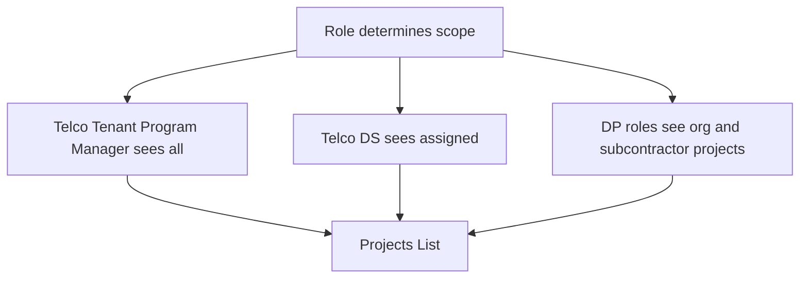

# Projects Feature — Frontend UI and UX Specification

Author: Kilo Code
Status: Draft v0.6
Audience: Product design, frontend engineering, QA
Date: 2025-08-19
Source PRD: [docs/product/projects-feature-prd.md](docs/product/projects-feature-prd.md:1)

Purpose
- Define user interface, interaction patterns, and end-to-end workflows for the Projects Feature as specified in the PRD.
- Map the PRD’s role-based visibility, data ownership, and assignment model into concrete screens, controls, and navigation flows.
- Avoid backend/policy specifics; focus on UX behavior, visual hierarchy, and UI state handling.

Out of scope
- Database schema, RLS policies, ingestion merge logic, or storage policies. Refer to [docs/projects-feature.md](docs/projects-feature.md:1) and [docs/security/rbac-rls-review.md](docs/security/rbac-rls-review.md:1) for backend details.

Design system conformance
- This specification conforms to Omnivia UI and UX Steering Guide v1.1 [docs/product/ui-ux-steering-guide.md](docs/product/ui-ux-steering-guide.md).
- All screens and components must:
  - Use shared design tokens for color, typography, spacing, radii, elevation, motion, and states.
  - Use SF Pro Text/Display typography scales; respect Dynamic Type.
  - Use a 4-pt spacing grid; default radii md 12 and lg 16 for cards and buttons.
  - Use elevation tokens for soft shadows and overlay scrims; avoid harsh shadows.
  - Use motion tokens (xfast/fast/standard/slow/xslow) and spring transitions where appropriate; respect Reduced Motion.
  - Iconography policy: prefer SF Symbols on iOS with Ionicons fallback; keep baseline size 24 and consistent fill/outline style per context.
  - Emit haptics for selection, success, warning, error, and destructive actions per the haptics token map; respect user settings and throttle repeats.
  - Avoid hard-coded values; prefer token references and primitives in [components/ui](components/ui:1) and [constants/colors.ts](constants/colors.ts:1).
- iPhone-first baseline (applies to Projects)
  - Large-title navigation on top-level screens with smooth collapse to compact on scroll.
  - Respect safe areas including Dynamic Island and home indicator; define a bottom action area with a minimum 24 pt inset above the home indicator.
  - Sheets for tasks and editors with medium and large detents and a visible grabber; blurred background and dim overlay; drag-to-dismiss where safe.
  - Long-press context menus for secondary actions on list rows, cards, and media (iOS); Android uses overflow menu or bottom sheet.
  - Keyboard management with a pinned form action footer above the keyboard; provide Next/Done navigation between fields.
  - Edge-swipe back enabled on iOS where safe; Android relies on system back; avoid gesture conflicts with horizontal swipes.
  - Dynamic Type validated from small to extra large, including 320-pt width; Reduced Motion paths swap to fades/instant transitions.

1. Information architecture and navigation

Primary routes and screens
- Protected stack and tabs
  - Root protected tabs container: [app/(protected)/(tabs)/index.tsx](app/(protected)/(tabs)/index.tsx:1)
  - Protected layout: [app/(protected)/_layout.tsx](app/(protected)/_layout.tsx:1)
- Projects module screens
  - Projects List: entry point for role-scoped project visibility
  - Project Detail
    - Tabs: Overview, Timeline, Contacts, Engagements, Attachments
  - Modals/Forms
    - Add/Edit Contact
    - Add Engagement
    - Upload Attachment
    - Shared modal shell: [app/(protected)/modal.tsx](app/(protected)/modal.tsx:1)
    - Presentation: Bottom sheets with iOS-style detents (medium=0.5, large=0.9), visible grabber, rounded top corners; blurred background and dim overlay; drag-to-dismiss where safe; standardized on @gorhom/bottom-sheet

Core UI components
- Buttons and CTAs: [components/ui/button.tsx](components/ui/button.tsx:1)
- Inputs: [components/ui/input.tsx](components/ui/input.tsx:1), [components/ui/textarea.tsx](components/ui/textarea.tsx:1)
- Labels and text: [components/ui/label.tsx](components/ui/label.tsx:1), [components/ui/text.tsx](components/ui/text.tsx:1)
- Form harness: [components/ui/form.tsx](components/ui/form.tsx:1)
- Iconography: SF Symbols on iOS with Ionicons fallback via @expo/vector-icons (baseline size 24; consistent fill/outline style per context)
Navigation model
- Projects List is accessible from protected home. Deep-link to Project Detail by Stage Application (Application Number).
- Within Project Detail, tabs preserve scroll position per tab and reflect the selected state via a top tab bar.
- Back navigation returns to the anchored position in the Projects List with applied filters and search preserved.

iPhone-first behaviors and Android compatibility
- Projects List uses large-title navigation on iOS and collapses smoothly on scroll; consider inline search in the navigation area for dense screens.
- iOS edge-swipe back is enabled where safe; Android uses system back; avoid conflicts with horizontal gestures and carousels.
- Primary bottom actions sit in a bottom action area with ≥24 pt inset above the home indicator on iOS.
- Card long-press opens:
  - iOS: a native context menu with Copy Stage Application, Share deep link, and Open in maps (when lat/long present).
  - Android: a bottom sheet or overflow menu with the same actions.
- Tasks/forms (Add Engagement, Add Contact, Upload Attachment) present as sheets with detents (medium=0.5, large=0.9), visible grabber, rounded top, blurred background and dim overlay; drag-to-dismiss where safe.
- Keyboard: forms provide a pinned action footer above the keyboard and support Next/Done navigation between fields.
- Do not emulate Dynamic Island on Android; use ongoing notifications and standard system surfaces.

2. Role-based visibility and gating (UI behavior)

Roles in UI
- Telco Tenant Admin
  - Sees all projects within the telco tenant.
  - UGC permitted on any project in tenant.
  - Can assign Delivery Partner ORG and Deployment Specialist USER.
- Telco Tenant Program Manager
  - Sees all projects within the telco tenant.
  - UGC permitted on any project in tenant.
  - Can assign Deployment Specialist USER; DP ORG assignment may be enabled with admin approval when available.
- Telco Tenant Deployment Specialist
  - Sees only projects where they are the named Deployment Specialist (synced field) and assigned via USER membership.
  - Full UGC capabilities on assigned projects.
- Telco Tenant Relationship Manager
  - Sees only projects explicitly assigned to them (synced Relationship Manager field) and assigned via USER membership.
  - Full UGC capabilities on assigned projects.
- Delivery Partner Tenant Admin
  - Sees projects where Delivery Partner equals their ORG and any SUB_ORG they manage.
  - UGC permitted; can assign projects to SUB_ORG.
- Delivery Partner Program Manager
  - Sees projects where Delivery Partner equals their ORG and any SUB_ORG they manage.
  - UGC permitted; can assign projects to SUB_ORG.
- Delivery Partner Construction Partner
  - Sees only projects assigned to their SUB_ORG.
  - UGC permitted for engagements, attachments, and contacts; cannot assign.

UI gating patterns
- List visibility: Projects List shows only projects for which the user has visibility by role/membership.
- Detail tabs and actions:
  - Overview shows imported fields as read-only for non-admin roles.
  - Contacts, Engagements, Attachments tabs show add/edit actions if the user has write scope to the project.
- Hidden vs disabled:
  - Actions the user cannot perform should generally be hidden (not disabled) to reduce friction, except where discoverability requires a disabled control with an info tooltip.

3. Projects List specifications

Layout
- Mobile-first card list with infinite scroll.
- Card style: radius md–lg (12–16), padding 16–24, elevation.1 soft shadow; tokens per [docs/product/ui-ux-steering-guide.md](docs/product/ui-ux-steering-guide.md:1)
- Card content (top to bottom):
  - Primary: Stage Application (Application Number; 14 chars, starts with STG-)
  - Secondary: Address (single line, ellipsized)
  - Meta chips: Delivery Partner (org chip), Deployment Specialist (initials chip), Developer Class
  - Counters: Premises Count (optional), Residential/Commercial/Essential as mini-pill counts if available
  - Status chip: Overall Project Status — use tokenized semantics per [docs/product/ui-ux-steering-guide.md](docs/product/ui-ux-steering-guide.md:1): In Progress → neutral chip; In Progress — Overdue → color.semantic.warning; Complete → color.semantic.success; Complete Overdue and Complete Overdue Late App → color.semantic.danger with a Late App badge. Chips use radius md and elevation.1 when lifted; otherwise border.default.
  - Optional secondary chips: In Service, Delivery Partner PC Sub (if present)
- Display rule: When Delivery Partner is blank, show the Delivery Partner chip as Not Yet Assigned.
- Tap anywhere on the card to open Project Detail.

Search and filters
- Global search: by Stage Application and Address.
- Filter chips row (scrollable):
  - Overall Project Status (multi-select: In Progress, In Progress — Overdue, Complete, Complete Overdue, Complete Overdue Late App)
  - Development type
  - Build Type
  - Delivery Partner (includes Not Yet Assigned)
  - Deployment Specialist (telco users only)
  - Date ranges (by key dates: Expected First Service Connection Date (EFSCD), Stage Application Created, Developer Design Submitted, Developer Design Accepted, Issued to Delivery Partner, Delivery Partner PC Sub, Practical Completion, In Service)
- Behavior:
  - Status reflects latest import; if EFSCD is missing the status chip and filter exclude those rows by default.
- Overflow policy:
  - Show at most 5 primary chips on initial render with a trailing Filters chip opening a drawer for the full set; keep the chip row horizontally scrollable; maintain single-row initial density.
- Quick scopes:
  - Telco Tenant Program Manager: All Projects (default), By Delivery Partner, By Deployment Specialist, Recent activity
  - Telco Tenant Deployment Specialist: Assigned to Me (default), Recently updated
  - Telco Tenant Relationship Manager: Assigned to Me (default), Recently updated
  - Delivery Partner Tenant Admin and Program Manager: My Organization (default), My Subcontractors, Recently updated
  - Delivery Partner Construction Partner: My Subcontractor Projects, Recently updated

Sorting
- Default sort: Desc by Stage Application Created (if present) else by latest key date present.
- User can toggle sort by Address (A-Z), Stage Application (A-Z), or Practical Completion Certified (latest first).

Empty, loading, error states
- Loading skeletons: 6 pseudo-cards with shimmering placeholders.
- Empty:
  - Scoped empty message e.g., No projects assigned yet for your organization.
  - CTA (telco roles): Adjust filters
- Error:
  - Inline error banner with Retry.

List item affordances
- iOS: Long-press shows a native context menu with:
  - Copy Stage Application
  - Share deep link
  - Open in maps (if lat/long present)
- Android: Long-press opens a bottom sheet or overflow menu with the same actions.
- Commit actions emit appropriate haptics; respect Reduced Motion.

4. Project Detail specifications

Header summary
- Title: Stage Application
- Subtitle: Address
- Meta row: Delivery Partner chip, Deployment Specialist chip, Developer Class tag
- Overall Project Status pill (computed; tooltip references PRD section 8.3; color semantics per Projects List)
- Location link only when latitude and longitude present; opens device maps; no inline preview in MVP.
- Quick actions (visible by role):
  - Add Engagement
  - Upload Attachment
  - Add Contact

Tab: Overview
- Objective: Provide a concise snapshot of imported attributes most relevant for comprehension.
- Content groups:
  - Identification
    - Stage Application
    - Address
  - Classification
    - Development type
    - Build Type
    - Developer Class
  - Delivery and ownership
    - Delivery Partner
    - Relationship Manager
  - Scale
    - Premises Count
    - Residential, Commercial, Essential (display as labelled counters if available)
  - Location
    - latitude, longitude (link to open maps)
  - Status indicators (read-only badges if present)
    - Overall Project Status (derived; hidden when EFSCD missing)
    - In Service
    - Delivery Partner PC Sub
- Presentation: Key-value rows with clear labels; chips for categorical fields; counters as pills.

Tab: Timeline
- Objective: Show a chronological sequence of key dates and user activity.
- Sections:
  - Milestones (from synced fields; read-only)
    - Stage Application Created
    - Developer Design Submitted
    - Developer Design Accepted
    - Issued to Delivery Partner
    - Practical Completion Certified
    - Delivery Partner PC Sub
    - In Service
  - Engagements stream (UGC; newest first) with day separators
- Controls:
  - Add Engagement floating action button (FAB) for users with write access.
- Interaction:
  - Tap milestone to view raw date metadata (read-only).
  - Tap engagement to view details and attachments.
- Risk and breach callouts (derived, read-only)
  - Show warning chip when fewer than 60 business days remain until EFSCD and Developer Design Accepted not set.
  - Show warning chip when fewer than 20 business days remain until EFSCD and PCC not set; for Late App, suppress warning until 20 business days after Issued to Delivery Partner.
  - Show danger chip when a milestone is achieved outside its allowed window (e.g., DD Accepted later than 60 BD before EFSCD; PCC later than allowed under the standard rule or Late App waiver).
  - Show danger banner when today is after EFSCD and In Service not set.
  - Tooltip: Status is computed per PRD 8.3 and may change when EFSCD updates on import.

Tab: Contacts
- List view with search by name/org.
- Item: name, role, org, phone, email; tap to open Contact sheet.
- Actions:
  - Add Contact (if permitted)
  - Edit/Delete Contact (creator or project member per policy; show as permitted)
- Role note: Delivery Partner Construction Partner can add contacts; Add Contact is visible when write scope is present.
- Contact sheet:
  - Quick call, email actions using device intents.

Tab: Engagements
- List with filters: kind chips site_visit, progress_note, call.
- Item: kind icon, occurred_at, first line of notes, optional linked contact badge, attachment count.
- Actions:
  - Add Engagement (if permitted)
  - Edit/Delete own engagement (if permitted)

Tab: Attachments
- Grid or list toggle
- Item: thumbnail or type icon, filename, size, created_at
- Actions:
  - Upload Attachment (if permitted)
  - Preview (image, pdf if supported) or open in external viewer
  - Share deep link (if enabled)
  - Delete (role permitted only)

States and feedback
- Loading per tab with skeletons.
- Empty messaging tailored per tab (e.g., No engagements yet).
- Error banners with retry.

5. Forms and interaction patterns

Form field standards
- Labels appear above inputs; placeholders are supplemental, not a replacement for labels.
- Focus states use accent ring; error states use semantic danger color with helper text.
- Controls follow minimum 44x44 hit areas. Radio/checkbox use accessible touch targets.
- Helper text uses concise language; reserve red for errors only.

Add Engagement
- Access: FAB on Timeline or primary CTA in header; permitted for users with write access to the project.
- Fields:
  - kind (site_visit, progress_note, call)
  - occurred_at (default now; editable)
  - notes (multiline)
  - optional linked contact (picker)
  - optional attachments (invoke Upload Attachment flow inline)
- Validation:
  - kind required, occurred_at required
- UX:
  - Save commits and shows toast Engagement added; emit haptic notificationSuccess on success and notificationError on failure.
  - Timeline scrolls to the new item, highlighted briefly.
  - Primary action press emits a light selection haptic; throttle repeated haptics and respect user settings.

Add Contact
- Fields:
  - name (required)
  - org (optional)
  - role (optional)
  - phone (optional; phone keypad)
  - email (optional; email keyboard)
- UX:
  - Save commits and returns to Contacts list with new contact at top and subtle highlight; emit haptic notificationSuccess on success and notificationError on failure.

Upload Attachment
- Entry points:
  - From Attachments tab
  - From Add Engagement (inline)
- Picker:
  - Camera and photo library, document provider
- Constraints:
  - Accept any file type up to 25 MB per file; show preflight errors clearly.
- UX:
  - Show local preview while uploading; progress indicator.
  - Success toast Attachment uploaded; emit haptic notificationSuccess on success and notificationError on failure.
  - Error state with Retry and Remove options.

Common patterns
- Permission-aware CTAs: Show only actions the user can perform; prefer hidden over disabled.
- Optimistic UI for UGC with rollback on error where feasible; otherwise blocking spinner with clear state.
- Non-blocking toasts for success; inline field errors for validation failures.

6. Field exposure and mapping to UI

Notes
- The PRD defines the complete synced field set. Not all fields appear in UI. Below is the proposed default exposure by screen. This can be tuned in detailed design but must never introduce fields outside the PRD list.

Overview tab
- Always show:
  - Stage Application
  - Address
  - Development type
  - Build Type
  - Delivery Partner
  - Relationship Manager
  - Developer Class
  - Overall Project Status (derived; hidden when EFSCD missing)
- Show when present:
  - FOD ID
  - Premises Count
  - Residential, Commercial, Essential
  - latitude, longitude (with Open map)
  - In Service
  - Delivery Partner PC Sub

Timeline tab (Milestones section)
- Stage Application Created
- Developer Design Submitted
- Developer Design Accepted
- Issued to Delivery Partner
- Practical Completion Certified
- Delivery Partner PC Sub
- In Service

Projects List card
- Stage Application
- Address
- Overall Project Status chip (color semantics per Layout)
- Delivery Partner (chip)
- Deployment Specialist (chip, initials)
- Developer Class (tag)
- Optional counters: Premises Count; Residential, Commercial, Essential if concise
- Optional status: In Service, Delivery Partner PC Sub if concise

Search and filters include
- Stage Application, Address (search)
- Overall Project Status
- Development type, Build Type, Delivery Partner (includes Not Yet Assigned), Deployment Specialist, date ranges across the key date fields

Normalization and presentation rules
- Delivery Partner
  - Blank source value is treated as Unassigned; UI must display Not Yet Assigned and no ORG membership is materialized.
- Developer Class
  - Normalize class codes to labels for all UI and filters:
    - Class 1 → Key Strategic
    - Class 2 → Managed
    - Class 3 → Inbound
    - Class 4 → Inbound

7. End-to-end workflows

Delivery Partner user — capture site visit with photo
- Flow
  1) Open app → Projects List (scoped to My Organization)
  2) Search Stage Application or Address → tap project card
  3) In Project Detail, go to Timeline → tap Add Engagement
  4) Select site_visit → add notes → attach photo → Save
  5) See engagement appears at top of Timeline
- Acceptance
  - User never sees projects from other organizations
  - Imported fields are read-only
  - Attachment preview accessible from the engagement

Telco Deployment Specialist — review assigned projects and log progress
- Flow
  1) Projects List default scope Assigned to Me
  2) Filter by Delivery Partner if needed
  3) Open project → Timeline → Add Engagement (progress_note) → Save
- Acceptance
  - Only projects assigned via Deployment Specialist are visible
  - Engagement is visible to DP users assigned to that project

Telco Tenant Program Manager — check milestones and contacts
- Flow
  1) Projects List → open project
  2) Overview: verify Delivery Partner, Developer Class, Premises Count
  3) Timeline: verify milestones present
  4) Contacts: add a stakeholder contact
- Acceptance
  - Milestones from synced fields are read-only
  - New contact appears in Contacts list

Mermaid flows

8. UI states, accessibility, and performance

States
- Loading: skeletons for list and each tab; avoid jank by preserving layout slots.
- Error: contextual messages with Retry; non-blocking toasts for minor issues.
- Empty: clear guidance; link to filters where relevant.

Accessibility
- Touch targets: iOS ≥ 44x44 pt; Android ≥ 48x48 dp; list items tappable area spans card width.
- Labels tied to inputs; semantic roles for lists and tabs.
- High-contrast text and sufficient color contrast for chips and badges.
- Keyboard navigation considerations for web builds (if applicable).
- Dynamic Type: typography scales with OS setting; maintain hierarchy and legibility.
- Reduced Motion: respect OS setting; use fade transitions and disable overshoot/scale and FAB bounce.

Performance
- Defer-heavy content in tabs until visible.
- Virtualized lists for Projects and Attachments.
- Image thumbnails cached; lazy load larger previews.
- Avoid blocking the main thread during uploads; show progress.

9. Analytics and instrumentation

Event taxonomy (examples)
- ui_projects_list_viewed
- ui_projects_search_submitted
- ui_projects_filter_applied
- ui_project_opened
- ui_engagement_add_started
- ui_engagement_added
- ui_attachment_upload_started
- ui_attachment_uploaded
- ui_contact_added

Dimensions to capture
- role, delivery_partner_org, deployment_specialist_user
- stage_application
- filters_applied, sort_option

10. Feature flags and progressive disclosure

- ENABLE_PROJECTS: toggles the Projects module visibility in navigation.
- ENABLE_ATTACHMENTS_UPLOAD: controls visibility of Upload Attachment CTAs.
- Role-driven disclosure:
  - Hide unpermitted actions for reduced cognitive load.
  - Prefer contextual hints on why an action is unavailable when discoverability matters.

11. QA acceptance checklist (UI-focused)

Projects List
- Only authorized projects are visible for each role.
- Search and filters work as specified and persist on back navigation.
- Cards render Stage Application, Address, and chips correctly.
- Overall Project Status chip displays with correct color semantics and tooltip. Status filter supports multi-select and returns unions of selected values.

Project Detail
- Overview shows only approved fields and all are read-only if imported.
- Timeline shows milestones and engagements in correct order; FAB visible only for permitted users.
- Status indicators include Overall Project Status when computable; hidden when EFSCD is missing.
- Contacts CRUD respects permissions; call/email intents launch correctly.
- Attachments upload, preview, and delete behave per role permissions.

General
- Loading, empty, and error states display as specified.
- Deep linking to a project opens the correct tab when specified.
- Analytics events are emitted at the defined interaction points.
- Status reflects latest import and recomputes after EFSCD changes (no sticky state).
- All screens use shared tokens for color, typography, spacing, radii, elevation, and motion; no hard-coded values.
- Icons: SF Symbols used on iOS where available with Ionicons fallback; baseline size 24; consistent fill/outline style per context.
- Haptics fire as specified and respect OS settings; repeated haptics are throttled.
- Reduced Motion pathways render with simplified transitions and no overshoot/scale effects.
- iOS acceptance: Large-title collapses smoothly on Projects List and Detail; edge-swipe back works where safe; bottom action area maintains ≥24 pt inset above home indicator; sheets use medium/large detents with visible grabber and blur/dim; long-press context menus present on list items/cards; Dynamic Type validated small→extra large at 320‑pt width.
- Android acceptance: System back parity; no gesture conflicts with horizontal swipes; minimum 48 dp touch targets; safe insets respected; no Dynamic Island emulation.

12. UI decisions — resolved

- Residential, Commercial, Essential semantics: Resolved — integer counts; blank spreadsheet cells render as 0 in the UI. See [docs/product/projects-okta-rbac-implementation-tracker.md](docs/product/projects-okta-rbac-implementation-tracker.md)
- Canonical label for PCC: Resolved — use Practical Completion Certified consistently across UI and docs. See [docs/product/projects-okta-rbac-implementation-tracker.md](docs/product/projects-okta-rbac-implementation-tracker.md)
- EFSCD as a Timeline milestone in MVP: Resolved — Overview only; no Timeline milestone in MVP. See [docs/product/projects-okta-rbac-implementation-tracker.md](docs/product/projects-okta-rbac-implementation-tracker.md)
- Max number of filter chips visible: Resolved — show at most 5 primary chips initially with a trailing Filters chip opening a Filter drawer for the full set (including date ranges and secondary chips). Chip row remains horizontally scrollable; maintain single-row initial density. See [docs/product/projects-okta-rbac-implementation-tracker.md](docs/product/projects-okta-rbac-implementation-tracker.md) and [docs/product/ui-ux-steering-guide.md](docs/product/ui-ux-steering-guide.md)

Appendix: Implementation anchors

- Protected tabs entry: [app/(protected)/(tabs)/index.tsx](app/(protected)/(tabs)/index.tsx:1)
- Protected layout: [app/(protected)/_layout.tsx](app/(protected)/_layout.tsx:1)
- Modal shell: [app/(protected)/modal.tsx](app/(protected)/modal.tsx:1)
- UI primitives: [components/ui/button.tsx](components/ui/button.tsx:1), [components/ui/input.tsx](components/ui/input.tsx:1), [components/ui/textarea.tsx](components/ui/textarea.tsx:1), [components/ui/label.tsx](components/ui/label.tsx:1), [components/ui/text.tsx](components/ui/text.tsx:1)

Change log
- v0.6 Align to UI/UX Steering Guide v1.1 iPhone‑first; add large‑title navigation behaviors, bottom sheets with detents/grabber and blur/dim, iOS context menus, bottom action area inset rules, keyboard pinned footers, Android parity notes (system back, 48 dp touch targets), icons policy (SF Symbols on iOS with Ionicons fallback), and QA acceptance updates.
- v0.5 Aligned to UI/UX Steering Guide v1.0 (tokens, iconography, haptics, reduced motion, elevation); normalized role names to RBAC (Telco Tenant Program Manager; Delivery Partner roles split) and updated scopes; enabled contacts creation for Delivery Partner Construction Partner; updated quick scopes, status chip token mapping, card/elevation specs, and QA checklist.
- v0.4 Added Telco Relationship Manager role to UI gating (assigned-only visibility and UGC on assigned projects); Delivery Partner blank handling displays Not Yet Assigned and is included as a Delivery Partner filter value; Developer Class normalization (Class 1/2/3/4 mapped to Key Strategic/Managed/Inbound) applied to all UI and filters.
- v0.3 Added Overall Project Status UI: list/status chip with color semantics, filters, header pill on detail, Timeline risk/breach callouts, field exposure mapping; status recomputes dynamically when EFSCD updates. Aligned to PRD 8.3.
- v0.2 Aligned with PRD feedback: link-only location (no mini-map), added EFSCD to date filters, added Delivery Partner PC Sub to milestones and date filters, exposed FOD ID on Overview when present, replaced Deployment Specialist with Relationship Manager on Overview, set attachment constraint to any file type up to 25 MB, standardized label to longitude, default sort confirmed, deep linking affirmed. Pending confirmations noted in Open UI questions.
- v0.1 Initial UI/UX specification drafted from [docs/product/projects-feature-prd.md](docs/product/projects-feature-prd.md:1). Includes role-scoped navigation, screen definitions, field exposure mapping, forms, states, and workflows.