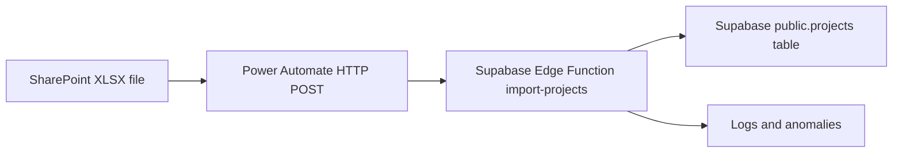

# Projects Import Contract — XLSX via Supabase Edge Function over HTTPS

Author: Kilo Code
Status: Draft v0.3
Date: 2025-08-22
References: [docs/product/projects-feature-prd.md](docs/product/projects-feature-prd.md), [docs/product/projects-feature-implementation-plan.md](docs/product/projects-feature-implementation-plan.md), [docs/security/rbac-rls-review.md](docs/security/rbac-rls-review.md), [supabase/functions/import-projects/index.ts](supabase/functions/import-projects/index.ts)

1. Purpose
- Define a stable XLSX ingestion contract for the Projects data uploaded daily from SharePoint via Power Automate to a Supabase Edge Function.
- Ensure large files 10k+ rows import reliably with idempotent merge and clear error reporting.
- Preserve existing normalization and validation semantics from the CSV contract while relaxing header strictness to a whitelist filter with optional aliasing.

2. Architecture overview

- The Edge Function parses the first worksheet using the xlsx library, filters to allowed columns, normalizes and validates, then performs batched upsert into the Projects table.
- Extra worksheet columns are ignored for persistence and reported as telemetry.

3. Transport and security
- Protocol: HTTPS POST to a per-tenant endpoint (Supabase Edge Function), for example /imports/projects/telco
- Auth: Authorization: Bearer <per-tenant secret> stored in a secure connection reference
- Content types accepted
  - application/vnd.openxmlformats-officedocument.spreadsheetml.sheet (raw binary body)
  - multipart/form-data with a single file field named file
- Size guidance
  - Supported: 10k+ data rows
  - Typical XLSX files under 25 MB; HTTP 413 may be returned if deployment-configured limits are exceeded
- Compression
  - Not required at client level. If CDN or proxy compression is enabled it is transparent to clients.
- Idempotency
  - Idempotent merge keyed by stage_application (scoped to the tenant). Repeated rows with same values no-op; updates apply to whitelisted fields only.

4. Workbook format and parsing rules
- Worksheet selection
  - The first worksheet in the workbook is parsed by default.
- Header row
  - Row 1 is required and is treated as the header row.
- Header normalization and filtering
  - Case-insensitive, whitespace-trimmed header names.
  - Optional alias mapping is applied before filtering.
  - Only headers in the Allowed fields list are kept; extra columns are ignored for persistence and reported in response.telemetry.extra_columns.
- Row filtering
  - Completely empty rows are skipped.
- Date handling
  - Excel serial dates and ISO 8601 strings are both supported. Serial dates are converted to ISO before field-level normalization.
  - Date-only fields discard time components.
- Numbers
  - Coerced to integers or floats as specified; blanks handled per field rules below.
- Text
  - Trim all textual inputs; case-insensitive handling for enumerations; canonicalization rules applied where defined.

5. Allowed fields and definitions
- The function filters to the following fields (case-insensitive, with optional alias support). Semantics match the prior CSV contract.
- Canonical list:
  ```
  stage_application,address,suburb,state,eFscd,build_type,delivery_partner,fod_id,premises_count,residential,commercial,essential,developer_class,latitude,longitude,relationship_manager,deployment_specialist,stage_application_created,developer_design_submitted,developer_design_accepted,issued_to_delivery_partner,practical_completion_notified,practical_completion_certified,delivery_partner_pc_sub,in_service
  ```
- stage_application
  - Type: string (14 chars, starts with STG-), required, unique key within tenant
  - Trim whitespace; must match canonical key from PRD
- address
  - Type: string, required
- suburb
  - Type: string, optional
- state
  - Type: string, optional
- eFscd
  - Label: Expected First Service Connection Date
  - Type: date (YYYY-MM-DD) or datetime (ISO 8601); normalized to date with timezone-neutral handling
- build_type
  - Allowed: SDU, MDU, HMDU, MCU (case-insensitive)
- delivery_partner
  - Type: string; can be blank to denote Unassigned; normalization to canonical partner_org via partner_normalization
- fod_id
  - Type: string (optional)
- premises_count
  - Type: integer (>= 0), optional; blanks → 0
- residential
  - Type: integer (>= 0), optional; blanks → 0
- commercial
  - Type: integer (>= 0), optional; blanks → 0
- essential
  - Type: integer (>= 0), optional; blanks → 0
- developer_class
  - Source codes: Class 1, Class 2, Class 3, Class 4
  - Normalization:
    - Class 1 → Key Strategic
    - Class 2 → Managed
    - Class 3 → Inbound
    - Class 4 → Inbound
- latitude
  - Type: decimal (+/- 90), optional
- longitude
  - Type: decimal (+/- 180), optional
- relationship_manager
  - Type: string identifier from source; mapped via rm_directory to Okta user id
- deployment_specialist
  - Type: string identifier from source; mapped via ds_directory to Okta user id
- stage_application_created
  - Type: date (YYYY-MM-DD) or datetime (ISO 8601)
- developer_design_submitted
  - Type: date/datetime
- developer_design_accepted
  - Type: date/datetime
- issued_to_delivery_partner
  - Type: date/datetime
- practical_completion_notified
  - Type: date/datetime
- practical_completion_certified
  - Type: date/datetime
- delivery_partner_pc_sub
  - Type: date/datetime
- in_service
  - Type: date/datetime

Field mapping to Supabase storage
| Header | Supabase column | Data type |
|---|---|---|
| address | public.projects.address | text |
| suburb | public.projects.suburb | text |
| state | public.projects.state | text |
| practical_completion_notified | public.projects.practical_completion_notified | date |

Inbound identifier mapping
- relationship_manager → public.projects.relationship_manager (text) with server-side directory resolution via rm_directory; see [supabase/migrations/20250817231500_stage4_import.sql](supabase/migrations/20250817231500_stage4_import.sql)
- rm_preferred_username: not accepted as a header; do not send. RM mapping is handled via relationship_manager only.

Derived fields (not inbound)
- development_type: derived on server from residential and commercial counts; see rules in [docs/product/projects-data-field-inventory.md](docs/product/projects-data-field-inventory.md)

Notes
- Case-insensitivity and whitespace trimming are applied for headers and code values.
- Extra columns in the worksheet are ignored for persistence and surfaced in response.telemetry.extra_columns to aid cleanup.
- UI: Address displayed as Address, Suburb State. Development Type is displayed but derived server-side and MUST NOT be included as a spreadsheet header.

6. Header alias mapping (optional)
- To ease adoption, the Edge Function supports simple aliases that are resolved before filtering. Example defaults:
  - efscd → eFscd
  - dev_class → developer_class
  - rm → relationship_manager
  - ds → deployment_specialist
  - dp → delivery_partner
  - lat → latitude
  - lon → longitude
  - pc_notified → practical_completion_notified
  - pc_certified → practical_completion_certified
  - dp_pc_sub → delivery_partner_pc_sub
- Aliases are case-insensitive and trimmed.

7. Example worksheet and post-parse record
Worksheet headers (example; extra columns like Notes and Misc will be ignored for persistence but reported):
```
stage_application,address,suburb,state,eFscd,build_type,delivery_partner,premises_count,residential,commercial,essential,developer_class,latitude,longitude,relationship_manager,deployment_specialist,stage_application_created,developer_design_submitted,developer_design_accepted,issued_to_delivery_partner,practical_completion_notified,practical_completion_certified,delivery_partner_pc_sub,in_service,Notes,Misc
```
Post-parse normalized record (illustrative):
```json
{
  "stage_application": "STG-000000000001",
  "address": "12 Main St",
  "suburb": "Adelaide",
  "state": "SA",
  "eFscd": "2025-10-01",
  "build_type": "SDU",
  "delivery_partner": "UGL",
  "premises_count": 50,
  "residential": 45,
  "commercial": 5,
  "essential": 0,
  "developer_class": "Key Strategic",
  "latitude": -34.9285,
  "longitude": 138.6007,
  "relationship_manager": "RM_JSMITH",
  "deployment_specialist": "DS_AJONES",
  "stage_application_created": "2025-04-01",
  "developer_design_submitted": "2025-04-10",
  "developer_design_accepted": "2025-04-15",
  "issued_to_delivery_partner": "2025-05-01",
  "practical_completion_notified": "2025-08-10",
  "practical_completion_certified": "2025-08-15",
  "delivery_partner_pc_sub": "2025-08-01",
  "in_service": "2025-09-28"
}
```

8. Server-side normalization and validation
- Normalizations
  - developer_class: Class 1 2 3 4 → Key Strategic Managed Inbound Inbound
  - delivery_partner: map via partner_normalization; blank → Unassigned
  - stage_application: trim and uppercase check; format enforcement STG- prefix and length
- Validations
  - stage_application required and format enforced
  - Dates parsed strictly; if time present and the target column is date-only, convert to date
  - Practical Completion Notified parsed as date; timezone discarded in merge
  - Integers validated non-negative; blanks → 0 for residential commercial essential premises_count
  - Latitude Longitude parsed as floats; blanks → null
  - Unknown build_type values rejected with per-row error
- Mapping
  - ds_directory: deployment_specialist → Okta user id; unknown values produce anomaly
  - rm_directory: relationship_manager → Okta user id; unknown values produce anomaly
  - partner_normalization: delivery_partner → partner_org id; blank allowed; unknown non-blank label produces anomaly
- XLSX specifics
  - Excel serial dates are detected and converted to ISO strings prior to field-level normalization.

9. Response schema
- application/json
```json
{
  "batch_id": "2025-08-16T02:30:00Z-tenant-abc-001",
  "tenant_id": "TELCO",
  "counts": {
    "received_rows": 5000,
    "inserted": 1200,
    "updated": 3800,
    "rejected": 10,
    "membership_upserts": 4100
  },
  "metrics": {
    "bytes_processed": 7340032,
    "parse_ms": 820,
    "merge_ms": 1420
  },
  "telemetry": {
    "worksheet_name": "Sheet1",
    "extra_columns": ["Notes", "Misc"]
  },
  "errors": [
    {
      "row_number": 42,
      "stage_application": "STG-000000000042",
      "code": "UNKNOWN_DELIVERY_PARTNER",
      "message": "Delivery Partner label did not normalize to a canonical partner_org",
      "field": "delivery_partner",
      "value": "Fulton-Hogan??"
    },
    {
      "row_number": 77,
      "stage_application": "STG-000000000077",
      "code": "INVALID_DATE",
      "message": "Invalid date format for EFSCD",
      "field": "eFscd",
      "value": "15/11/2025"
    }
  ]
}
```
- HTTP status codes
  - 200: Request accepted; see counts and per-row errors
  - 400: Request invalid (e.g., missing header row, malformed XLSX or unreadable worksheet)
  - 401 403: Auth failure
  - 413: Payload too large
  - 429 5xx: Backoff and retry per flow policy

10. Operational guidance for Power Automate
- Trigger: SharePoint When a file is created in folder targeting the daily XLSX drop location
- Action: HTTP to POST the file content to the import endpoint
  - URL: Supabase Edge Function endpoint e.g., /imports/projects/telco
  - Headers:
    - Authorization: Bearer <per-tenant secret>
    - Content-Type: application/vnd.openxmlformats-officedocument.spreadsheetml.sheet
  - Body:
    - Use the file content dynamic value as binary body
- Alternative multipart approach
  - Send multipart/form-data with field name file containing the XLSX
- Logging
  - Capture response counts telemetry and errors; persist to SharePoint list or Dataverse for audit
- Retries
  - Use exponential backoff on non-2xx; do not retry 400-class validation errors without correction
- Schedule
  - Run daily at 17:00 local time; allow manual trigger for catch-up

11. Performance and batching
- The Edge Function batches upserts to the database to handle large files efficiently.
- Typical chunk size: 500–1000 records per batch; per-batch transaction with robust error capture.
- Throttling controls and rate limits are enforced server-side; see section 13.

12. Security and tenancy
- Bearer token authenticates the caller and resolves tenant context.
- Per-tenant rate limits and authorization are enforced in the Edge Function; see [supabase/functions/import-projects/index.ts](supabase/functions/import-projects/index.ts).

13. Rate limiting and backoff
- Purpose: protect downstream database and RPCs against bursts while preserving throughput under normal load.
- Signal: HTTP 429 indicates temporary backpressure. Treat as retryable.
- Response details on 429
  - Headers: Retry-After: integer seconds
  - Body (application/json):
    {
      "error": "rate_limited",
      "tenant": "<resolved-tenant>",
      "retry_after_ms": <milliseconds>
    }
- Default thresholds (subject to change)
  - Per-tenant rate: 1 request per second, burst 5
  - Per-tenant concurrent requests: 2
  - Global concurrent requests across all tenants: 6
- Backoff strategy (recommended)
  - Exponential backoff with full jitter
  - Initial jittered delay: 500–1500 ms; double per retry; clamp at 60 s; total window 5 minutes
  - Respect Retry-After header and retry_after_ms body hints; wait at least the maximum

14. Versioning and change control
- This document supersedes the CSV contract by switching payload from CSV JSON to XLSX.
- Changes to field semantics or whitelist require a minor version bump and advance notice.
- Referenced by:
  - [docs/product/projects-feature-implementation-plan.md](docs/product/projects-feature-implementation-plan.md)
  - [docs/product/projects-feature-prd.md](docs/product/projects-feature-prd.md)
  - [docs/security/rbac-rls-review.md](docs/security/rbac-rls-review.md)

Change log
- v0.3 XLSX ingestion via Edge Function; relaxed header strictness to whitelist with aliasing; added telemetry.extra_columns and worksheet_name
- v0.2 CSV contract refinements
- v0.1 Initial CSV contract