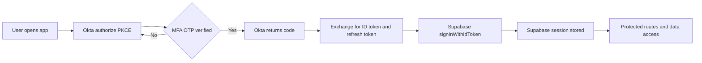

# Okta OIDC + Supabase Auth for Expo Passwordless TOTP

## Goal
- Make Okta the primary OpenID Connect IdP
- Integrate seamlessly with Supabase Auth for session persistence and RLS
- No email based login; tenant admins provision a stable user identifier
- Passwordless using an authenticator app TOTP such as Okta Verify or Google Authenticator
- Ready for future SSO providers while keeping a single client flow

## Scope
- This document describes architecture, Okta and Supabase configuration, required Expo changes, and a migration path from the current email and password setup
- It does not change code; it provides ready to copy snippets and file references for implementation

## Current state reference
- Supabase client setup persists sessions and auto refreshes tokens in [config/supabase.ts](config/supabase.ts)
- Auth state and actions live in [AuthProvider()](context/supabase-provider.tsx:31) and are consumed via [useAuth()](context/supabase-provider.tsx:29)
- Routing gates protected versus public stacks using session presence in [app/_layout.tsx](app/_layout.tsx)

## Target architecture
1. The app performs an OIDC PKCE authorization with Okta using deep links
2. On success, the app exchanges the authorization code for an ID token and refresh token
3. The app exchanges the Okta ID token for a Supabase session to leverage Supabase RLS and APIs
4. The app stores the Supabase session using the configured storage (AsyncStorage or SecureStore adapter)
5. Roles are read from Supabase tables or from an Okta claim mapped into user metadata and used for RBAC gates



## Identity model
- Canonical user identifier
  - Okta sub is globally unique; keep it as the canonical identity key
  - Also store an admin-assigned human-friendly user_id in an Okta claim such as preferred_username or a custom claim okta_user_id
  - Mirror both into Supabase auth.users user_metadata at first login
- Email
  - Email is not used for login; it may be absent
  - Avoid assuming email in UI or backend; use auth.uid and the mirrored identifiers instead
- Roles
  - Option A: Mirror Okta groups into a roles claim and sync into a Supabase table user_roles
  - Option B: Store a roles array as a custom Okta claim app_roles and mirror to user_metadata then materialize into a normalized table for RLS

## Okta configuration: Native OIDC app (passwordless TOTP)
1. Create an Okta application integration of type OIDC Native
2. Sign-in redirect URIs
   - omnivia://oauthredirect (production scheme)
   - exp://127.0.0.1:19000 (Expo Go local development)
   - Additional dev URIs as needed per platform
3. Sign-out redirect URIs
   - omnivia://signout
4. Allowed grant types
   - Authorization Code with PKCE
   - Refresh Token
5. Scopes
   - openid profile offline_access
   - Add groups if you plan to map Okta groups to roles
6. Passwordless policy
   - Create a sign-on policy that disables password and requires Okta Verify TOTP or Google Authenticator as primary authenticator
   - Enroll users to the authenticator and assign them to this policy
7. Claims
    - preferred_username set to the admin-assigned user_id
    - Optional custom claim app_roles array from group assignments
    - Optionally include groups claim filtered to relevant app groups
    - Recommended context claims for RLS mirroring (read-only in client):
      - tenant_id identifying the tenant context (e.g., TELCO or DP_NNN)
      - partner_org_id when user belongs to a Delivery Partner tenant
      - sub_partner_org_id when user belongs to a subcontractor org

## Supabase configuration: two supported patterns
- Pattern A: Supabase SSO OIDC (if available on your plan)
  1. In Supabase Dashboard → Authentication → SSO, add a new OIDC connection
  2. Enter Okta issuer https://your-okta-domain.okta.com/oauth2/default and the client ID
  3. Configure redirect URL to a universal link or custom scheme supported by your app and Supabase SSO handler
  4. In the client use supabase.auth.signInWithSSO with provider oidc and a domain hint or connection ID
  5. Result: Supabase handles the federation and returns a Supabase session
- Pattern B: Client obtains Okta tokens and exchanges with Supabase
  1. The app uses Expo Auth Session to complete PKCE flow against Okta
  2. The app then calls supabase.auth.signInWithIdToken with provider okta (or oidc, depending on project capability) passing the Okta ID token and nonce
  3. Supabase creates or links the user and issues a Supabase session token that the current code already persists

## Environment variables
Add the following to .env (local/dev). For CI and builds, use repository or platform secrets; do not commit secrets to the repo.
- EXPO_PUBLIC_OKTA_ISSUER=https://your-okta-domain.okta.com/oauth2/default
- EXPO_PUBLIC_OKTA_CLIENT_ID=your-okta-oidc-native-client-id
- EXPO_PUBLIC_DEEP_LINK_SCHEME=omnivia

## Expo deep link configuration
- Update [app.json](app.json) to declare the deep link scheme:

```json
{
  "expo": {
    "scheme": "omnivia"
  }
}
```
- For Expo Go, AuthSession.makeRedirectUri will generate exp:// URIs; for standalone builds it will use the scheme omnivia://

## Dependencies
- yarn add expo-auth-session
- If using SecureStore: expo install expo-secure-store
- Optional biometric: expo install expo-local-authentication

## Okta auth helper (PKCE) example
Create a helper to encapsulate the PKCE flow and token exchange. Suggested path: src/auth/okta.ts

```ts
import * as AuthSession from "expo-auth-session";

const issuer = process.env.EXPO_PUBLIC_OKTA_ISSUER as string;
const clientId = process.env.EXPO_PUBLIC_OKTA_CLIENT_ID as string;
const scheme = process.env.EXPO_PUBLIC_DEEP_LINK_SCHEME as string;

export async function oktaAuthorize() {
  const discovery = await AuthSession.fetchDiscoveryAsync(issuer);
  const redirectUri = AuthSession.makeRedirectUri({ scheme });

  const request = new AuthSession.AuthRequest({
    clientId,
    redirectUri,
    scopes: ["openid", "profile", "offline_access"],
    usePKCE: true,
    extraParams: {
      prompt: "login",
      nonce: AuthSession.generateRandom(16)
    }
  });

  await request.makeAuthUrlAsync(discovery);

  const result = await request.promptAsync(discovery);
  if (result.type !== "success" || !result.params.code) {
    throw new Error("Okta authorization failed");
  }

  const token = await AuthSession.exchangeCodeAsync(
    {
      clientId,
      code: result.params.code,
      redirectUri,
      extraParams: {
        code_verifier: request.codeVerifier as string
      }
    },
    discovery
  );

  return {
    idToken: token.idToken as string,
    accessToken: token.accessToken as string,
    refreshToken: token.refreshToken as string,
    issuedAt: token.issuedAt,
    expiresIn: token.expiresIn,
    nonce: request.nonce
  };
}
```

## Supabase token exchange and session
Extend the existing auth provider to add oktaSignIn. File to update: [context/supabase-provider.tsx](context/supabase-provider.tsx)

```ts
import { oktaAuthorize } from "@/auth/okta";
import { supabase } from "@/config/supabase";

export async function oktaSignIn() {
  const { idToken } = await oktaAuthorize();

  const { data, error } = await supabase.auth.signInWithIdToken({
    provider: "okta", // or "oidc" depending on Supabase support
    token: idToken
  });

  if (error) throw error;
  return data.session;
}
```

## UI changes
- Replace email and password forms with a single "Continue with Okta" button that triggers oktaSignIn
- Files impacted:
  - [app/(public)/sign-in.tsx](app/(public)/sign-in.tsx)
  - [app/(public)/sign-up.tsx](app/(public)/sign-up.tsx)
  - [app/(public)/welcome.tsx](app/(public)/welcome.tsx)

## Mapping identifiers and roles
On first sign-in create a profile row keyed by auth.uid with okta_sub and okta_user_id from the ID token claims. If you use app_roles claim mirror its contents into user_roles table for normalized RLS checks.

```sql
create table if not exists public.user_profiles (
  user_id uuid primary key references auth.users(id) on delete cascade,
  okta_sub text not null,
  okta_user_id text not null,
  created_at timestamp with time zone default now()
);

create table if not exists public.user_roles (
  user_id uuid references auth.users(id) on delete cascade,
  role text not null,
  primary key (user_id, role)
);
```

### RLS policies example

```sql
alter table public.user_profiles enable row level security;
alter table public.user_roles enable row level security;

create policy user_can_read_own_profile
on public.user_profiles for select
using (auth.uid() = user_id);

create policy user_can_read_own_roles
on public.user_roles for select
using (auth.uid() = user_id);
```

## Token and session lifecycle (PKCE, refresh, logout, revocation)
- PKCE, state, and nonce
  - AuthSession manages state; include and retain a nonce and, if you later add a verifier, check the nonce in the ID token
  - Prefer prompt=login to force user presence for TOTP when appropriate
- Refresh tokens
  - Request offline_access to obtain a refresh token from Okta
  - Supabase will manage its own refresh for its session; do not store Okta refresh token unless strictly needed
- Session lifetimes
  - Align Okta session TTL, token expiration, and Supabase session TTL to minimize surprise re-prompts
- Logout
  - Call supabase.auth.signOut to clear the Supabase session
  - Additionally call Okta end_session_endpoint to perform RP-initiated logout, then redirect back to omnivia://signout
- Revocation
  - Use Okta revocation endpoint to revoke access/refresh tokens if you store them
  - Rely on Supabase signOut and server-side revocation to invalidate the Supabase refresh token

## Secure storage and biometric re-unlock
- Use SecureStore for at-rest protection on iOS Keychain / Android Keystore; avoid storing sensitive material in plain AsyncStorage
- Supabase client accepts a custom storage adapter compatible with getItem/setItem/removeItem

Example SecureStore adapter:

```ts
import * as SecureStore from "expo-secure-store";

export const SecureStorage = {
  getItem: async (key: string) => {
    return (await SecureStore.getItemAsync(key)) ?? null;
  },
  setItem: async (key: string, value: string) => {
    await SecureStore.setItemAsync(key, value, {
      keychainAccessible: SecureStore.AFTER_FIRST_UNLOCK_THIS_DEVICE_ONLY
    });
  },
  removeItem: async (key: string) => {
    await SecureStore.deleteItemAsync(key);
  }
};
```

Wire it in [config/supabase.ts](config/supabase.ts):

```ts
import { createClient } from "@supabase/supabase-js";
import { SecureStorage } from "@/auth/secure-storage";

export const supabase = createClient(supabaseUrl, supabaseAnonKey, {
  auth: {
    storage: SecureStorage,
    autoRefreshToken: true,
    persistSession: true,
    detectSessionInUrl: false
  }
});
```

- Biometric re-unlock
  - Gate access to the protected stack by a local "unlocked" flag encrypted in SecureStore
  - Use expo-local-authentication to prompt FaceID/TouchID/Android Biometrics before flipping the flag after cold start

## TOTP enrollment, recovery, and device loss
- First-run enrollment
  - If the user has no enrolled authenticator, Okta will drive enrollment in the hosted flow
- Backup codes
  - Enable backup codes as a secondary authenticator; instruct users to store them securely
- Device loss / replacement
  - Admin flow to reset factor for a user; user re-enrolls at next sign-in
- Time drift
  - Enforce NTP on devices where possible; drift can cause TOTP failures

## Error handling UX and offline states
- Common errors: authorization cancelled, timeout, invalid_redirect_uri, interaction_required, id_token_missing, invalid_nonce
- UX patterns
  - Provide retry with exponential backoff
  - Detect offline via NetInfo and allow deferred sign-in
  - Log error codes and correlation IDs for support

## Telemetry, audit, and security logging
- Client telemetry
  - Emit events for start_auth, otp_challenge_shown, auth_success, auth_failure, signout
- Server and IdP
  - Forward Okta System Log to your SIEM
- PII
  - Avoid logging user identifiers or token contents in plaintext

## Environment and configuration strategy
- Separate Okta orgs and apps per environment (dev, stage, prod)
- Distinct client IDs and redirect URIs; configure via .env and EAS build profiles
- Configure Feature Flags for cutover (e.g., ENABLE_OKTA_AUTH) and RBAC toggles

## Clock skew tolerance and local verifier

- Default skew tolerance: 300 seconds applied to exp, nbf, and iat.
- Local verifier: [typescript.verifyIdTokenClaims()](auth/okta.ts:306) performs claims-only checks (no signature crypto). It:
  - Decodes header+payload (no signature verification) to validate:
    - iss equals opts.issuer or EXPO_PUBLIC_OKTA_ISSUER
    - aud equals provided audience when supplied (string or string[])
    - Time-based claims exp/nbf/iat using skewSec=300 by default; milliseconds are coerced to seconds
    - Optional nonce when provided via opts
  - Throws concise errors with machine-parseable prefixes:
    - IDV_CLAIMS_JWT_MALFORMED
    - IDV_CLAIMS_DECODE
    - IDV_CLAIMS_ISS_MISMATCH
    - IDV_CLAIMS_AUD
    - IDV_CLAIMS_EXPIRED
    - IDV_CLAIMS_NBF
    - IDV_CLAIMS_IAT_FUTURE
    - IDV_CLAIMS_NONCE
- Source of truth: Server-side verification (Supabase) remains authoritative. The local verifier is an optional guardrail for development/testing and early detection.
- Enable via environment flag:
  - Set EXPO_PUBLIC_ENABLE_LOCAL_ID_VERIFY=true to enable local claims verification (default is false).
- Call sites and guardrails:
  - When enabled, the verifier runs after successful Okta sign-in and on Supabase session refresh in [context/supabase-provider.tsx](context/supabase-provider.tsx:1). Calls are debounced and throttled to avoid excessive checks.
  - Audience is not enforced by default in call sites; pass audience explicitly only when a stable value is available (e.g., the Okta client ID).
- Negative tests: See [docs/security/identity-negative-tests.md](docs/security/identity-negative-tests.md:1) for step-by-step failure scenarios and expected codes.
## Testing strategy
- Device matrix across iOS/Android versions and hardware
- Deep link end-to-end path (launch → auth → redirect → session) in dev and standalone builds
- Negative MFA cases: wrong TOTP, expired code, device clock skew
- ID token validation: issuer, aud, exp, iat, nonce
- Sandbox org
  - Use a non-production Okta org with test policies and fake users

## Multi-tenant provisioning and SCIM
- Tenant model
  - Tenant admins provision users in Okta (no email required; use preferred_username as stable user_id)
- SCIM (optional, recommended for enterprise)
  - Implement a SCIM server (e.g., via Supabase Edge Functions or external service) to create/update/delete Supabase profiles on Okta lifecycle events
  - Map Okta group assignments to roles in Supabase
- Custom domain
  - Use Okta custom domain for branded URLs and to simplify allowlists; update issuer accordingly

## Admin portal integration (Model B — Option B2)

- Objective
  - Provide a unified in-app experience for Vendor Admin, Telco Tenant Admin, and DP Admin to initiate user lifecycle and role assignments, while keeping Okta as the sole provisioning authority.

- Pattern
  - The portal collects requests and stores them in a provisioning_requests table (status, requested_action, payload, tenant_id, requested_by, correlation_id).
  - Okta Workflows (or event hooks) picks up requests, executes create/assign/disable in Okta (groups → app_roles claim), and posts completion/failure to a webhook that updates status.
  - App never holds write-capable Okta secrets; all provisioning is executed by Okta.

- Scope of in-app versus Okta
  - In-app:
    - Create and manage SUB_ORG nodes under partner_org hierarchy (restricted to telco_admin and dp_admin). Enforcement is via RLS templates in [docs/security/rbac-rls-review.md](docs/security/rbac-rls-review.md:245).
    - Submit provisioning requests and view their status/audit.
  - Okta:
    - Create/disable users, manage group memberships mapping to app_roles claim.
    - Emit audit in Okta System Log; Workflows manages retries/backoff.

- Claims and mapping
  - Keep app_roles as the sole role source exposed to the client. Optional context claims tenant_id, partner_org_id, sub_partner_org_id may be included to simplify RLS mirroring; the DB remains the enforcement authority.
  - On first sign-in mirror identifiers into user_profiles and roles into user_roles per [Mapping identifiers and roles](docs/security/okta-oidc-supabase.md:189).

- Admin acceptance statements (aligned with RBAC reference)
  - Relationship Manager has assigned-only visibility and UGC on assigned projects (via rm_directory mapping).
  - Telco Tenant Admin and DP Admin can create SUB_ORG entries; changes apply immediately in DB and are enforced by RLS.
  - Vendor Admin has global oversight and may submit provisioning requests for any tenant; execution occurs in Okta via Workflows.

- Operational considerations
  - Asynchronous completion (seconds–minutes): show request status, correlation IDs, and retry guidance.
  - Dual audit: app-side (provisioning_requests) and Okta System Log.
  - Error paths: transient failures retried by Workflows; terminal failures surfaced to requestor with remediation tips.

## Migration and rollback plan
1. Introduce a feature flag ENABLE_OKTA_AUTH to switch UI to Okta
2. Ship builds with both email/password and Okta behind flags; selectively enable per-tenant
3. Cut over tenants in waves; monitor auth_success/auth_failure metrics
4. Rollback by disabling the flag; email/password remains functional until decommissioned

## SSO expansion path
- Treat Okta as federation hub; onboard SAML/OIDC IdPs into Okta
- Normalize external claims to app_roles in Okta via profile mappings
- Client flow remains unchanged; Okta performs federation and returns tokens

## Threat model and compliance notes
- TLS
  - Consider certificate pinning for API calls; with Expo, pinning requires a custom native client (EAS Dev Client + plugins)
- Root/jailbreak detection
  - Consider third-party libraries in a custom client; warn and degrade functionality on compromised devices
- PII
  - Minimize storage; never persist ID tokens and avoid writing tokens to logs
- Data residency and compliance
  - Align Okta org region and Supabase project region; document data flows

## Validation checklist
- App launches and deep link scheme resolves back to the app
- Okta login prompts for OTP from the authenticator and succeeds without password
- Supabase session is present in [AuthProvider() state](context/supabase-provider.tsx:32) and protected routes render
- Profiles row is created and roles synced
- RLS policies behave as expected in read and write operations
- Logout clears Supabase session and triggers Okta end-session redirect

## Appendix: troubleshooting
- ID token missing nonce
  - Add a nonce to the authorization request via extraParams and validate it if you implement a verifier
- Invalid redirect URI
  - Ensure the exact URI is listed in Okta app and matches makeRedirectUri output
- Supabase not accepting ID token
  - Verify your Supabase project supports signInWithIdToken with provider okta or oidc on your plan
  - If not available use SSO Pattern A or proxy the exchange via a trusted backend
- MFA enrollment loop
  - Ensure the passwordless policy allows the chosen authenticator and the user is assigned to the policy
## Implementation Task List

Stage 1 — Passwordless Okta + Supabase Foundation
1) Create Okta Native OIDC app and passwordless policy
   - Configure Authorization Code + PKCE, scopes openid profile offline_access.
   - Add redirect URIs: omnivia://oauthredirect and exp://127.0.0.1:19000.
   - Enforce passwordless with Okta Verify or Google Authenticator; assign target users.
   - Map preferred_username to admin-provisioned identifier; optionally app_roles/groups claim.
   - Refs: Okta configuration section; [docs/okta-oidc-supabase.md](docs/okta-oidc-supabase.md)

2) Configure project environment and deep links
   - Add EXPO_PUBLIC_OKTA_ISSUER, EXPO_PUBLIC_OKTA_CLIENT_ID, EXPO_PUBLIC_DEEP_LINK_SCHEME=omnivia to .env.
   - Set scheme "omnivia" in [app.json](app.json:1).
   - Refs: Environment variables; Expo deep link configuration

3) Install and wire dependencies
   - yarn add expo-auth-session
   - expo install expo-secure-store (for secure session storage)
   - expo install expo-local-authentication (optional biometric re-unlock)
   - Refs: Dependencies

4) Implement Okta PKCE helper and Supabase token exchange
   - Create helper file for PKCE authorize + token exchange at [auth/okta.ts](auth/okta.ts).
   - In [context/supabase-provider.tsx](context/supabase-provider.tsx), add oktaSignIn flow calling supabase.auth.signInWithIdToken with provider "okta" or "oidc" as supported.
   - Refs: Okta auth helper, Supabase token exchange and session

5) Switch Supabase auth storage to SecureStore (recommended)
   - Add storage adapter and set auth.storage to SecureStore-backed adapter in [config/supabase.ts](config/supabase.ts).
   - Refs: Secure storage and biometric re-unlock

6) Update public screens and enable feature flag
   - Replace email/password flows with "Continue with Okta" in [app/(public)/welcome.tsx](app/(public)/welcome.tsx), [app/(public)/sign-in.tsx](app/(public)/sign-in.tsx), [app/(public)/sign-up.tsx](app/(public)/sign-up.tsx).
   - Gate UI with ENABLE_OKTA_AUTH flag; keep legacy flow disabled by default.
   - Refs: UI changes; Migration and rollback plan

7) Validate end-to-end auth in development
   - Test deep link E2E with Expo Go; verify Supabase session created and protected routes render.
   - Refs: Validation checklist

Assumptions (Stage 1)
- Supabase project supports signInWithIdToken with provider "okta" or "oidc". Default: use "oidc". If unsupported, fall back to Supabase SSO Pattern A.
- @ path alias resolves to project root. Default: create [auth/okta.ts](auth/okta.ts) and [auth/secure-storage.ts](auth/secure-storage.ts) under project root.

Open questions (Stage 1)
- Do we need Okta custom domain now (branding, CORS allowlists)? Default: not required for dev; plan for prod in Stage 3.
- Should biometric re-unlock be enabled in MVP? Default: disabled; add behind flag ENABLE_BIOMETRIC_UNLOCK.


Stage 2 — Identity, RBAC, and Security Hardening
1) Create identity and RBAC tables with RLS
   - Apply SQL for public.user_profiles and public.user_roles with RLS policies.
   - Refs: Mapping identifiers and roles; RLS policies example

2) Implement post-login profile/roles sync
   - After Supabase session established, upsert profile with okta_sub and preferred_username; materialize app_roles/groups into user_roles.
   - Implement client call or RPC to keep claims → tables in sync on login refresh.
   - Refs: Mapping identifiers and roles

3) Finalize token/session lifecycle and logout
   - Ensure nonce/state included; decide on storing Okta refresh tokens (default: do not store in client).
   - Implement RP-initiated logout: Supabase signOut + Okta end_session redirect handler.
   - Refs: Token and session lifecycle

4) Harden storage and local unlock
   - Confirm SecureStore adapter in [config/supabase.ts](config/supabase.ts); encrypt any at-rest flags.
   - Optionally gate app with biometric prompt at cold start behind ENABLE_BIOMETRIC_UNLOCK.
   - Refs: Secure storage and biometric re-unlock

5) Error handling and offline UX
   - Implement standardized error mapping and retry/backoff on auth failure.
   - Add offline detection and graceful cancellation flows.
   - Refs: Error handling UX and offline states

6) Telemetry and audit hooks
   - Emit client events (start_auth, otp_challenge_shown, auth_success/failure, signout).
   - Ensure Okta System Log export to SIEM is configured (out-of-app).
   - Refs: Telemetry, audit, and security logging

Assumptions (Stage 2)
- Claims include preferred_username and optionally roles/groups. Default: use preferred_username; roles optional.
- Supabase Edge Functions or backend not required for MVP. Default: client-side upsert; revisit for SCIM.

Open questions (Stage 2)
- Do tenants require roles at launch? Default: enable roles but keep UI gating minimal.
- Should we validate ID token nonce locally? Default: rely on AuthSession and Supabase; add explicit verifier later if required.


Stage 3 — Productionization and Rollout
1) Environment separation and configuration
   - Create Okta dev/stage/prod apps with distinct client IDs and redirect URIs; set EXPO env per EAS profile.
   - Update issuer for Okta custom domain in prod if used.
   - Refs: Environment and configuration strategy

2) Multi-tenant provisioning and (optional) SCIM
   - Define tenant onboarding runbook; confirm identifier format for preferred_username.
   - If SCIM required, implement SCIM server (Edge Function or service) to sync Okta lifecycle to Supabase.
   - Refs: Multi-tenant provisioning and SCIM

3) SSO expansion readiness
   - Document per-IdP mapping in Okta (groups → app_roles) and claim normalization.
   - Validate that client flow is unchanged with Okta as federation hub.
   - Refs: SSO expansion path

4) Testing and QA signoff
   - Execute device matrix, deep-link E2E, negative MFA (wrong/expired OTP), clock skew.
   - Validate ID token issuer/aud/exp/nonce checks and logout end-to-end.
   - Refs: Testing strategy

5) Threat model and compliance checks
   - Review PII handling, token storage, regional alignment, and jailbreak/root detection posture.
   - Consider TLS pinning feasibility (native client) and document decision.
   - Refs: Threat model and compliance notes

6) Rollout with flags and rollback plan
   - Enable ENABLE_OKTA_AUTH per-tenant; monitor auth_success/failure, time-to-auth, drop-off.
   - Maintain rollback: disable flag to revert to legacy flow until decommissioned.
   - Refs: Migration and rollback plan

Assumptions (Stage 3)
- Some enterprise tenants may require SCIM and custom domains. Default: support via optional track; not blocking launch.
- TLS pinning requires a custom client build. Default: document and defer unless mandated by compliance.

Open questions (Stage 3)
- SLAs for SSO onboarding and tenant-specific policies?
- Audit/retention requirements for auth telemetry and Okta logs?

Proposed defaults (cross-cutting)
- Provider for token exchange: "oidc" unless Supabase "okta" is confirmed.
- Do not store Okta refresh tokens client-side; rely on Supabase session refresh.
- Enable backup codes in passwordless policy for recovery.
- Use SecureStore for all Supabase session persistence.
- Feature flags: ENABLE_OKTA_AUTH (default off in dev until verified), ENABLE_BIOMETRIC_UNLOCK (off).
