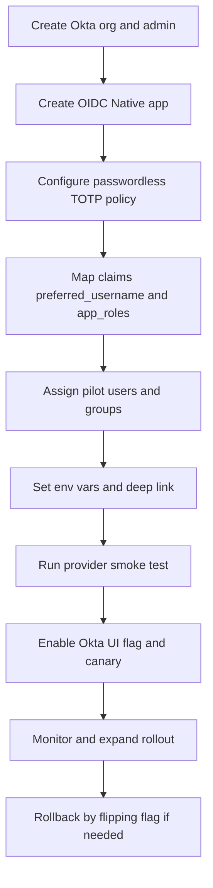

# Okta Setup Worksheet — Omnivia Mobile (OIDC Native + Passwordless TOTP)
Version: 1.0 — This worksheet guides Security to configure and record tenant-specific values required by the app.

References
- Identity flow and artifacts: [docs/security/okta-oidc-supabase.md](docs/security/okta-oidc-supabase.md:50)
- Client PKCE helper: [typescript.oktaAuthorize()](auth/okta.ts:36)
- Supabase token exchange: [docs/security/okta-oidc-supabase.md](docs/security/okta-oidc-supabase.md:176)
- App deep link scheme and logout return: [app.json](app.json:1), [context/supabase-provider.tsx](context/supabase-provider.tsx:1)

Owner and dates
- Tenant/Org name: ____________
- Prepared by (Security): ____________
- Date: ____________

1. Tenant identifiers (from OIDC discovery)
- Issuer (EXPO_PUBLIC_OKTA_ISSUER): ______________________
- Authorization endpoint: ______________________
- Token endpoint: ______________________
- JWKS URI: ______________________
- End session endpoint (logout): ______________________

2. OIDC Native App configuration (Okta Admin Console)
- [ ] App type: OIDC — Native Application
- [ ] Grant type: Authorization Code with PKCE
- [ ] Scopes: openid, profile, email
- [ ] Redirect URIs:
  - omnivia://oauthredirect
- [ ] Post Logout Redirect URIs:
  - omnivia://signout
- [ ] Client ID (EXPO_PUBLIC_OKTA_CLIENT_ID): ______________________
- [ ] Assignments: add pilot users/groups for canary

3. Passwordless policy (TOTP-only for this app)
- [ ] Create/Select a Sign-on Policy for the application
- [ ] Require passwordless via Okta Verify TOTP or Google Authenticator
- [ ] Enforce for targeted user/group population (canary first)
- [ ] Backup factors and recovery codes enabled per org policy
- [ ] Verify that first-time users are guided to enroll an authenticator during [typescript.oktaAuthorize()](auth/okta.ts:36)

4. ID token claims and roles
- [ ] Preferred roles claim: app_roles included in ID token per mapping rules
- [ ] Optional groups claim not used for authorization by default
- [ ] Ensure identifiers (sub/preferred_username) align with downstream mirrors [user_profiles](docs/security/okta-oidc-supabase.md:197) and [user_roles](docs/security/okta-oidc-supabase.md:204)
- Notes: The client mirrors roles post-login; server-side RLS uses mirrored tables.

5. Values to copy into the app environment
- EXPO_PUBLIC_OKTA_ISSUER = (from Section 1)
- EXPO_PUBLIC_OKTA_CLIENT_ID = (from Section 2)
- EXPO_PUBLIC_OKTA_END_SESSION_REDIRECT = omnivia://signout
- EXPO_PUBLIC_ENABLE_OKTA_AUTH = true (enable once ready to test)
- EXPO_PUBLIC_SUPABASE_OIDC_PROVIDER = oidc (default; switch to okta only if required)

6. Validation checklist (device or simulator)
- [ ] Launch app and tap “Continue with Okta” on a public screen
- [ ] Okta prompts enrollment/TOTP per policy; upon success, app exchanges code for ID token via [docs/security/okta-oidc-supabase.md](docs/security/okta-oidc-supabase.md:176)
- [ ] Protected tabs render; session persisted via [config/supabase.ts](config/supabase.ts:1)
- [ ] Sign out from Settings triggers RP-initiated logout and returns to omnivia://signout via [context/supabase-provider.tsx](context/supabase-provider.tsx:1)
- [ ] Negative test: cancel logout browser flow — app remains signed out locally

7. Recorded artifacts (attach or paste below)
- Screenshot: Okta app settings (General)
- Screenshot: Sign-on Policy with passwordless enforcement
- Discovery document JSON (redacted): issuer, authorization_endpoint, token_endpoint, end_session_endpoint
- Client ID string

8. Sign-off
- Security approver: ______________________
- Date: ______________________
- Notes: ______________________

Appendix — Pointers
- Client helper source: [typescript.oktaAuthorize()](auth/okta.ts:36)
- Auth storage: [config/supabase.ts](config/supabase.ts:1), [auth/secure-storage.ts](auth/secure-storage.ts:1)
- Tracker context and exit tests: [docs/projects-okta-rbac-implementation-tracker.md](docs/projects-okta-rbac-implementation-tracker.md:228

Yes — the app is built to let you keep Supabase sign-up/login now and switch to Okta later via a feature flag.

How it works

Runtime gate (no code change needed):
Keep EXPO_PUBLIC_ENABLE_OKTA_AUTH=false in .env to use the existing Supabase public screens and their legacy flows on:
app/(public)/welcome.tsx
app/(public)/sign-in.tsx
app/(public)/sign-up.tsx
Flip EXPO_PUBLIC_ENABLE_OKTA_AUTH=true when ready; those same screens show a single “Continue with Okta” button and route through Okta PKCE and token exchange via:
typescript.oktaSignIn()
supabase.auth.signInWithIdToken()
What users see

Flag OFF (today): legacy Supabase forms render as before on the three public screens; nothing in Stage 1 removed them.
Flag ON (later): the public screens render only the brand-compliant “Continue with Okta” CTA; successful auth lands in protected tabs; logout triggers Okta end-session via typescript.oktaSignOut().
Provider selection (under the hood)

The Okta path uses Supabase’s ID token exchange with the provider from env (EXPO_PUBLIC_SUPABASE_OIDC_PROVIDER default “oidc”), read inside typescript.oktaSignIn(). This is independent of the UI gate, so you can keep the default and only change it if your Supabase plan requires “okta”.
Readiness notes before switching ON

Complete Okta tenant setup and record values in docs/security/okta-setup-worksheet.md.
Populate EXPO_PUBLIC_OKTA_ISSUER and EXPO_PUBLIC_OKTA_CLIENT_ID in .env, and ensure “omnivia” scheme is in [app.json](app.json:1).
Then set EXPO_PUBLIC_ENABLE_OKTA_AUTH=true to enable the Okta CTA in the UI.
Current status

With EXPO_PUBLIC_ENABLE_OKTA_AUTH=false, Supabase sign-up/login remains active via the legacy public screens. Switching to Okta later is a controlled, flag-only change with no additional code required.
## Supplement — Okta Transition Readiness, Runbook, and Onboarding (v1.0)

This supplement provides:
- A thorough readiness assessment with explicit gaps and remediation
- End-to-end transition instructions (from Okta org creation to app linkage)
- Steps to create the first Vendor Admin and Telco Tenant Admin accounts in Okta
- First-admin onboarding instructions to sign in via the app and reach protected UI

Cross-references used throughout:
- Client helper and flows: [typescript.oktaAuthorize()](auth/okta.ts:36), [typescript.fetchOktaUserInfo()](auth/okta.ts:151), [typescript.buildEndSessionUrl()](auth/okta.ts:209), [typescript.callEndSessionWithTimeout()](auth/okta.ts:263), [typescript.verifyIdTokenClaims()](auth/okta.ts:319)
- Provider integration: [typescript.oktaSignIn()](context/supabase-provider.tsx:32), [typescript.oktaSignOut()](context/supabase-provider.tsx:88)
- Secure session storage: [config/supabase.ts](config/supabase.ts:1), [auth/secure-storage.ts](auth/secure-storage.ts:1)
- Public screens and post-logout route: [app/(public)/welcome.tsx](app/(public)/welcome.tsx:1), [app/(public)/sign-in.tsx](app/(public)/sign-in.tsx:1), [app/(public)/sign-up.tsx](app/(public)/sign-up.tsx:1), [app/(public)/signout.tsx](app/(public)/signout.tsx:1)
- Settings screen (sign out button): [app/(protected)/(tabs)/settings.tsx](app/(protected)/(tabs)/settings.tsx:1)
- Post-login profile and roles sync RPC: [supabase/migrations/20250818021000_stage5_post_login_sync.sql](supabase/migrations/20250818021000_stage5_post_login_sync.sql:1)
- Deep link scheme: [app.json](app.json:1)
- Okta + Supabase design and test strategy: [docs/security/okta-oidc-supabase.md](docs/security/okta-oidc-supabase.md:1), [docs/security/identity-negative-tests.md](docs/security/identity-negative-tests.md:1)
- Provider smoke test: [scripts/provider-smoke.js](scripts/provider-smoke.js:1)
- Environment: [.env](.env:1)

### A. Overall readiness to transition to Okta

Assessment summary
- Frontend
  - Okta PKCE helper and token exchange flow implemented behind a feature flag via [typescript.oktaSignIn()](context/supabase-provider.tsx:32) calling Supabase [signInWithIdToken](docs/security/okta-oidc-supabase.md:176).
  - Deep link scheme omnivia present in [app.json](app.json:5).
  - Secure session storage wired in [config/supabase.ts](config/supabase.ts:27) using [auth/secure-storage.ts](auth/secure-storage.ts:1).
  - RP-initiated logout hardened via [typescript.oktaSignOut()](context/supabase-provider.tsx:88) which uses [typescript.buildEndSessionUrl()](auth/okta.ts:209) and [typescript.callEndSessionWithTimeout()](auth/okta.ts:263) and lands on [app/(public)/signout.tsx](app/(public)/signout.tsx:1).
  - UI gate present on public screens (Continue with Okta) controlled by EXPO_PUBLIC_ENABLE_OKTA_AUTH in [.env](.env:3).

- Backend (Supabase)
  - Post-login profile and roles mirror implemented via [supabase/migrations/20250818021000_stage5_post_login_sync.sql](supabase/migrations/20250818021000_stage5_post_login_sync.sql:1), invoked after sign-in and on token refresh (debounced) in [context/supabase-provider.tsx](context/supabase-provider.tsx:324).
  - RBAC/RLS model and tables are in place per [docs/security/rbac-rls-review.md](docs/security/rbac-rls-review.md:1) with user_profiles and user_roles as the client-readable mirrors.

- Configuration and Ops
  - Environment toggles and Okta issuer/client_id placeholders exist in [.env](.env:3).
  - Provider smoke test exists: [scripts/provider-smoke.js](scripts/provider-smoke.js:1) to validate discovery and provider parity.

Readiness conclusion
- Technically ready for cutover once Okta tenant/app and claims are configured and environment values are set.
- Gaps are small (see next section) and have clear, low-effort remediations.
- Risk is mitigated by a feature flag, canary rollout plan, and rollback path.

### B. Gaps and remediation plan

1) Settings screen sign-out bypasses Okta end-session
- Gap: [app/(protected)/(tabs)/settings.tsx](app/(protected)/(tabs)/settings.tsx:1) calls signOut instead of [typescript.oktaSignOut()](context/supabase-provider.tsx:88).
- Risk: Users may remain logged into Okta in the browser session; post-logout deep link landing may be skipped.
- Remediation:
  - Switch Settings button to call oktaSignOut when EXPO_PUBLIC_ENABLE_OKTA_AUTH is true; otherwise call signOut (legacy).
  - Test on iOS and Android to ensure return to [app/(public)/signout.tsx](app/(public)/signout.tsx:1).

2) Optional nonce in authorization request
- Gap: [typescript.oktaAuthorize()](auth/okta.ts:36) does not include a nonce extra param.
- Risk: Reduced defense-in-depth against token replay in local testing; Supabase still performs server-side verification.
- Remediation (optional, recommended):
  - Add a cryptographically strong nonce via AuthRequest extraParams and retain it for optional local verification in [typescript.verifyIdTokenClaims()](auth/okta.ts:319) when EXPO_PUBLIC_ENABLE_LOCAL_ID_VERIFY=true.

3) Scopes and refresh token posture
- Observed: scopes ["openid","profile","email","groups"] in [typescript.oktaAuthorize()](auth/okta.ts:49).
- Decision: offline_access not required because the app does not store Okta refresh tokens; Supabase manages its own session refresh. Keep as-is unless future userinfo refresh is needed without re-auth.

4) Claims mapping and role source of truth
- Requirement: app_roles and preferred_username must be present in the ID token (or derivable via userinfo) and mirrored to DB on login.
- Remediation: Configure Okta Authorization Server claims as specified in the runbook (Section D) and verify via discovery and login tests.

5) Provider parity and environment verification
- Action: Run [scripts/provider-smoke.js](scripts/provider-smoke.js:1) per environment before enabling the feature flag. Confirm EXPO_PUBLIC_SUPABASE_OIDC_PROVIDER=oidc unless plan requires okta.

6) Device QA and negative tests
- Action: Execute the validation matrix and negative tests documented in [docs/security/okta-oidc-supabase.md](docs/security/okta-oidc-supabase.md:411) and [docs/security/identity-negative-tests.md](docs/security/identity-negative-tests.md:1).
- Include clock-skew checks (±5 minutes) and logout cancellation behavior.

### C. Go/No-Go readiness gates

Go only when all are true:
- Okta
  - OIDC Native app configured with redirect omnivia://oauthredirect and post-logout omnivia://signout
  - Authentication policy enforces passwordless (Okta Verify TOTP or Google Authenticator)
  - Claims configured: preferred_username, app_roles (and optional tenant_id, partner_org_id, sub_partner_org_id)
  - Assignments: pilot groups/users assigned to the app

- App configuration
  - Environment populated in [.env](.env:1): EXPO_PUBLIC_OKTA_ISSUER, EXPO_PUBLIC_OKTA_CLIENT_ID, EXPO_PUBLIC_OKTA_END_SESSION_REDIRECT=omnivia://signout, EXPO_PUBLIC_SUPABASE_OIDC_PROVIDER=oidc
  - Deep link scheme present in [app.json](app.json:5)
  - Feature flag EXPO_PUBLIC_ENABLE_OKTA_AUTH=true for canary builds

- Backend
  - Post-login sync RPC deployed and executable by authenticated users: [supabase/migrations/20250818021000_stage5_post_login_sync.sql](supabase/migrations/20250818021000_stage5_post_login_sync.sql:1)
  - RLS policies and mirrors validated per [docs/security/rbac-rls-review.md](docs/security/rbac-rls-review.md:1)

- Validation
  - Provider smoke test passes in target environment(s): [scripts/provider-smoke.js](scripts/provider-smoke.js:1)
  - Device QA for iOS and Android (auth, redirect, session persistence, logout return) completed

### D. End-to-end transition runbook

Mermaid overview

1) Create an Okta org (Dev and Stage first)
- Sign up for an Okta Developer org or use enterprise tenant per environment.
- Record base issuer URL: https://your-okta-domain.okta.com/oauth2/default
- For production, plan a custom domain; document in Section H.

2) Create an OIDC Native Application (Okta Admin Console)
- Applications → Create App Integration
  - Sign-in method: OIDC – OpenID Connect
  - Application type: Native Application
- General settings
  - Sign-in redirect URIs:
    - omnivia://oauthredirect
    - exp://127.0.0.1:19000 (for Expo Go local dev)
  - Sign-out redirect URIs:
    - omnivia://signout
  - Allowed grant types: Authorization Code, PKCE is implicit, Refresh Token optional
  - Scopes: openid, profile, email, groups (offline_access optional per posture)
- Save and copy the Client ID

3) Configure passwordless TOTP-only policy
- Security → Authenticators
  - Enable Okta Verify (TOTP), optionally Google Authenticator
  - Disable Password authenticator for the target user population if your org’s policy allows
- Security → Authentication Policies
  - Add a new policy targeted to the mobile app
  - Rule: Require possession (TOTP) for all sign-in, disallow password where possible
- Assign the policy to the OIDC Native app

4) Map ID token claims (Authorization Server: default)
- Security → API → Authorization Servers → default → Claims → Add Claim
  - preferred_username
    - Include in: ID Token
    - Value type: Expression
    - Value: user.login
    - Include in any scope
  - app_roles
    - Include in: ID Token
    - Value type: Groups / Filter
    - Filter: Groups with name starting with app_role_ (or use an explicit list)
    - Include in any scope
  - Optional context claims (recommended for easier mirroring)
    - tenant_id, partner_org_id, sub_partner_org_id as custom claims, from app profile or group attributes as appropriate

5) Create groups for roles and assign users
- Directory → Groups → Add:
  - app_role_vendor_admin
  - app_role_telco_admin
  - (Optional for later) app_role_telco_pm, app_role_telco_ds, app_role_telco_rm, app_role_dp_admin, app_role_dp_pm, app_role_dp_cp
- Assign these groups to the OIDC Native app (Applications → your app → Assignments → Groups)

6) Link Okta to the app
- Populate [.env](.env:1)
  - EXPO_PUBLIC_OKTA_ISSUER=https://your-okta-domain.okta.com/oauth2/default
  - EXPO_PUBLIC_OKTA_CLIENT_ID=the_client_id_copied
  - EXPO_PUBLIC_OKTA_END_SESSION_REDIRECT=omnivia://signout
  - EXPO_PUBLIC_SUPABASE_OIDC_PROVIDER=oidc
  - EXPO_PUBLIC_ENABLE_OKTA_AUTH=true (for canary; leave false in mainline until ready)
- Confirm deep link scheme omnivia in [app.json](app.json:5)
- Verify sign-in flow is wired:
  - [typescript.oktaSignIn()](context/supabase-provider.tsx:32)
  - [typescript.oktaAuthorize()](auth/okta.ts:36)
  - Supabase ID token exchange in the provider (provider=oidc by default)
  - Post-login mirror RPC call [fn_sync_profile_and_roles](supabase/migrations/20250818021000_stage5_post_login_sync.sql:12)

7) Preflight checks
- Run provider smoke test
  - export EXPO_PUBLIC_ENABLE_OKTA_AUTH=true
  - export EXPO_PUBLIC_OKTA_ISSUER=...
  - export EXPO_PUBLIC_OKTA_END_SESSION_REDIRECT=omnivia://signout
  - export EXPO_PUBLIC_SUPABASE_OIDC_PROVIDER=oidc
  - yarn smoke:provider → should print ok:true JSON
- Ensure sign-out uses Okta path in Settings (see Remediation 1)

8) Enable canary and monitor
- Flip EXPO_PUBLIC_ENABLE_OKTA_AUTH=true for a canary build or environment
- Assign only pilot users/groups in Okta
- Monitor auth_success/auth_failure and sign-in times; validate role mirroring appears in DB

9) Rollback plan
- Flip EXPO_PUBLIC_ENABLE_OKTA_AUTH=false to immediately revert public screens to legacy Supabase email/password
- No code changes required; keep env toggles per environment

### E. Create the first accounts in Okta (Vendor Admin and Telco Tenant Admin)

Objective
- Create two initial admin identities with stable identifiers and role assignments that flow into app_roles.

Steps
- Directory → People → Add person (for each admin)
  - Username (login): set to the stable admin-assigned user id you want mirrored into preferred_username (e.g., vendor.admin, telco.admin)
  - Primary email: your corporate email (Okta requires an email attribute even if not used for login in the app)
  - Password: if using full passwordless enforcement, Okta will guide enrollment; you can still set a temporary password for console access if needed
- Assign to groups
  - Vendor Admin → group app_role_vendor_admin
  - Telco Tenant Admin → group app_role_telco_admin
- Assign the OIDC Native app to these users or to the groups (preferred)
- Outcome
  - At login, ID token should include preferred_username=user.login and app_roles containing the corresponding slugs
  - On first sign-in, the app mirrors identifiers and roles to DB via [fn_sync_profile_and_roles](supabase/migrations/20250818021000_stage5_post_login_sync.sql:12)

Optional context claims per tenant
- If you include tenant_id, partner_org_id, sub_partner_org_id in the token, set these on the users or groups and map via Authorization Server claims; they will be mirrored into user_profiles on login and used by RLS

### F. First-admin onboarding via the app

Preconditions
- Okta app and claims configured; users assigned; [.env](.env:1) populated; [app.json](app.json:1) has scheme omnivia; canary flag on

Steps for the first admin (either Vendor Admin or Telco Tenant Admin)
1) Install Okta Verify (or Google Authenticator if allowed) on device
2) Launch the app (canary build) → tap “Continue with Okta” on [app/(public)/sign-in.tsx](app/(public)/sign-in.tsx:1)
3) Complete enrollment if first-time; otherwise enter TOTP and approve
4) App exchanges code, calls Supabase ID token exchange, and persists the Supabase session
5) Post-login mirror runs (debounced on refresh) and roles appear in user_roles; you land in protected tabs
6) Verify logout from Settings uses [typescript.oktaSignOut()](context/supabase-provider.tsx:88) and returns to [app/(public)/signout.tsx](app/(public)/signout.tsx:1)

Operator verification (optional)
- In Supabase SQL Editor, confirm mirrors after first login:
  - user_profiles row keyed by auth.uid with okta_sub and okta_user_id
  - user_roles contains expected roles (e.g., vendor_admin or telco_admin)
  - The mirror is maintained by [fn_sync_profile_and_roles](supabase/migrations/20250818021000_stage5_post_login_sync.sql:12)

### G. Validation checklist and negative tests

Functional
- [ ] Button renders with EXPO_PUBLIC_ENABLE_OKTA_AUTH=true on all public screens: [app/(public)/welcome.tsx](app/(public)/welcome.tsx:1), [app/(public)/sign-in.tsx](app/(public)/sign-in.tsx:1), [app/(public)/sign-up.tsx](app/(public)/sign-up.tsx:1)
- [ ] Okta login prompts for authenticator and completes; Supabase session present; protected tabs visible
- [ ] Logout clears Supabase session and triggers Okta end-session; return to omnivia://signout renders [app/(public)/signout.tsx](app/(public)/signout.tsx:1)
- [ ] Post-login mirror populates user_profiles and user_roles; role-gated features match expectations

Discovery and provider
- [ ] [scripts/provider-smoke.js](scripts/provider-smoke.js:1) returns ok:true for issuer and provider parity
- [ ] Discovery document includes authorization_endpoint and (optionally) end_session_endpoint

Negative paths (dev)
- [ ] Wrong issuer/audience/nonce paths produce local verifier warnings when EXPO_PUBLIC_ENABLE_LOCAL_ID_VERIFY=true, per [docs/security/identity-negative-tests.md](docs/security/identity-negative-tests.md:1)
- [ ] Logout cancellation in the browser does not keep the app signed in locally
- [ ] Clock skew up to ±5 minutes does not break sign-in; larger skew shows guidance to correct time

### H. Productionization notes (custom domain, environments, and rollout)

Custom domain (production)
- Recommended for brand and stable allowlists. Update issuer and redirect URIs accordingly
- Validate flows again after switching issuer (run smoke test and device QA)
- Documented in [docs/security/okta-oidc-supabase.md](docs/security/okta-oidc-supabase.md:311)

Environment separation
- Maintain distinct Okta apps and Client IDs for dev/stage/prod
- Configure env per EAS profile; do not commit secrets; confirm [.env](.env:1) is local/dev only

Rollout and rollback
- Use EXPO_PUBLIC_ENABLE_OKTA_AUTH flag to stage the cutover and to rollback if needed
- Keep assignments scoped to pilot groups initially, then expand

### I. Implementation changes to schedule (remediation tasks)

- Update Settings screen sign-out:
  - Change handler in [app/(protected)/(tabs)/settings.tsx](app/(protected)/(tabs)/settings.tsx:1) to call [typescript.oktaSignOut()](context/supabase-provider.tsx:88) when EXPO_PUBLIC_ENABLE_OKTA_AUTH=true; else call signOut
- Optional: Add nonce to [typescript.oktaAuthorize()](auth/okta.ts:36) and pass it to [typescript.verifyIdTokenClaims()](auth/okta.ts:319) when EXPO_PUBLIC_ENABLE_LOCAL_ID_VERIFY=true; keep Supabase verification authoritative

### J. Quick troubleshooting

- Invalid redirect URI
  - Ensure omnivia://oauthredirect matches Okta app settings exactly and deep link scheme omnivia exists in [app.json](app.json:5)
- Supabase refuses token
  - Confirm EXPO_PUBLIC_SUPABASE_OIDC_PROVIDER=oidc or okta per plan; verify issuer and client_id in [.env](.env:1)
- Roles not reflected
  - Verify app_roles claim appears in ID token and groups are mapped; confirm post-login RPC [fn_sync_profile_and_roles](supabase/migrations/20250818021000_stage5_post_login_sync.sql:12) executes (provider calls are debounced on refresh)
- Logout does not return
  - Confirm EXPO_PUBLIC_OKTA_END_SESSION_REDIRECT=omnivia://signout and that Okta discovery includes end_session_endpoint