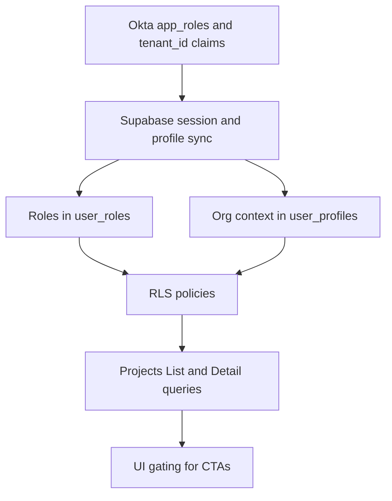

# Roles, Permissions, and Enforcement — Projects Feature RBAC, Claims, and RLS Reference

Author: Kilo Code
Status: Draft v0.3
Date: 2025-08-19
Sources: [docs/product/projects-feature-implementation-plan.md](docs/product/projects-feature-implementation-plan.md:1), [docs/product/projects-feature-ui-ux.md](docs/product/projects-feature-ui-ux.md:1), [docs/security/okta-oidc-supabase.md](docs/security/okta-oidc-supabase.md:1)

Purpose
- Define a single, authoritative RBAC model for Projects across tenants.
- Specify Okta claims and how they map to Supabase identities and roles.
- Provide SQL RLS policy templates for projects, UGC, and storage.
- Define frontend gating points and anchors for consistent enforcement.

1. Tenant and subject model
- Primary tenant: Telco tenant is canonical owner; default visibility is all projects within the telco tenant for admin and PM roles.
- Secondary tenants: Delivery Partner tenants only see projects assigned to their organization or subcontractors they manage.
- Subjects for membership:
  - USER: a specific Supabase auth user id.
  - ORG: a partner organization id representing a Delivery Partner.
  - SUB_ORG: a subcontractor organization id linked under a Delivery Partner.
- Membership materialization: On each import merge, memberships for ORG and USER are upserted per [docs/product/projects-feature-implementation-plan.md](docs/product/projects-feature-implementation-plan.md:100).

2. Roles and capabilities
Roles
- Vendor Admin
- Telco Tenant Admin
- Telco Tenant Program Manager
- Telco Tenant Deployment Specialist
- Telco Tenant Relationship Manager
- Delivery Partner Tenant Admin
- Delivery Partner Program Manager
- Delivery Partner Construction Partner

Capability legend
- Read Projects: Can view Projects List and Detail.
- UGC: Create and manage Engagements, Contacts, Attachments for visible projects.
- Assign: Can allocate a project to an ORG or SUB_ORG membership.
- Admin Corrections: Limited edits to imported fields for corrections.
- User Management: Manage users within their tenant (out of app scope; via Okta admin).
- Feature Flags: Toggle tenant-scoped flags.
- Org Hierarchy Mgmt: Create and manage SUB_ORG records under a tenant's partner_org hierarchy.
- Provisioning Requests: Submit user lifecycle and role changes via admin portal; executed by Okta Workflows (Model B2).

Capability matrix (summary)
- Vendor Admin: Read Projects (all tenants), UGC (any), Assign (any tenant), Admin Corrections (yes), User Management (oversight only; provisioning via Okta), Feature Flags (global), Org Hierarchy Mgmt (global as needed), Provisioning Requests (any tenant).
- Telco Tenant Admin: Read Projects (telco tenant all), UGC (any in tenant), Assign (DP orgs and DS users within tenant), Admin Corrections (limited), Feature Flags (tenant), Org Hierarchy Mgmt (create SUB_ORG), Provisioning Requests (own tenant).
- Telco Tenant Program Manager: Read Projects (telco tenant all), UGC (yes), Assign (DS users; optional DP org with admin approval).
- Telco Tenant Deployment Specialist: Read Projects (assigned only), UGC (on assigned), Assign (no).
- Telco Tenant Relationship Manager: Read Projects (assigned only), UGC (on assigned), Assign (no), Admin Corrections (no).
- Delivery Partner Tenant Admin: Read Projects (their ORG and SUB_ORG), UGC (yes), Assign (their SUB_ORG), User Management (their tenant via Okta requests), Admin Corrections (no), Org Hierarchy Mgmt (create SUB_ORG), Provisioning Requests (own tenant).
- Delivery Partner Program Manager: Read Projects (their ORG and SUB_ORG), UGC (yes), Assign (their SUB_ORG), Admin Corrections (no).
- Delivery Partner Construction Partner: Read Projects (SUB_ORG assigned subset), UGC (engagements, attachments, and contacts), Assign (no).

3. Okta claims schema and mapping
Required claims in ID token
- sub: Okta subject, canonical unique id.
- preferred_username: Admin-assigned human-friendly user id.
- app_roles: Array of role slugs, e.g., ["vendor_admin","telco_admin","telco_pm","telco_ds","telco_rm","dp_admin","dp_pm","dp_cp"].
- tenant_id: UUID or string identifying the tenant (telco vs a specific delivery partner tenant).
- partner_org_id: UUID string when user belongs to a Delivery Partner tenant; null for telco.
- sub_partner_org_id: UUID string when user belongs to a subcontractor org; optional.

Optional claims
- groups: Okta groups mapped to app roles; if used, map to app_roles via profile mapping.
- app_features: Array of feature flags at login (informational; source of truth is DB).

Example claim payloads
Telco Deployment Specialist
- tenant_id: TELCO
- app_roles: ["telco_ds"]
- partner_org_id: null
- sub_partner_org_id: null

Delivery Partner Program Manager
- tenant_id: DP_NNN
- app_roles: ["dp_pm"]
- partner_org_id: <UUID>
- sub_partner_org_id: null

Construction Partner user
- tenant_id: DP_NNN
- app_roles: ["dp_cp"]
- partner_org_id: <UUID of DP>
- sub_partner_org_id: <UUID of subcontractor>

Supabase mapping
- On first sign-in, mirror claims to tables per [Mapping identifiers and roles](docs/security/okta-oidc-supabase.md:189).
- Tables
  - user_profiles(user_id, okta_sub, okta_user_id, tenant_id, partner_org_id, sub_partner_org_id, created_at).
  - user_roles(user_id, role).
- Post-login sync
  - Update user_profiles when claims change.
  - Upsert user_roles to reflect app_roles.

4. Data model anchors for membership
- partner_org
  - Adds optional parent_partner_org_id to support subcontractor hierarchy. Creation of SUB_ORG is permitted to telco_admin and dp_admin; vendor_admin may oversee globally as needed but is not required in-app.
- project_membership
  - Columns:
    - project_id uuid references projects(id)
    - member_user_id uuid nullable
    - member_partner_org_id uuid nullable
    - member_sub_partner_org_id uuid nullable
    - created_at timestamptz default now()
  - Check: exactly one of member_user_id, member_partner_org_id, member_sub_partner_org_id is non-null.
- Materialization flow
  - After merge, upsert ORG membership from Delivery Partner mapping and SUB_ORG if allocation exists.
  - Upsert USER membership for Deployment Specialist via ds_directory lookup.
  - Upsert USER membership for Relationship Manager via rm_directory lookup (or via projects.relationship_manager field when provided).

Assignment sources and field mapping
- Delivery Partner assignment
  - Source field: projects.delivery_partner (synced from import)
  - Mapping: partner_normalization -> partner_org.id
  - Materialization: ORG membership (member_partner_org_id)
- Deployment Specialist assignment
  - Source field: projects.deployment_specialist (synced from import)
  - Mapping: ds_directory(value) -> auth.users.id
  - Materialization: USER membership (member_user_id)
- Relationship Manager assignment
  - Source field: projects.relationship_manager (synced from import)
  - Mapping: rm_directory(value) -> auth.users.id
  - Materialization: USER membership (member_user_id)
- Subcontractor assignment
  - Source: In-app allocation by dp_admin or dp_pm (and telco_admin if acting on behalf)
  - Materialization: SUB_ORG membership (member_sub_partner_org_id)
- Tenant association
  - All Projects belong to TELCO tenant; Delivery Partner visibility derives exclusively from membership materialization.

5. RLS policy templates
Note: Replace schema.table names to match actual schema. Enable RLS on all user-facing tables.

Projects visibility
SQL template
```sql
-- Enable RLS
alter table public.projects enable row level security;

-- Helper views or functions can be added later; template shows inline checks
create policy projects_select_policy
on public.projects for select
using (
  -- Vendor Admin across all tenants
  exists (
    select 1 from public.user_roles r
    where r.user_id = auth.uid() and r.role = 'vendor_admin'
  )
  or
  -- Telco tenant admin/PM can see all projects in telco tenant
  exists (
    select 1 from public.user_roles r
    join public.user_profiles p on p.user_id = r.user_id
    where r.user_id = auth.uid()
      and r.role in ('telco_admin','telco_pm')
      and p.tenant_id = projects.tenant_id
  )
  or
  -- Telco Deployment Specialist sees assigned projects via USER membership
  (
    exists (
      select 1 from public.user_roles r
      where r.user_id = auth.uid() and r.role = 'telco_ds'
    )
    and exists (
      select 1 from public.project_membership m
      where m.project_id = projects.id
        and m.member_user_id = auth.uid()
    )
  )
  or
  -- Telco Relationship Manager sees assigned projects via USER membership
  (
    exists (
      select 1 from public.user_roles r
      where r.user_id = auth.uid() and r.role = 'telco_rm'
    )
    and exists (
      select 1 from public.project_membership m
      where m.project_id = projects.id
        and m.member_user_id = auth.uid()
    )
  )
  or
  -- Delivery Partner users see projects via ORG or SUB_ORG membership
  exists (
    select 1 from public.user_roles r
    join public.user_profiles p on p.user_id = r.user_id
    where r.user_id = auth.uid()
      and r.role in ('dp_admin','dp_pm','dp_cp')
      and (
        exists (
          select 1 from public.project_membership m
          where m.project_id = projects.id
            and m.member_partner_org_id = p.partner_org_id
        )
        or exists (
          select 1 from public.project_membership m2
          where m2.project_id = projects.id
            and m2.member_sub_partner_org_id = p.sub_partner_org_id
        )
      )
  )
);
```

UGC write scopes
Engagements
```sql
alter table public.engagements enable row level security;

create policy engagements_select
on public.engagements for select
using (
  exists (select 1 from public.projects where id = engagements.project_id)
  and
  using_rls_for_project(engagements.project_id) -- replace with inline projects_select_policy logic or a SQL function
);

create policy engagements_insert_update_delete
on public.engagements for all
to authenticated
using (
  -- must have membership on the project as USER or ORG or SUB_ORG
  exists (
    select 1 from public.project_membership m
    where m.project_id = engagements.project_id
      and (
        m.member_user_id = auth.uid()
        or m.member_partner_org_id = (select partner_org_id from public.user_profiles where user_id = auth.uid())
        or m.member_sub_partner_org_id = (select sub_partner_org_id from public.user_profiles where user_id = auth.uid())
      )
  )
);
```

Contacts and Attachments metadata
```sql
alter table public.contacts enable row level security;
alter table public.attachments_meta enable row level security;

-- Similar select and write policies as engagements with project_id based checks
```

Imported fields protection
```sql
-- Deny updates to canonical projects imported fields by default
create policy projects_update_admin_only
on public.projects for update
using (
  exists (
    select 1 from public.user_roles r
    where r.user_id = auth.uid() and r.role in ('vendor_admin','telco_admin')
  )
)
with check (
  -- If needed, limit updatable columns using column-level privileges outside RLS
  true
);
```

Storage policies
```sql
-- Example for Supabase Storage bucket 'attachments'
create policy attachment_object_read
on storage.objects for select
using (
  bucket_id = 'attachments'
  and exists (
    select 1
    from public.attachments_meta am
    join public.project_membership m on m.project_id = am.project_id
    where am.bucket = 'attachments' and am.object_name = storage.objects.name
      and (
        m.member_user_id = auth.uid()
        or m.member_partner_org_id = (select partner_org_id from public.user_profiles where user_id = auth.uid())
        or m.member_sub_partner_org_id = (select sub_partner_org_id from public.user_profiles where user_id = auth.uid())
      )
  )
);
```

6. Frontend enforcement plan
Anchors
- Protected routing and tabs: [app/(protected)/_layout.tsx](app/(protected)/_layout.tsx:1), [app/(protected)/(tabs)/index.tsx](app/(protected)/(tabs)/index.tsx:1).
- Auth state and session: [AuthProvider()](context/supabase-provider.tsx:31), [useAuth()](context/supabase-provider.tsx:29).
- UI modules per spec: [docs/product/projects-feature-ui-ux.md](docs/product/projects-feature-ui-ux.md:1).

Client checks
- Fetch effective roles from [user_roles](docs/security/okta-oidc-supabase.md:200) and org context from [user_profiles](docs/security/okta-oidc-supabase.md:193) after session.
- Hide unpermitted CTAs; rely on RLS for hard enforcement.
- Provide helpers:
  - canViewProjects(): role check plus rely on data returning via RLS.
  - canCreateUGC(projectId): membership check via a lightweight API or optimistic UI with RLS fallback.
  - canAssign(projectId): role-based gates for admins and PMs per matrix.

Suggested helper implementations
- Add an authorization utility module [authorization.ts](context/supabase-provider.tsx:1) that exports:
  - [canViewProjects()](context/supabase-provider.tsx:1)
  - [canCreateUGC()](context/supabase-provider.tsx:1)
  - [canAssign()](context/supabase-provider.tsx:1)
- Integration points:
  - Projects List actions in [app/(protected)/(tabs)/index.tsx](app/(protected)/(tabs)/index.tsx:1).
  - Project Detail CTAs in feature tabs per [docs/product/projects-feature-ui-ux.md](docs/product/projects-feature-ui-ux.md:126).

Feature flags
- Use ENABLE_PROJECTS and ENABLE_ATTACHMENTS_UPLOAD flags per tenant as defined in [docs/product/projects-feature-implementation-plan.md](docs/product/projects-feature-implementation-plan.md:75).
- Add RBAC-driven disclosure to complement flags.

Admin portal and provisioning (Model B — Okta Workflows)
- The admin portal provides Vendor Admin, Telco Tenant Admin, and DP Admin with in-app forms to submit Provisioning Requests (invite/disable/role changes). Requests are stored in provisioning_requests with status and correlation_id.
- Okta Workflows (or event hooks) executes the lifecycle in Okta (create user, assign groups → app_roles claim) and posts completion/failure back to the app; the app never holds write-capable Okta secrets.
- SUB_ORG creation remains in-app; restricted to telco_admin and dp_admin; changes are immediate in DB and enforced via RLS.
- Relationship Manager visibility is assigned-only and realized via USER membership materialization from rm_directory.
- Audit: dual trail in the app (requests) and in Okta System Log; errors surface to admins with retry/backoff guidance.

7. Conflict and consistency review
- UI spec aligns with role-scoped visibility: DS and DP scope by membership, PM and Admin see more. No conflicts detected.
- Implementation plan requires RLS templates and policy tests in Stage 2; this document supplies initial templates.
- Okta auth doc defines profile and role tables; this document extends with tenant_id and org fields consistent with DP and DS flows.

8. Mermaid overview


9. Open questions for confirmation
- Relationship Manager mapping: Confirm import field header used for RM mapping (projects.relationship_manager) and ownership/stewardship of rm_directory.
- DP to subcontractor allocation: Confirm that DP Admin and DP PM can allocate projects to SUB_ORG without Telco approval, and that Telco can view all allocations.
- Construction Partner capabilities: CP can add contacts in addition to engagements and attachments.
- Admin Corrections: Confirm which imported fields, if any, Telco Admin can correct; default is none until a future stage.
- DS assign rights: Should Telco DS be allowed to reassign themselves or suggest assignment only?

10. Implementation checklist
- Add tenant_id, partner_org_id, sub_partner_org_id columns to [user_profiles](docs/security/okta-oidc-supabase.md:193).
- Add parent_partner_org_id to partner_org.
- Create project_membership with three membership columns.
- Create rm_directory mapping and extend membership materialization to include Relationship Manager.
- Create provisioning_requests table and service hooks for Okta Workflows callbacks (Model B2).
- Implement admin UI for SUB_ORG creation; restrict to telco_admin and dp_admin.
- Apply RLS policies above and add CI tests per [docs/product/projects-feature-implementation-plan.md](docs/product/projects-feature-implementation-plan.md:242).
- Implement frontend authorization helpers and wire CTAs.
- Document Okta claim mappings in Okta app configuration and verify in sandbox.

11. Role slug canonical list
- vendor_admin
- telco_admin
- telco_pm
- telco_ds
- telco_rm
- dp_admin
- dp_pm
- dp_cp

Change log
- v0.3 Enabled contacts creation for Delivery Partner Construction Partner; updated capability matrix and resolved CP contacts open question; synchronized with Projects UI spec v0.5; date updated to 2025-08-19.
- v0.2 Model B2 integrated: RM scope set to assigned-only; added SUB_ORG creation rights for telco_admin and dp_admin; added provisioning requests via Okta Workflows; clarified assignment sources and updated RLS for telco_rm.
- v0.1 Initial RBAC, claims, and RLS reference; adds subcontractor hierarchy and membership templates; aligned with Projects plan and UI spec.